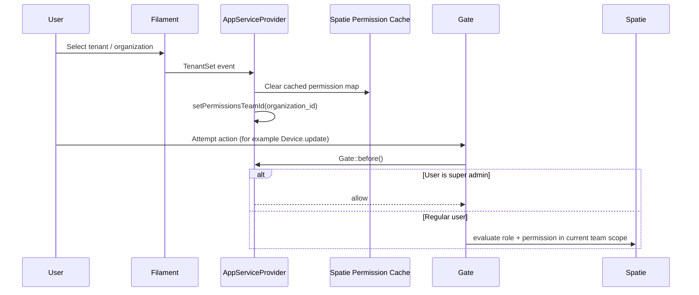

# Authorization Module - Overview

## What This Module Does

The Authorization module controls who can access and operate features in the portal.

It combines:

1. Spatie roles and permissions.
2. Organization-scoped team context.
3. Enum-driven permission catalogs.
4. Filament resources for roles and permissions.

This module is the policy and access-control layer used across all business domains.

## Core Concepts

| Concept | Description |
|--------|-------------|
| Role | `App\Domain\Authorization\Models\Role`, extends Spatie role and belongs to an organization |
| Permission | Spatie permission model with grouped names (for example `Device.view-any`) |
| Team Scope | `organization_id` is used as Spatie team key to isolate role assignment by organization |
| Super Admin Bypass | `Gate::before()` allows full access for `is_super_admin=true` users |
| Role-Permission Assignment | `role_has_permissions` pivot defines which permissions a role grants |
| User-Role Assignment | `model_has_roles` stores user-role assignments with organization context |

## High-Level Access Flow

## Boundaries and Integrations

| Area | Integration |
|------|-------------|
| Shared domain | Uses organization membership and user tenancy context |
| Filament Admin | Role and Permission resources under Access Control navigation |
| Policies | Domain policies rely on permissions resolved by this module |
| Automation policy | `AutomationWorkflowPolicy` is explicitly registered in `AppServiceProvider` |

## Key Source Areas

- Domain model: `app/Domain/Authorization/Models/Role.php`
- Permission enums: `app/Domain/Authorization/Permissions/`
- Spatie team config: `config/permission.php`
- Team context bootstrapping: `app/Providers/AppServiceProvider.php`
- Admin UI:
  - `app/Filament/Admin/Resources/Authorization/Roles/`
  - `app/Filament/Admin/Resources/Authorization/Permissions/`

## Documentation Map

- [02 - Architecture](02-architecture.md)
