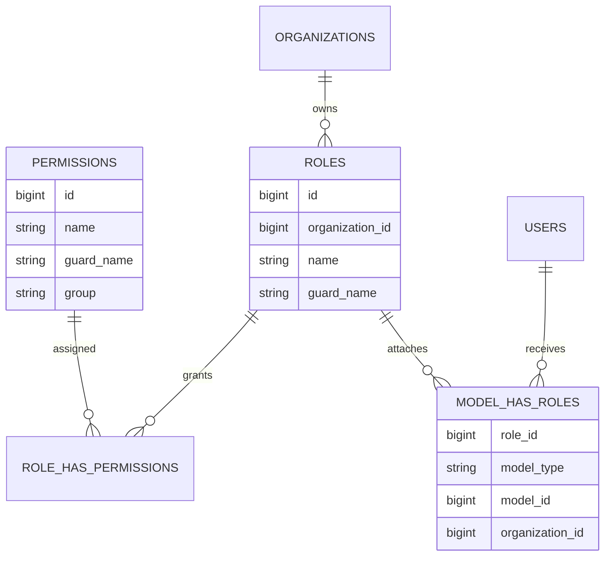

# Authorization Module - Architecture

## Architectural Model

Authorization is implemented as a layered structure:

1. Data layer: roles, permissions, and pivot tables.
2. Team context layer: current organization scope for permission checks.
3. Gate/policy layer: authorization decisions in runtime.
4. Admin management layer: Filament resources to maintain roles and permissions.

## Component Responsibilities

| Component | Responsibility |
|-----------|----------------|
| `Role` (`App\Domain\Authorization\Models\Role`) | Organization-scoped role model used by Spatie |
| Permission enums | Canonical permission names grouped by domain aggregate |
| `AppServiceProvider::boot()` | Super-admin bypass and team-context cache reset on tenant switch |
| `RoleResource` | CRUD for roles and permission assignment |
| `PermissionResource` | Read/manage permission catalog and bulk assignment to roles |
| `PermissionsRelation` | Attach/detach permissions from a role |

## Data Model

## Team Scoping Details

- Spatie teams are enabled (`config('permission.teams') = true`).
- Team foreign key is `organization_id`.
- On Filament tenant switch (`TenantSet` event), the app:
  - sets the active team with `setPermissionsTeamId()`,
  - flushes Spatie permission cache.

This guarantees permission checks run in the current organization context.

## Runtime Decision Path

1. Request reaches a protected action.
2. `Gate::before()` grants immediate allow for super admin users.
3. For other users, policies/permissions are evaluated through Spatie role relations in the active team context.

## Admin Workflows

### Role Management

- Role uniqueness is constrained by organization + guard in UI validation.
- Role form requires:
  - name,
  - guard,
  - organization,
  - permissions.

### Permission Management

- Permissions are grouped (`permissions.group`) and displayed in table/grid modes.
- Bulk action can assign selected permissions directly to a role in a selected organization.

## Operational Notes

- If permissions appear stale after tenant switching, check cache invalidation in `AppServiceProvider` and cache store settings in `config/permission.php`.
- Team-scoped assignments depend on the `organization_id` pivot in `model_has_roles`; direct inserts should always include that value.
