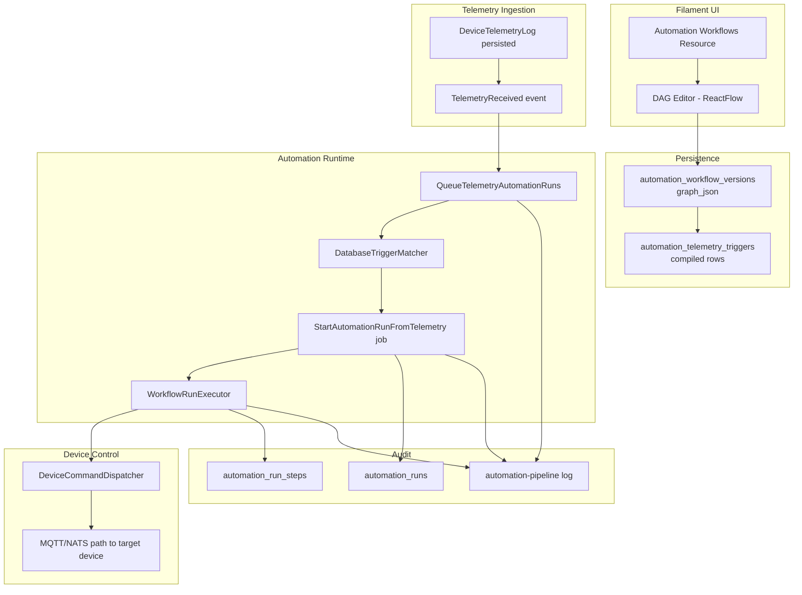

# Automation Module - Overview

## What This Module Does

The Automation module turns incoming telemetry into automated actions using a visual DAG builder.

At a high level, it enables this pattern:

1. Receive telemetry from a device.
2. Match telemetry against saved workflow triggers.
3. Evaluate workflow conditions.
4. Dispatch a command to a target device when conditions pass.
5. Persist a full run and step-by-step execution history.

## First Supported Production Flow

The current Phase 1 workflow path is:

`Telemetry Trigger -> Condition -> Command`

Primary use case:

`Energy meter voltage > threshold -> send RED blink command to RGB strip`

## Core Concepts

| Concept | Description |
|--------|-------------|
| Automation Workflow | Top-level definition owned by an organization (`automation_workflows`) |
| Workflow Version | Immutable graph snapshot with checksum (`automation_workflow_versions`) |
| Graph JSON | DAG definition (nodes, edges, viewport) saved in `graph_json` |
| Compiled Trigger | Indexed telemetry trigger row derived from graph (`automation_telemetry_triggers`) |
| Automation Run | One execution instance started by a trigger (`automation_runs`) |
| Run Step | Per-node execution record with input/output/error/duration (`automation_run_steps`) |
| Event Correlation ID | Correlates all queueing logs for a telemetry event |
| Run Correlation ID | Correlates all logs and steps inside a specific run |

## End-to-End Flow

## Current Module Boundaries

| Area | Responsibility |
|------|----------------|
| Filament Resource + DAG Page | Workflow CRUD, DAG editing, graph save entrypoint |
| ReactFlow Builder | Node/edge editing, node modal configuration, summary rendering |
| Validation Layer | Topology validation + node-config validation |
| Compiler Layer | Build telemetry trigger index rows from graph |
| Trigger Match Layer | Select candidate workflow versions for incoming telemetry |
| Execution Layer | Execute condition/command nodes and persist run history |
| Device Control Integration | Reuse existing command dispatch path |
| Observability | Structured logs with correlation IDs and execution stages |

## Current Scope (Important)

The runtime currently executes telemetry workflows only.

- Fully active: `telemetry-trigger`, `condition`, `command`
- Graph-level placeholders (config persistence only): `schedule-trigger`, `delay`, `alert`
- No full generic node executor plugin chain yet

## Documentation Map

| Document | Focus |
|---------|-------|
| [02 - Architecture](02-architecture.md) | Components, responsibilities, and dependency flow |
| [03 - DAG Editor and Node Modals](03-dag-editor-and-node-modals.md) | UI model, node types, and configuration experience |
| [04 - Save, Validation, and Trigger Compilation](04-save-validation-and-trigger-compilation.md) | What happens on Save DAG and why |
| [05 - Runtime Trigger Matching and Execution](05-runtime-trigger-matching-and-execution.md) | Telemetry event to command dispatch runtime path |
| [06 - Observability and Troubleshooting](06-observability-and-troubleshooting.md) | Logs, correlation IDs, and debugging runbooks |
| [07 - Operations and Performance](07-operations-and-performance.md) | Queue/Horizon setup, scaling, and reliability practices |
| [08 - Testing and Roadmap](08-testing-and-roadmap.md) | Automated coverage and phased next steps |
