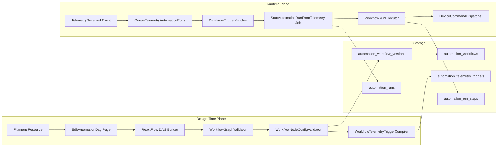
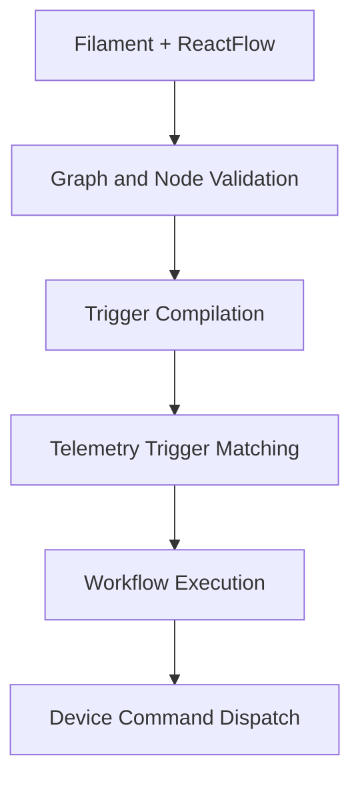
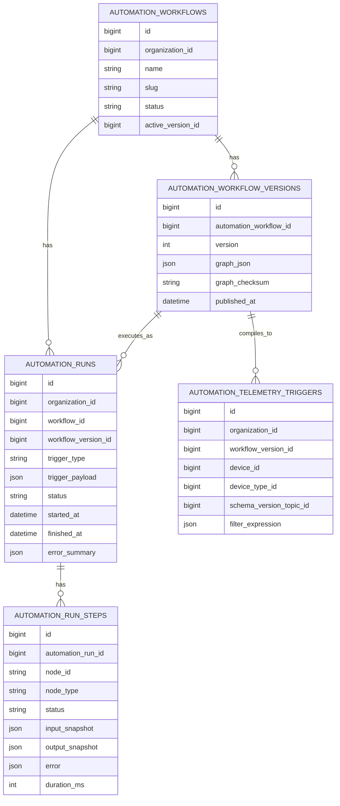

# Automation Module - Architecture

## Architectural Model

The module is split into two major planes:

1. Design-time plane: build and save workflow graphs.
2. Runtime plane: react to telemetry and execute runs.

## Component Responsibilities

| Component | Layer | Responsibility |
|-----------|------|----------------|
| `AutomationWorkflowResource` | Filament | Workflow CRUD and navigation entry point |
| `EditAutomationDag` | Livewire page | Exposes graph save API and option lookup methods for node modals |
| `dag-builder.jsx` | Frontend | ReactFlow canvas, node editing, config modal UX, graph serialization |
| `WorkflowGraphValidator` | Domain service | Validates graph topology (node ids, trigger existence, no cycles) |
| `WorkflowNodeConfigValidator` | Domain service | Validates node-specific configs against organization/device/topic/schema constraints |
| `WorkflowTelemetryTriggerCompiler` | Domain service | Compiles telemetry-trigger nodes into indexed DB rows |
| `QueueTelemetryAutomationRuns` | Event listener | Converts telemetry events into queue jobs with correlation context |
| `DatabaseTriggerMatcher` | Domain service | Matches incoming telemetry against compiled trigger rows |
| `StartAutomationRunFromTelemetry` | Queue job | Creates run record and invokes execution engine |
| `WorkflowRunExecutor` | Domain service | Executes trigger/condition/command chain and records step history |
| `DeviceCommandDispatcher` | Shared device control | Publishes target command over MQTT/NATS path |

## Dependency Direction

The dependency direction is one-way:

`UI -> Validation/Compile -> Runtime Triggering -> Execution -> Device Control`

No runtime component depends back on the UI layer.

## Event Wiring

`AppServiceProvider` wires automation into app runtime by:

- Binding `TriggerMatcher` to `DatabaseTriggerMatcher`.
- Registering policy for `AutomationWorkflow`.
- Listening for `TelemetryReceived` and invoking `QueueTelemetryAutomationRuns`.

This makes automation event-driven by default once telemetry persistence emits `TelemetryReceived`.

## Data Model (ER View)

## Status Models

| Workflow Status | Meaning |
|-----------------|---------|
| `draft` | Editable workflow under development |
| `active` | Intended to be active/published |
| `paused` | Temporarily disabled operationally |
| `archived` | Retained but inactive |

| Run Status | Meaning |
|------------|---------|
| `queued` | Reserved state in enum (not currently persisted in this runtime path) |
| `running` | Run created and execution in progress |
| `completed` | Run reached terminal success path (may include non-passing condition branches) |
| `failed` | Run failed due to node or execution exception |
| `cancelled` | Reserved terminal state |

## Architectural Notes

- Topology and node configuration are validated before persistence.
- Trigger matching is based on compiled rows, not full graph scans.
- Execution currently uses direct node-type handling (`condition`, `command`) in `WorkflowRunExecutor`.
- `NodeExecutor` contract exists as a future extension seam for pluggable node executors.
