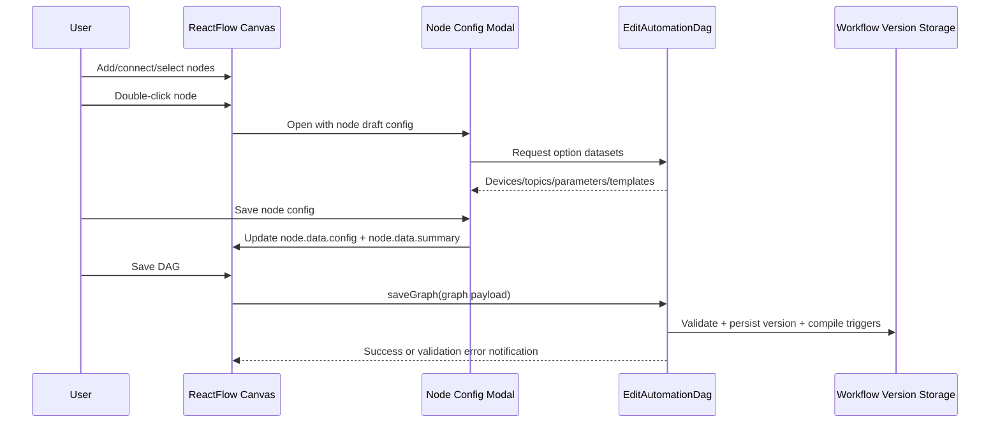

# Automation Module - DAG Editor and Node Modals

## Editor Entry Points

Users access the DAG editor from the Automation resource through:

- Workflow list table action: `DAG Editor`
- Workflow view page action: `DAG Editor`
- Workflow edit page action: `DAG Editor`
- Post-create redirect: newly created workflow routes directly to DAG editor

This keeps authoring flow centered on graph editing immediately after workflow creation.

## Canvas Interaction Model

The editor is a ReactFlow (XYFlow) canvas embedded inside a Filament page.

Core interactions:

1. Add nodes from palette.
2. Connect nodes with directed edges.
3. Select node(s) and delete.
4. Double-click node to open configuration modal.
5. Save DAG to persist graph and compile trigger metadata.

## Node Palette

| Node Type | Runtime Status | Purpose |
|-----------|----------------|---------|
| `telemetry-trigger` | Active | Starts flow on matching telemetry context |
| `schedule-trigger` | Placeholder | Reserved for schedule-based execution |
| `condition` | Active | Evaluates guided or JSON logic boolean result |
| `delay` | Placeholder | Reserved for wait/delay orchestration |
| `command` | Active | Sends command payload to target subscribe topic |
| `alert` | Placeholder | Reserved for alert/notification actions |

## Modal Behavior

All nodes open a config modal. Modal actions:

- `Save`: validate draft and persist into node config.
- `Reset`: restore default draft for that node type.
- `Cancel`: close without applying draft changes.

Accessibility and UX notes:

- Double-click open path is primary.
- Selected-node panel includes a Configure action path.
- Validation errors are shown inline in modal where possible.
- Saved configs generate short summaries shown on node cards.

## Telemetry Trigger Modal

Required fields:

- Source device (organization scoped).
- Source publish topic (filtered by selected device schema version).
- Source parameter (filtered by selected topic active parameters).

Additional behavior:

- Reads latest telemetry value preview for selected parameter.
- Preview is read-only and intended for operator confidence.

Persisted config shape (conceptual):

- Mode: `event`
- Source: `device_id`, `topic_id`, `parameter_definition_id`

## Condition Modal

Two modes are supported:

1. Guided mode
2. Advanced JSON mode

Guided mode:

- Left operand fixed to `trigger.value`.
- Operator selection: `>`, `>=`, `<`, `<=`, `==`, `!=`.
- Numeric threshold input.

Advanced JSON mode:

- Editable JSON logic object.
- Must parse as valid JSON.
- Must be a single-root-operator object.

Normalization rule:

- Both modes persist canonical `json_logic` payload.

## Command Modal

Required fields:

- Target device (organization scoped).
- Target subscribe topic (filtered by target device schema version).

Payload configuration:

- Dynamic schema-driven fields generated from topic parameter metadata.
- Supports widget-driven inputs (toggle/select/slider/number/color/json/text).
- Displays payload JSON preview.

Persisted shape (conceptual):

- Target: `device_id`, `topic_id`
- Payload object
- Payload mode: `schema_form`

## Generic Placeholder Modal

For node types without runtime executor yet (`schedule-trigger`, `delay`, `alert`):

- Generic JSON object editor is provided.
- Config persists with graph.
- No runtime side effects in current phase.

## Node Summary Strategy

Each configured node stores a short summary string for at-a-glance readability:

- Trigger summary: selected device/topic/parameter IDs.
- Condition summary: expression preview.
- Command summary: target and key payload fields.
- Generic summary: configured key count.

This avoids opening every modal to understand graph intent.

## Filament Dark Mode Compatibility

The editor is dark-mode aware and theme-synced with Filament using:

- CSS variable palette for light and dark tokens.
- Runtime detection of dark class on document root/body.
- ReactFlow `colorMode` update based on theme state.
- Explicit dark styles for:
  - canvas background
  - nodes and handles
  - side panels
  - controls and minimap
  - modal overlay/content/forms

## Output Contract Between UI and Backend

When saving, the frontend sends:

- Graph version
- Node array
- Edge array
- Viewport

Each node includes:

- node identity and position
- node type
- `data.config` object
- optional `data.summary`

This contract is validated server-side before persistence.
