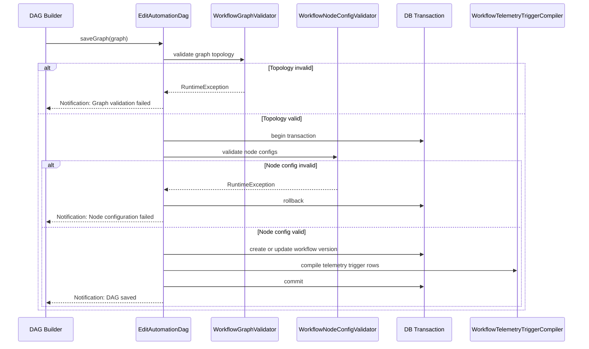

# Automation Module - Save, Validation, and Trigger Compilation

## Save DAG Lifecycle

When `Save DAG` is clicked, the server executes a deterministic transaction-driven pipeline.

## Validation Layers

Two independent validation layers run on save.

### 1) Topology Validation

Performed by `WorkflowGraphValidator`.

Rules:

- Every node must have non-empty string `id`.
- Graph must include at least one node.
- Graph must include at least one trigger node (`telemetry-trigger` or `schedule-trigger`).
- Every edge must have string `source` and `target`.
- Every edge must reference existing nodes.
- Graph must be acyclic.

### 2) Node Configuration Validation

Performed by `WorkflowNodeConfigValidator`.

Rules by node type:

| Node Type | Required Rules |
|-----------|----------------|
| `telemetry-trigger` | Mode must be `event`; source device/topic/parameter IDs required; must resolve to valid org-scoped publish topic and active parameter |
| `condition` | Mode must be `guided` or `json_logic`; `json_logic` must be single-root object; guided mode requires valid operator and numeric threshold |
| `command` | Target device/topic required; topic must be valid subscribe topic for target device schema; payload must pass `CommandPayloadResolver` validation |

## Version Persistence Behavior

Workflow version behavior during save:

- If no active/editable version exists: create next numeric version.
- If version exists: update existing version `graph_json` and checksum.
- `graph_checksum` is SHA-256 of normalized graph payload.
- Workflow `updated_by` is set from current auth user.

## Trigger Compilation

After successful validation, `WorkflowTelemetryTriggerCompiler` rebuilds telemetry trigger rows for the saved version.

Compile strategy:

1. Delete existing compiled rows for the version.
2. Scan graph nodes for `telemetry-trigger` nodes.
3. Extract source tuple (`device_id`, `topic_id`, `parameter_definition_id`).
4. Resolve and verify organization-scoped device/topic/parameter.
5. Write `automation_telemetry_triggers` rows.
6. De-duplicate by `device_id + schema_version_topic_id`.

This creates a fast lookup index for runtime trigger matching.

## Why Compile Instead of Reading Full Graph at Runtime

Compiled trigger rows reduce runtime work:

- Runtime matcher does indexed table scans by organization/device/topic.
- No need to load full graph for every telemetry message.
- Keeps trigger detection cost stable as graph complexity grows.

## Failure Modes and User Feedback

| Failure Point | User Feedback |
|---------------|---------------|
| Invalid node IDs/edges/cycle | `Graph validation failed` notification |
| Invalid node config | `Node configuration failed` notification |
| Graph JSON encode failure | `Unable to encode graph JSON` notification |
| Success | `DAG saved` notification |

## Data Integrity Guarantees

Save pipeline integrity protections:

- Uses DB transaction around validation+version write+compile.
- Compiled trigger rows cannot drift from saved graph for the same version inside a committed transaction.
- Organization-scoped validation prevents cross-tenant device/topic references.
