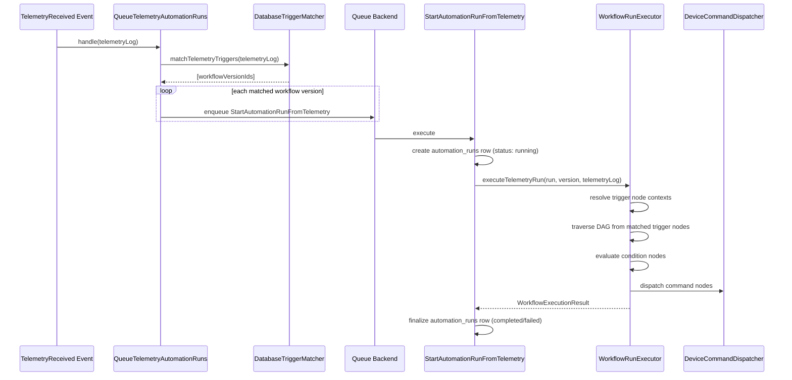
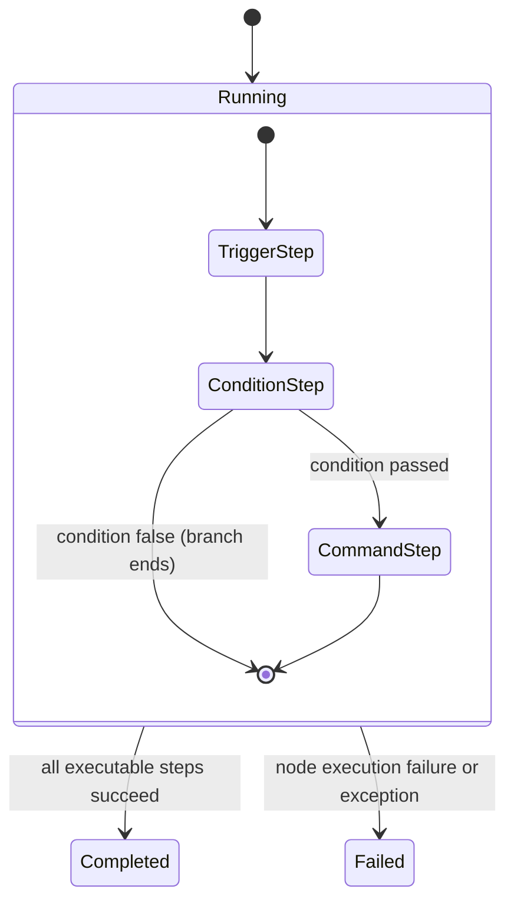

# Automation Module - Runtime Trigger Matching and Execution

## Runtime Entry Event

Runtime begins when telemetry is persisted and `TelemetryReceived` is emitted.

Event sources currently include:

- Ingestion pipeline persistence service.
- Telemetry recorder service.

`AppServiceProvider` listens for this event and routes it to `QueueTelemetryAutomationRuns`.

## Runtime Sequence

## Trigger Matching Details

`DatabaseTriggerMatcher` filters compiled trigger rows by:

- `organization_id` (from telemetry device)
- `device_id` (exact or null wildcard)
- `device_type_id` (exact or null wildcard)
- `schema_version_topic_id` (exact or null wildcard)

Then optional `filter_expression` JSON logic is evaluated against telemetry transformed payload.

Output is a unique list of `workflow_version_id` values.

## Queueing and Correlation

For each matched version, listener dispatches `StartAutomationRunFromTelemetry` with:

- `workflowVersionId`
- `telemetryLogId`
- `eventCorrelationId`

The job then generates a run-scoped `runCorrelationId` and creates the run record.

## Run Creation

A new `automation_runs` row is created with:

- organization/workflow/workflow version references
- trigger type `telemetry`
- trigger payload including telemetry context and correlation IDs
- status `running`
- `started_at` timestamp

## Execution Semantics

`WorkflowRunExecutor` loads graph JSON and executes as follows:

1. Build node and edge indexes.
2. Resolve trigger contexts by matching configured trigger source to telemetry log context.
3. Record trigger step(s).
4. Traverse outgoing edges depth-first.
5. Execute supported node types:
   - `condition`
   - `command`
   - unsupported types are recorded as `skipped`.
6. Persist run step rows for every executed/skipped node.
7. Return overall run status and summary.

### Condition Node Behavior

- Requires `json_logic` config.
- Evaluates logic against context:
  - `trigger` object
  - raw payload merged into evaluation data
- Result is normalized to boolean.
- If false: branch stops (not a failure).
- If config invalid: step marked failed.

### Command Node Behavior

- Validates target device/topic from node config.
- Ensures target topic belongs to target device schema and is subscribe direction.
- Dispatches payload through `DeviceCommandDispatcher`.
- If dispatch fails: node step fails and run may fail.

## Run and Step Status Model

Step status values currently recorded in `automation_run_steps`:

- `completed`
- `failed`
- `skipped`

## Example: Voltage Threshold to RED Blink

Scenario:

1. Telemetry trigger watches `voltage` parameter from energy meter topic.
2. Condition evaluates `trigger.value > 240`.
3. Command sends payload to RGB strip command topic.

Expected runtime outcomes:

- Voltage above threshold:
  - run status `completed`
  - steps include trigger, condition, command
- Voltage below threshold:
  - run status `completed`
  - steps include trigger, condition
  - no command step

## Current Runtime Scope

Currently executable node types:

- `telemetry-trigger` (entry selection)
- `condition`
- `command`

Not yet runtime-executed in this phase:

- `schedule-trigger`
- `delay`
- `alert`
