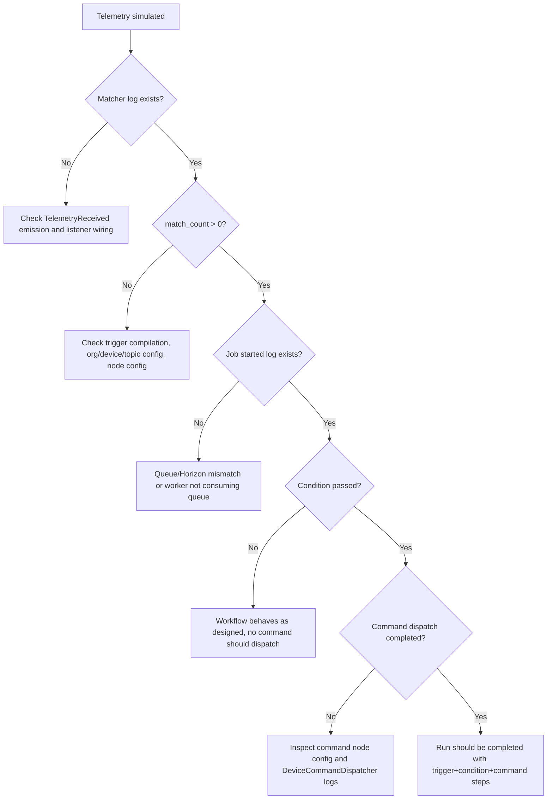

# Automation Module - Observability and Troubleshooting

## Logging Strategy

Automation runtime uses a dedicated log channel:

- Channel: `automation_pipeline`
- File: `storage/logs/automation-pipeline-YYYY-MM-DD.log`
- Config source: `config/logging.php` and `config/automation.php`

This isolates automation diagnostics from general app/device-control logs.

## Correlation Identifiers

Two correlation IDs are emitted for traceability:

| Correlation ID | Scope | Generated By |
|----------------|-------|--------------|
| `event_correlation_id` | One telemetry event through matching and job dispatch | `QueueTelemetryAutomationRuns` |
| `run_correlation_id` | One automation run execution lifecycle | `StartAutomationRunFromTelemetry` |

Additional step correlation:

- `step_correlation_id` derived from run correlation + step sequence + node id.

## Log Stage Catalog

### Trigger Matching Stage

Logger source:

- `DatabaseTriggerMatcher`
- `QueueTelemetryAutomationRuns`

Key fields:

- telemetry log id
- organization/device/topic context
- candidate trigger count
- matched workflow version ids
- queue connection + queue name

### Run Lifecycle Stage

Logger source:

- `StartAutomationRunFromTelemetry`

Key events:

- job started
- run record created
- run finished
- aborted due to missing entities
- exception failure

### Node Execution Stage

Logger source:

- `WorkflowRunExecutor`

Key events:

- execution started/finished
- condition evaluated (pass/fail)
- command dispatching/completed
- per-step recorded with duration and status

## First-Line Debugging Checklist

1. Confirm telemetry event is being persisted.
2. Confirm automation matcher logs appear.
3. Confirm workflows are matched.
4. Confirm queue dispatch logs appear.
5. Confirm job start logs appear.
6. Confirm condition evaluation logs.
7. Confirm command dispatch logs.
8. Confirm run finish status and step count.

## Troubleshooting Decision Flow

## Common Production-Like Issues

### 1) Jobs are queued but never processed

Symptoms:

- Listener logs show matched workflows and queueing.
- No `Automation run job started` logs.

Likely cause:

- Automation queue connection differs from what Horizon workers consume.

Fix approach:

- Set automation queue connection and queue to a Horizon-consumed queue.
- Clear config cache and restart Horizon.

### 2) `match_count` is zero

Symptoms:

- Telemetry arrives but no workflow is selected.

Likely causes:

- Trigger rows not compiled (graph was not saved successfully).
- Source device/topic in node config does not match incoming telemetry log.
- Organization scoping mismatch.

### 3) Run exists but no command step

Symptoms:

- Run completed with trigger + condition only.

Likely cause:

- Condition evaluated false, branch ended by design.

### 4) Command step failed

Symptoms:

- Run failed or step status failed with command reason.

Likely causes:

- Invalid target device/topic at runtime.
- Command dispatch failure in device control layer.

## Data Inspection Points

Useful records to inspect during debugging:

- `automation_telemetry_triggers`: compiled trigger rows.
- `automation_runs`: run-level status and correlation context.
- `automation_run_steps`: per-node execution snapshots and durations.
- `device_command_logs`: downstream command delivery status.

## Operational Logging Recommendation

For active debugging:

- Keep `AUTOMATION_LOG_LEVEL=debug`.

For stable production:

- Usually `info` is enough, with temporary escalation to `debug` during incidents.
