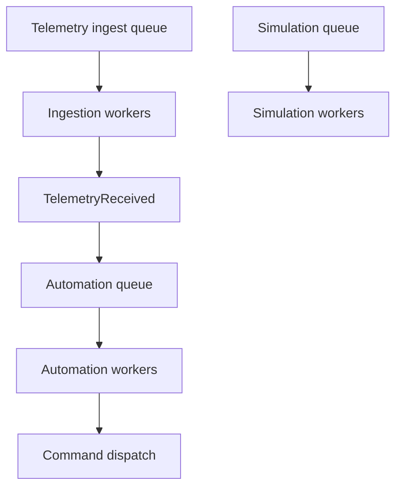

# Automation Module - Operations and Performance

## Queue and Worker Topology

Automation runtime is queue-backed and should run on workers supervised by Horizon.

Configuration entry points:

- `config/automation.php`
- `config/horizon.php`
- environment variables in `.env`

Recommended baseline:

| Setting | Recommended Value |
|---------|-------------------|
| `AUTOMATION_PIPELINE_ENABLED` | `true` |
| `AUTOMATION_PIPELINE_QUEUE_CONNECTION` | `redis` |
| `AUTOMATION_PIPELINE_QUEUE` | `default` (or dedicated automation queue) |
| `AUTOMATION_PIPELINE_LOG_CHANNEL` | `automation_pipeline` |

## Why Queue Alignment Matters

Automation jobs are dispatched to the queue configured in `config/automation.php`.

If workers consume a different backend, jobs will accumulate unprocessed.

Typical mismatch example:

- Queue dispatches to `database`.
- Horizon workers consume only Redis queues.

Result:

- Trigger matching logs appear.
- Run job start logs do not appear.

## Suggested Horizon Strategy

As automations grow, split workers by workload profile.

Example strategy:

- `ingestion` queue workers: telemetry normalization/persistence.
- `automation` queue workers: workflow execution.
- `simulations` queue workers: synthetic load/testing.

This prevents telemetry ingestion spikes from starving automation execution.

## Scaling Levers

### 1) Trigger Match Efficiency

- Use compiled trigger table (`automation_telemetry_triggers`) as the first-stage filter.
- Ensure DB indexes remain healthy for organization/device/topic predicates.

### 2) Queue Throughput

- Increase Horizon process count for automation queue.
- Use queue balancing to adapt to traffic bursts.
- Keep queue latency metrics visible in Horizon dashboards.

### 3) Execution Cost Control

- Keep condition logic lightweight.
- Avoid oversized command payload transformations in runtime path.
- Keep run-step snapshots bounded and focused.

### 4) Failure Isolation

- Isolate automation workers from critical ingestion workers.
- Use queue-level retry and timeout settings tuned for automation tasks.

## Recommended Capacity Evolution

### Stage A - Current

- Shared `default` Redis queue.
- Modest worker counts.
- Correlation logging enabled.

### Stage B - Medium Scale

- Dedicated `automation` queue.
- Dedicated supervisor in Horizon.
- Queue wait and throughput alerting.

### Stage C - Large Scale

- Tenant-aware queue partitioning where needed.
- Additional runtime optimizations for graph loading and caching.
- Backpressure controls on simulation and non-critical pipelines.

## Technology Direction: Fibers vs Queue Workers

For this pipeline, queue workers remain the practical default.

Reasoning:

- Work is naturally event/queue driven.
- Queue workers provide horizontal scaling and failure isolation.
- Existing Laravel + Horizon operational model already fits the workload.

PHP fibers can be useful for specific in-process concurrency patterns, but they do not replace the need for durable queue-backed execution in this automation architecture.

## Reliability Checklist

- Queue backend and Horizon workers are aligned.
- `AUTOMATION_PIPELINE_ENABLED=true` in active environments.
- Correlation logs are enabled and searchable.
- Failed jobs monitoring is active.
- Replay strategy is defined for missed telemetry windows.

## Deployment Checklist

1. Confirm `.env` automation queue settings.
2. Clear config cache after env changes.
3. Restart Horizon.
4. Trigger one test telemetry event.
5. Verify full log chain and run-step persistence.
