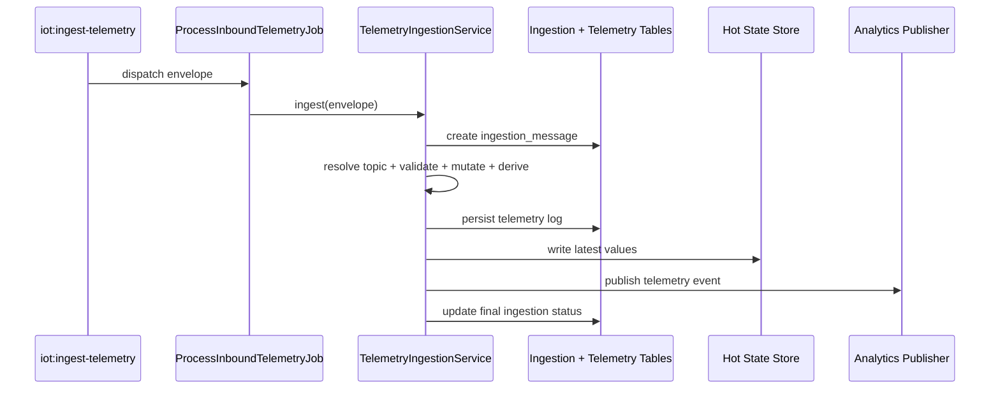

# Data Ingestion Module - Overview

## What This Module Does

The Data Ingestion module is the staged telemetry processing pipeline.

It consumes inbound telemetry and performs:

1. Deduplication.
2. Topic/device resolution.
3. Validation against schema parameters.
4. Mutation and derivation.
5. Persistence to telemetry logs.
6. Hot-state and analytics publishing.

The pipeline is queue-driven and records stage-by-stage diagnostics.

## Core Concepts

| Concept | Description |
|--------|-------------|
| Ingestion Envelope | `IncomingTelemetryEnvelope` transport DTO |
| Ingestion Message | Durable pipeline record (`ingestion_messages`) |
| Stage Log | Per-stage diagnostics (`ingestion_stage_logs`) |
| Status | Pipeline terminal/intermediate status (`IngestionStatus`) |
| Stage | Pipeline phase (`Ingress`, `Validate`, `Mutate`, `Derive`, `Persist`, `Publish`) |
| Topic Resolver | Maps MQTT topic to concrete device + publish topic contract |

## End-to-End Pipeline

## Feature-Gated Runtime

Pipeline execution depends on Pennant features defined in `FeatureServiceProvider`:

- `ingestion.pipeline.enabled`
- `ingestion.pipeline.driver`
- `ingestion.pipeline.publish_analytics`

If disabled or non-`laravel` driver is selected, ingestion short-circuits.

## Key Source Areas

- Domain:
  - `app/Domain/DataIngestion/DTO/`
  - `app/Domain/DataIngestion/Enums/`
  - `app/Domain/DataIngestion/Models/`
  - `app/Domain/DataIngestion/Services/`
  - `app/Domain/DataIngestion/Jobs/`
- Listener command: `app/Console/Commands/IoT/IngestTelemetryCommand.php`
- Feature definitions: `app/Providers/FeatureServiceProvider.php`
- Config: `config/ingestion.php`

## Documentation Map

- [02 - Architecture](02-architecture.md)
