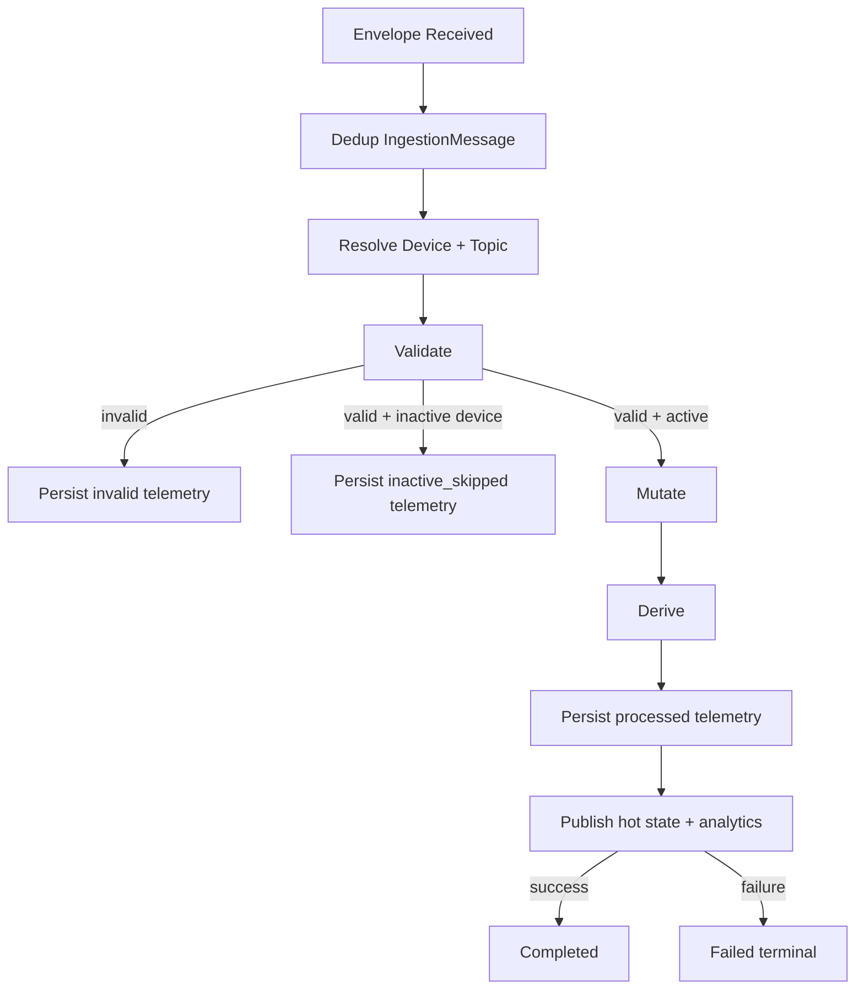
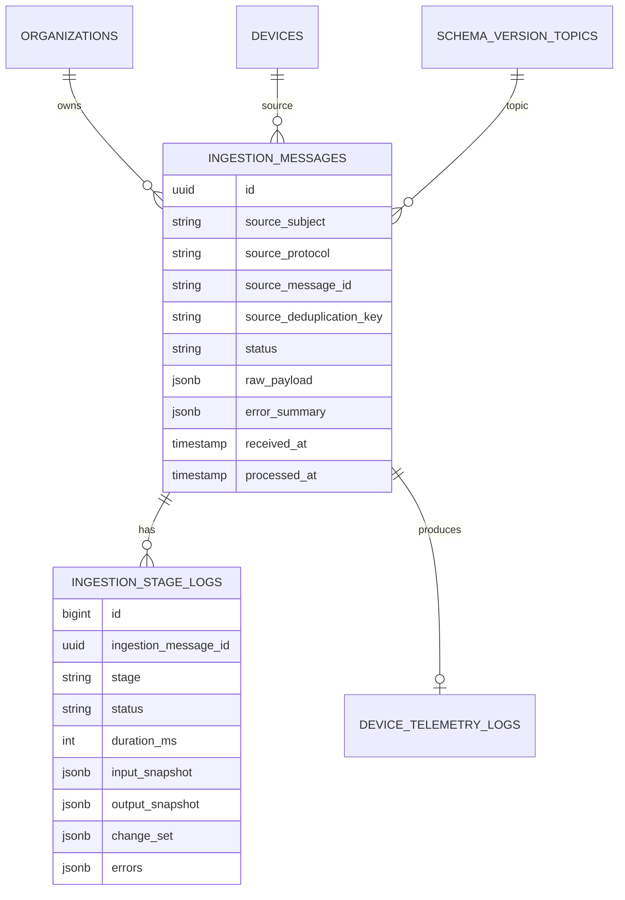

# Data Ingestion Module - Architecture

## Architectural Model

The ingestion pipeline is a staged orchestrator with explicit stage logging.

## Component Responsibilities

| Component | Responsibility |
|-----------|----------------|
| `IngestTelemetryCommand` | NATS subscriber; filters subjects; dispatches queue job |
| `ProcessInboundTelemetryJob` | Queue entry point that reconstructs envelope DTO |
| `TelemetryIngestionService` | Full orchestration and stage transitions |
| `DeviceTelemetryTopicResolver` | Topic registry with TTL refresh |
| `TelemetryValidationService` | Parameter extraction + validation error classification |
| `TelemetryMutationService` | Field mutation pass |
| `TelemetryDerivationService` | Derived metric evaluation with dependency order |
| `TelemetryPersistenceService` | Writes `DeviceTelemetryLog`, marks presence online, emits `TelemetryReceived` |
| `NatsKvHotStateStore` | Writes processed values into NATS KV hot-state bucket |
| `TelemetryAnalyticsPublishService` | Conditional analytics publish based on feature/config |

## Data Model

## Status and Stage Semantics

### `IngestionStatus`

- `queued`
- `processing`
- `completed`
- `failed_validation`
- `inactive_skipped`
- `failed_terminal`
- `duplicate`

### `IngestionStage`

- `ingress`
- `validate`
- `mutate`
- `derive`
- `persist`
- `publish`

## Deduplication Strategy

`IncomingTelemetryEnvelope::deduplicationKey()`:

- prefers source message id when present,
- otherwise hashes subject + payload + received timestamp.

The dedup key is unique in `ingestion_messages`. Existing rows become `duplicate` status.

## Publish Stage Failure Handling

Hot-state and analytics publish are isolated in try/catch blocks.

If either fails:

- telemetry log `processing_state` is set to `publish_failed`,
- publish stage log is written with errors,
- ingestion message becomes `failed_terminal`.

This preserves persisted telemetry while exposing post-persist failure visibility.

## Configuration Surface

`config/ingestion.php` controls:

- feature defaults (`enabled`, `driver`, `publish_analytics`),
- queue connection and queue name,
- resolver registry TTL,
- stage snapshot capture,
- NATS host/port/subject and analytics prefixes.

## Operational Notes

- Listener ignores internal NATS subjects (`$JS.`, `$KV.`, `_INBOX.`, `_REQS.`) and analytics/invalid subjects to avoid loops.
- Redis queue with `phpredis` requires extension availability; command warns when missing.
- Stage logs are suitable for post-incident replay analysis and performance profiling.
