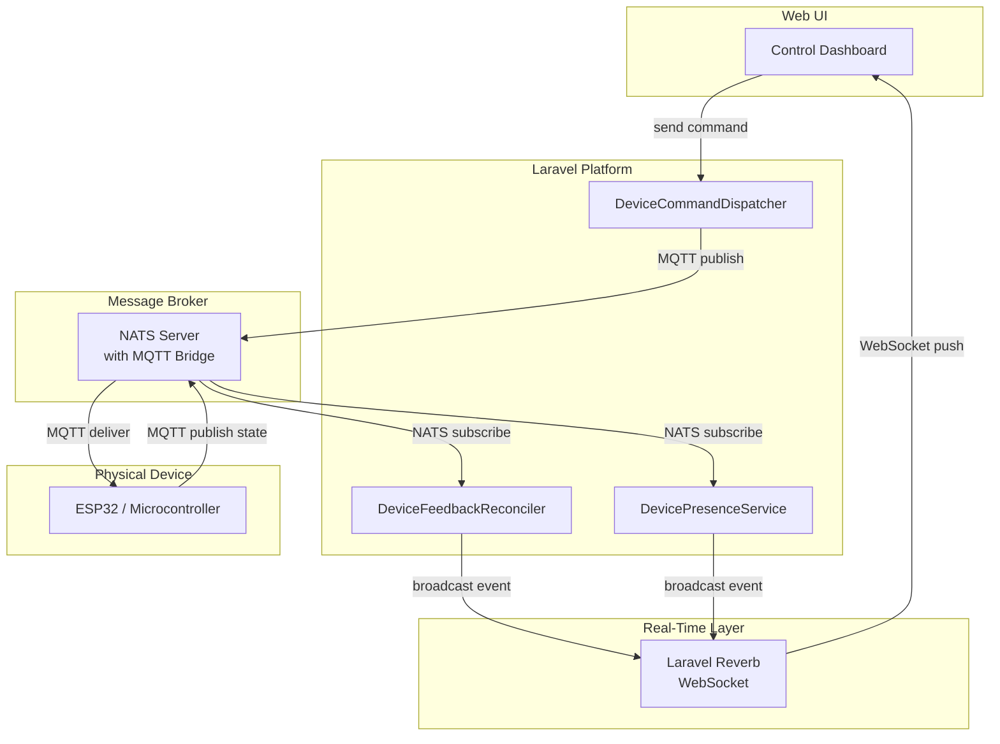

# Device Control Module — Overview

## What Is This Module?

The Device Control module is the system that allows the IoT portal to **send commands to physical devices** (like an RGB LED strip or a water pump) and **track what happens next** — did the device receive the command? Did it actually change its state? Is it even online?

Think of it as a two-way conversation between the web platform and a microcontroller sitting on someone's desk:

1. **Platform → Device**: "Turn the LED green at 50% brightness"
2. **Device → Platform**: "OK, I'm now green at 50% brightness"

This module handles every step of that conversation — building the command, delivering it over MQTT, listening for the device's response, matching it back to the original command, and updating the UI in real time.

## Key Concepts

### Commands

A **command** is a JSON payload sent from the platform to a device on a specific MQTT topic. For example:

```
Topic:   devices/rgb-led-01/control
Payload: {"color": {"r": 0, "g": 255, "b": 0}, "brightness": 50}
```

Every command goes through a defined lifecycle tracked by a `DeviceCommandLog` record in the database.

### Topics

Devices communicate over **MQTT topics** — structured paths that act like addresses. Each device has a schema that defines:

- **Subscribe topics** (commands the device listens to): e.g., `devices/{id}/control`
- **Publish topics** (data the device sends back): e.g., `devices/{id}/state`

These are defined per-schema, not hardcoded. Different device types can have entirely different topic structures.

### Desired State vs. Actual State

When a command is sent, the platform records what it **wants** the device to look like (`DeviceDesiredTopicState`). When the device responds, the system compares and **reconciles** the desired state with the actual reported state.

### Connection State

Devices are either **online** or **offline**. The module tracks this through MQTT Last Will and Testament (LWT) messages and a periodic heartbeat health check.

## How It All Fits Together



## Module Boundaries

The Device Control module spans two Laravel domain folders:

| Domain | What It Contains |
|--------|-----------------|
| `app/Domain/DeviceControl/` | Command lifecycle — dispatching, reconciliation, payload resolution, status tracking |
| `app/Domain/DeviceManagement/` | Device models, MQTT/NATS publishing infrastructure, presence tracking |

Supporting layers:

| Layer | Location |
|-------|----------|
| Artisan Commands | `app/Console/Commands/IoT/` |
| Broadcast Events | `app/Events/` |
| Filament UI | `app/Filament/Admin/Resources/DeviceManagement/Devices/` |
| Blade Views | `resources/views/filament/admin/resources/device-management/devices/` |
| Configuration | `config/iot.php` |

## Technology Stack

| Component | Technology | Role |
|-----------|-----------|------|
| Message broker | NATS 2.11 with JetStream | Handles all MQTT traffic; bridges MQTT ↔ NATS subjects |
| Device protocol | MQTT v3.1.1 (QoS 1) | Reliable message delivery to/from microcontrollers |
| Real-time UI | Laravel Reverb (WebSocket) | Pushes command status updates and device state to the browser |
| State storage | NATS KV (`device-states` bucket) | Stores last-known device state per topic for fast reads |
| UI framework | Filament v5 + Livewire + Alpine.js | Renders the control dashboard with live-updating widgets |
| Scheduling | Laravel Scheduler | Runs `iot:expire-stale-commands` and `iot:check-device-health` every minute |

## What's in the Rest of the Documentation

| Document | What You'll Learn |
|----------|------------------|
| [02 — Architecture](02-architecture.md) | Detailed class map, layer responsibilities, dependency flow |
| [03 — Command Lifecycle](03-command-lifecycle.md) | Pending → Sent → Acknowledged → Completed/Failed/Timeout |
| [04 — MQTT Publishing](04-mqtt-publishing.md) | How commands reach devices via the NATS MQTT bridge |
| [05 — Feedback & Reconciliation](05-feedback-reconciliation.md) | How device responses are matched back to commands |
| [06 — Presence Tracking](06-presence-tracking.md) | Online/offline detection via LWT and heartbeat checks |
| [07 — Artisan Commands](07-artisan-commands.md) | All IoT CLI commands — listeners, health checks, simulators |
| [08 — Real-Time Events & UI](08-realtime-events-and-ui.md) | Broadcast events, WebSocket channels, and the control dashboard |
