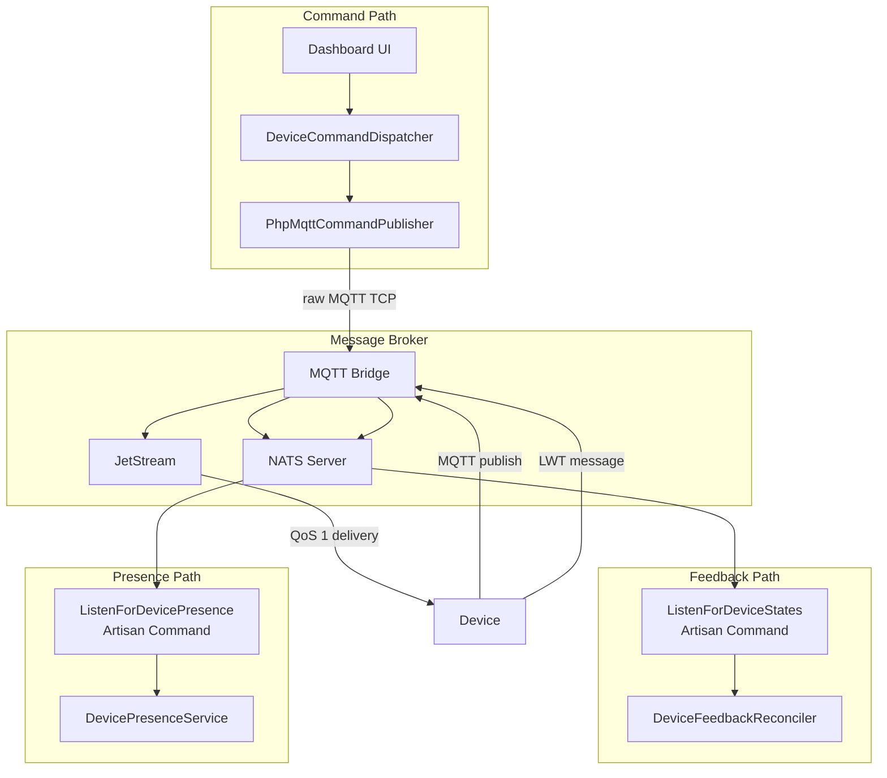
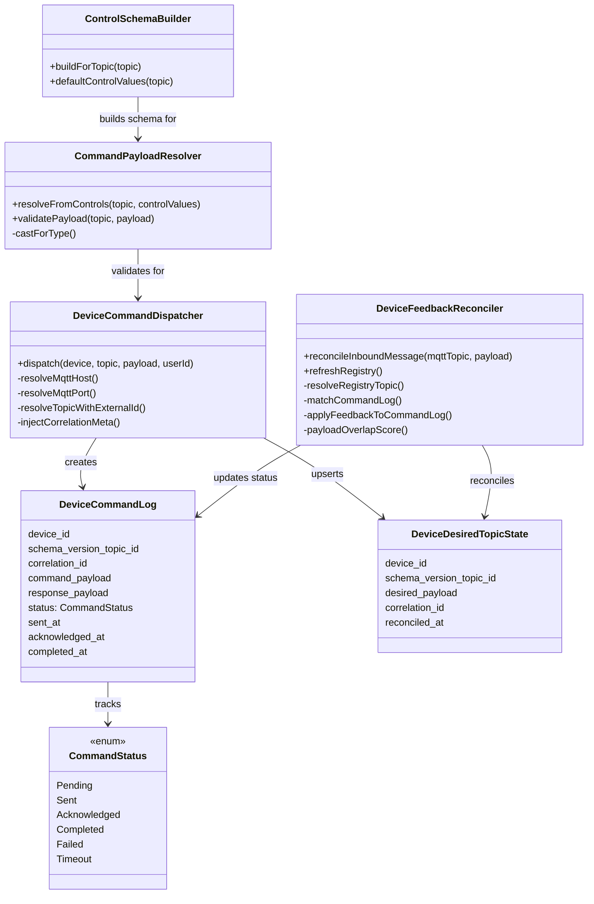
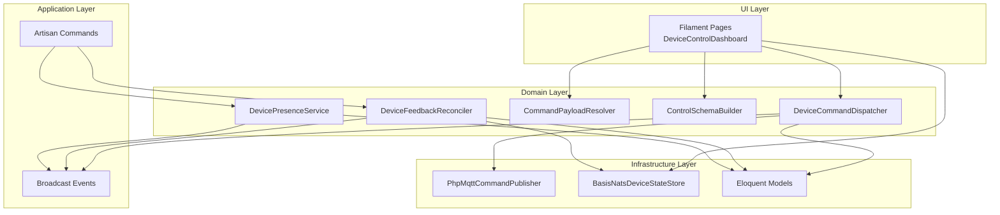

# Device Control Module — Architecture

## High-Level Architecture

The module follows a **command–feedback** pattern across three data paths that all converge through NATS:

## Class Responsibilities

### Domain: DeviceControl

These classes own the **command lifecycle** — from the moment a user clicks "Send Command" to the moment the device's response is reconciled.

| Class | File | Role |
|-------|------|------|
| `DeviceCommandDispatcher` | `Services/DeviceCommandDispatcher.php` | Orchestrates the entire outbound command flow: creates a log, publishes via MQTT, broadcasts lifecycle events |
| `DeviceFeedbackReconciler` | `Services/DeviceFeedbackReconciler.php` | Processes inbound device messages: matches them to pending commands, updates statuses, stores state in NATS KV |
| `CommandPayloadResolver` | `Services/CommandPayloadResolver.php` | Converts UI control widget values into structured payloads; validates against parameter definitions |
| `ControlSchemaBuilder` | `Services/ControlSchemaBuilder.php` | Reads a topic's parameter definitions and generates a UI control schema (sliders, toggles, selects, etc.) |
| `DeviceCommandLog` | `Models/DeviceCommandLog.php` | Eloquent model tracking every command sent — payload, status transitions, response, timestamps |
| `DeviceDesiredTopicState` | `Models/DeviceDesiredTopicState.php` | Tracks the last desired payload per device + topic, marked as reconciled when device confirms |
| `DeviceDesiredState` | `Models/DeviceDesiredState.php` | Tracks overall desired state per device (higher-level aggregate) |
| `CommandStatus` | `Enums/CommandStatus.php` | The six possible states: Pending, Sent, Acknowledged, Completed, Failed, Timeout |

### Domain: DeviceManagement

These classes own the **infrastructure** — how messages physically reach devices and how presence is tracked.

| Class | File | Role |
|-------|------|------|
| `PhpMqttCommandPublisher` | `Publishing/Mqtt/PhpMqttCommandPublisher.php` | Raw TCP MQTT v3.1.1 client that sends CONNECT→PUBLISH→DISCONNECT through NATS's MQTT bridge |
| `MqttCommandPublisher` | `Publishing/Mqtt/MqttCommandPublisher.php` | Interface for MQTT publishing (allows swapping implementations or mocking in tests) |
| `BasisNatsDeviceStateStore` | `Publishing/Nats/BasisNatsDeviceStateStore.php` | Stores and retrieves per-topic device state from a NATS KV bucket (`device-states`) |
| `NatsDeviceStateStore` | `Publishing/Nats/NatsDeviceStateStore.php` | Interface for the state store |
| `DevicePresenceService` | `Services/DevicePresenceService.php` | Updates device `connection_state` and broadcasts `DeviceConnectionChanged` events |
| `Device` | `Models/Device.php` | Core model — relationships to DeviceType, SchemaVersion, CommandLogs, DesiredStates |
| `DeviceType` | `Models/DeviceType.php` | Defines protocol config (MQTT broker host, port, base topic) |
| `MqttProtocolConfig` | `ValueObjects/Protocol/MqttProtocolConfig.php` | Immutable value object holding MQTT connection parameters |

### Artisan Commands

Long-running NATS subscriber processes and scheduled maintenance tasks:

| Command | Class | Run Mode |
|---------|-------|----------|
| `iot:listen-for-device-states` | `ListenForDeviceStates` | Long-running process (supervisor) |
| `iot:listen-for-device-presence` | `ListenForDevicePresence` | Long-running process (supervisor) |
| `iot:expire-stale-commands` | `ExpireStaleCommands` | Scheduled every minute |
| `iot:check-device-health` | `CheckDeviceHealth` | Scheduled every minute |
| `iot:mock-device` | `MockDeviceCommand` | Development tool — simulates a device |
| `iot:simulate` | `SimulateDeviceCommand` | Development tool — generates random telemetry |
| `iot:manual-publish` | `ManualDevicePublishCommand` | Development tool — interactive CLI publisher |

### Broadcast Events

All events implement `ShouldBroadcastNow` and are pushed to the browser via Laravel Reverb:

| Event | Channel | Trigger |
|-------|---------|---------|
| `CommandDispatched` | `device-control.{uuid}` | Command log created, before MQTT publish |
| `CommandSent` | `device-control.{uuid}` | MQTT PUBACK received from broker |
| `CommandCompleted` | `device-control.{uuid}` | Device feedback matched and reconciled |
| `CommandTimedOut` | `device-control.{uuid}` | Stale command expired by scheduler |
| `DeviceStateReceived` | `device-control.{uuid}` | Any inbound device state message |
| `DeviceConnectionChanged` | `devices` + `device-control.{uuid}` | Device goes online or offline |

## Dependency Flow

The module follows a strict dependency direction — higher layers depend on lower layers, never the reverse:

Key design decisions:

- **Interface-driven infrastructure**: `MqttCommandPublisher` and `NatsDeviceStateStore` are interfaces bound in the service container. Tests inject fakes; production uses the real implementations.
- **No direct DB facade usage**: All database interaction goes through Eloquent models and relationships.
- **Event-driven UI updates**: The domain layer never touches the UI directly. It broadcasts events, and the Filament/Livewire/Alpine.js layers listen to those events via WebSocket.

## Configuration Reference

All module settings live in `config/iot.php`:

| Key | Default | Purpose |
|-----|---------|---------|
| `nats.host` | `127.0.0.1` | NATS server address for subscriber commands |
| `nats.port` | `4223` | NATS client port |
| `mqtt.host` | `127.0.0.1` | MQTT broker address for command publishing |
| `mqtt.port` | `1883` | MQTT broker port |
| `device_control.inject_meta_command_id` | `true` | Whether to inject `_meta.command_id` into command payloads |
| `device_control.command_timeout_seconds` | `120` | Seconds before a pending command is marked as Timeout |
| `presence.subject_prefix` | `devices` | NATS subject prefix for presence messages |
| `presence.subject_suffix` | `presence` | NATS subject suffix for presence messages |
| `presence.heartbeat_timeout_seconds` | `300` | Seconds of silence before a device is marked offline |
