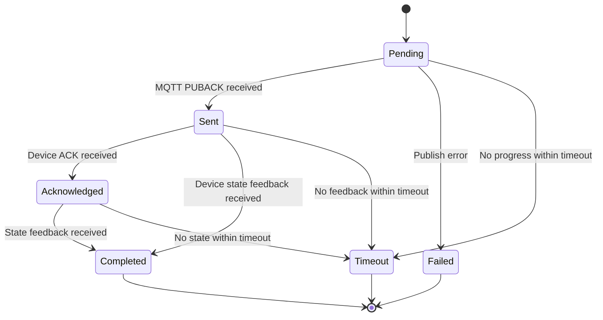
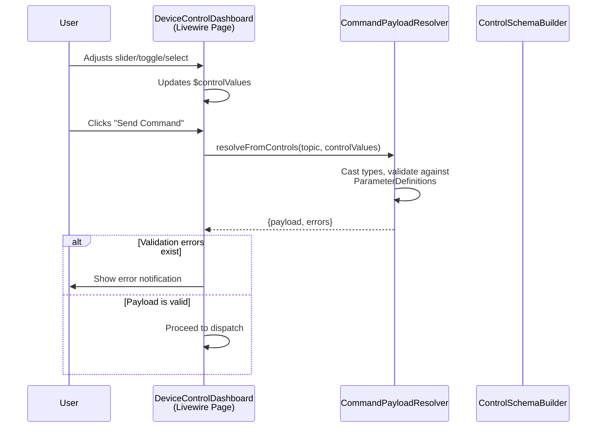
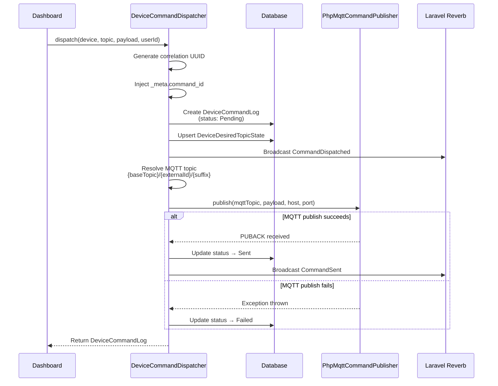
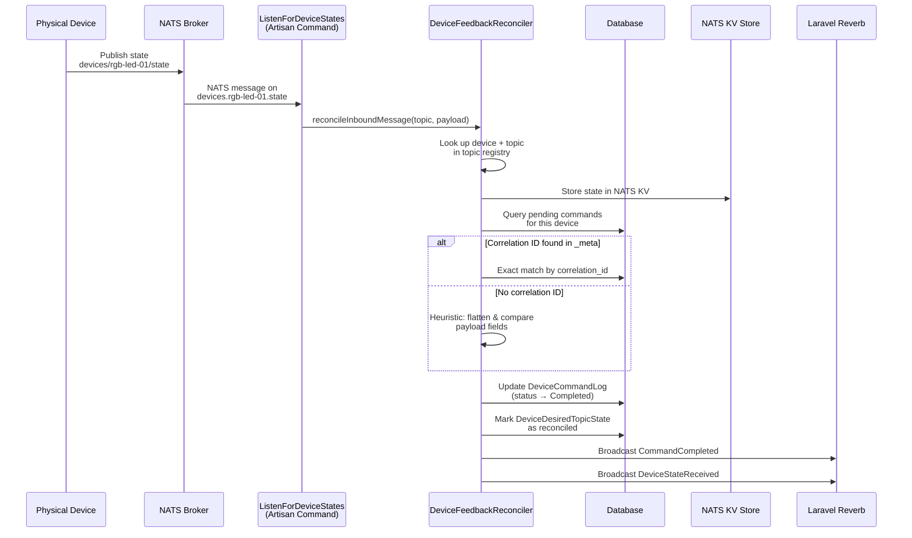
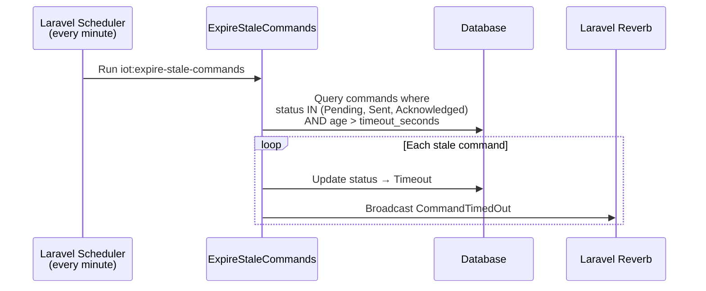
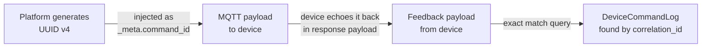

# Device Control Module — Command Lifecycle

## The Six States

Every command sent to a device goes through a tracked lifecycle. The `CommandStatus` enum defines six possible states:

| State | Meaning | What Triggered It |
|-------|---------|-------------------|
| **Pending** | Command log created, MQTT publish not yet attempted | `DeviceCommandDispatcher` creates the `DeviceCommandLog` record |
| **Sent** | MQTT broker acknowledged receipt (PUBACK) | The NATS MQTT bridge stored the message in JetStream for QoS 1 delivery |
| **Acknowledged** | Device sent an explicit ACK response | The device published to an ACK-purpose topic linked to the command topic |
| **Completed** | Device confirmed its actual state matches | The device published to a state-purpose topic, and reconciliation matched the command |
| **Failed** | MQTT publish threw an exception | TCP connection failed, timeout during protocol exchange, or broker refused |
| **Timeout** | No response within the configured timeout | The `iot:expire-stale-commands` scheduler marked it as timed out |

## Step-By-Step: What Happens When You Press "Send Command"

### Phase 1 — Payload Preparation

Before the command is dispatched, the raw UI control values need to be resolved into a structured JSON payload. This is where `CommandPayloadResolver` takes over:

1. **Control values come from the UI**: The dashboard stores widget state in a `$controlValues` array keyed by parameter name (e.g., `['brightness' => 75, 'power' => true]`).
2. **Type casting**: The resolver casts values to the correct PHP type based on each `ParameterDefinition`'s data type — integers, floats, booleans, JSON objects, or strings.
3. **Validation**: Each value is checked against the parameter's validation rules (min/max range, required, allowed options).
4. **Payload assembly**: Values are placed at the correct JSON path using `ParameterDefinition::placeValue()`, supporting nested structures like `color.r`, `color.g`, `color.b`.

If the user has "Advanced JSON mode" enabled, the raw JSON string is decoded and validated directly against the topic's parameter definitions instead.

### Phase 2 — Command Dispatch

`DeviceCommandDispatcher` is the orchestrator. Here's what it does in order:

1. **Generate a correlation ID**: A UUID v4 string that uniquely identifies this command. It is injected into the payload as `_meta.command_id` so the device can echo it back, enabling precise matching.

2. **Create `DeviceCommandLog`**: A database record is created immediately with status `Pending`. This ensures the command is tracked even if the MQTT publish fails.

3. **Upsert `DeviceDesiredTopicState`**: The desired payload is stored per device + topic. If a previous desired state exists for the same device and topic, it is overwritten. The `reconciled_at` field is cleared to indicate this is an unreconciled desire.

4. **Broadcast `CommandDispatched`**: A real-time event is pushed to the browser via Reverb so the dashboard can show "Pending..." immediately.

5. **Resolve the MQTT topic**: The topic is built from three parts:
   - `baseTopic` from the device type's protocol config (e.g., `devices`)
   - `externalId` from the device (e.g., `rgb-led-01`)
   - `suffix` from the schema version topic (e.g., `control`)
   - Result: `devices/rgb-led-01/control`

6. **MQTT publish**: The `PhpMqttCommandPublisher` opens a TCP connection to the NATS MQTT bridge, performs the MQTT handshake (CONNECT → CONNACK → PUBLISH → PUBACK → DISCONNECT), and returns.

7. **Update status to Sent**: If the broker acknowledges the message (PUBACK), the log status is updated and `CommandSent` is broadcast.

8. **Handle failure**: If any step of the MQTT protocol fails, the log is marked `Failed` with the error message, and the exception is reported (but not re-thrown, so it doesn't crash the UI request).

### Phase 3 — Device Response & Reconciliation

This happens asynchronously — the device processes the command on its own time and publishes a response.

The reconciliation process is covered in detail in [05 — Feedback & Reconciliation](05-feedback-reconciliation.md).

### Phase 4 — Timeout Expiration

If a command never receives a response, the scheduler catches it:

The timeout threshold is configured via `iot.device_control.command_timeout_seconds` (default: 120 seconds). The scheduler uses `sent_at` if present, falling back to `created_at` for commands that failed before being sent.

## The Correlation ID

The correlation ID is the single most important piece of data for reliable command tracking. Here's how it flows:

When the device echoes back the `_meta.command_id` field in its response, the `DeviceFeedbackReconciler` can do a **direct database lookup** rather than relying on heuristic matching. This is the preferred path.

If the device does not echo the correlation ID (e.g., simpler firmware), the reconciler falls back to **payload overlap scoring** — comparing the command's payload fields against the feedback's payload fields to find the best match among recent pending commands.

## Database Models Summary

### DeviceCommandLog

The central audit trail. One row per command sent:

| Column | Type | Purpose |
|--------|------|---------|
| `device_id` | FK | Which device |
| `schema_version_topic_id` | FK | Which topic schema was used |
| `user_id` | FK (nullable) | Who sent it (null for system-initiated) |
| `command_payload` | JSON | The payload that was published |
| `response_payload` | JSON (nullable) | What the device sent back |
| `correlation_id` | String | UUID linking command to response |
| `status` | Enum | Current lifecycle state |
| `sent_at` | Timestamp | When PUBACK was received |
| `acknowledged_at` | Timestamp | When device ACK arrived |
| `completed_at` | Timestamp | When reconciliation finished |
| `error_message` | String (nullable) | Failure/timeout reason |

### DeviceDesiredTopicState

The "what we want the device to look like" record:

| Column | Type | Purpose |
|--------|------|---------|
| `device_id` | FK | Which device |
| `schema_version_topic_id` | FK | Which topic |
| `desired_payload` | JSON | The last payload we sent |
| `correlation_id` | String | Which command set this desired state |
| `reconciled_at` | Timestamp (nullable) | `null` = unreconciled; set when device confirms |
