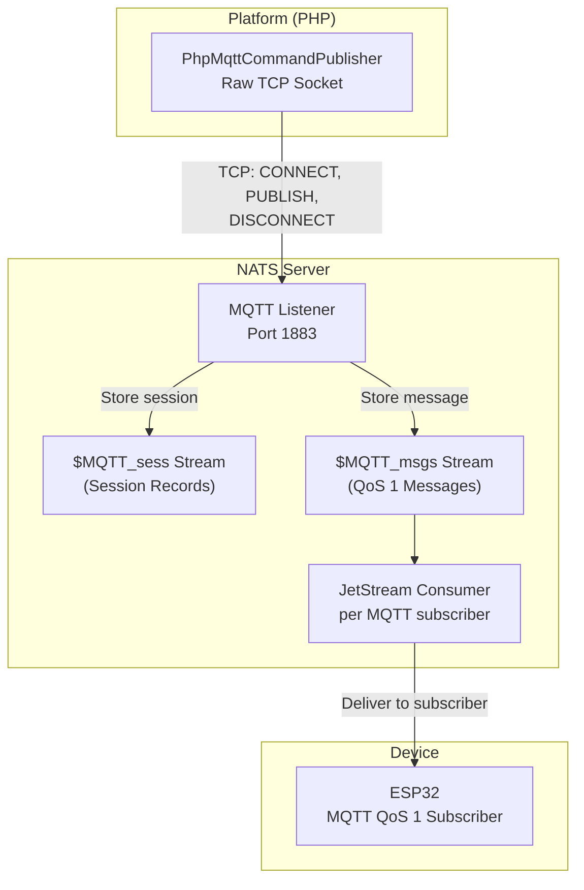
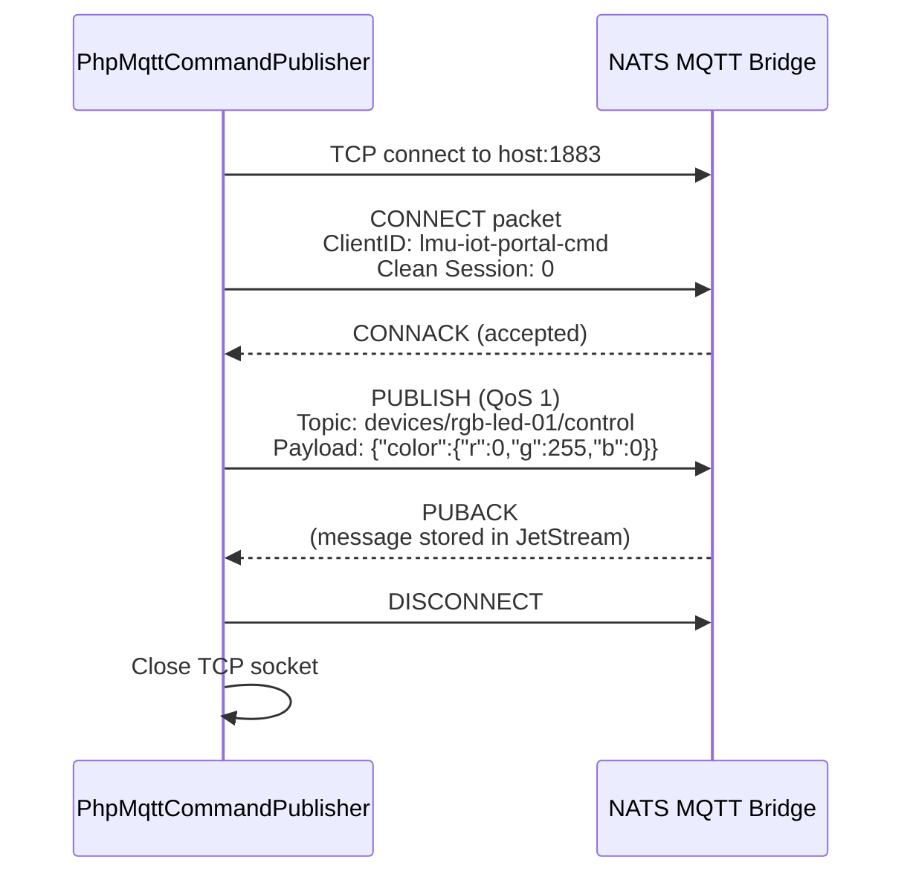
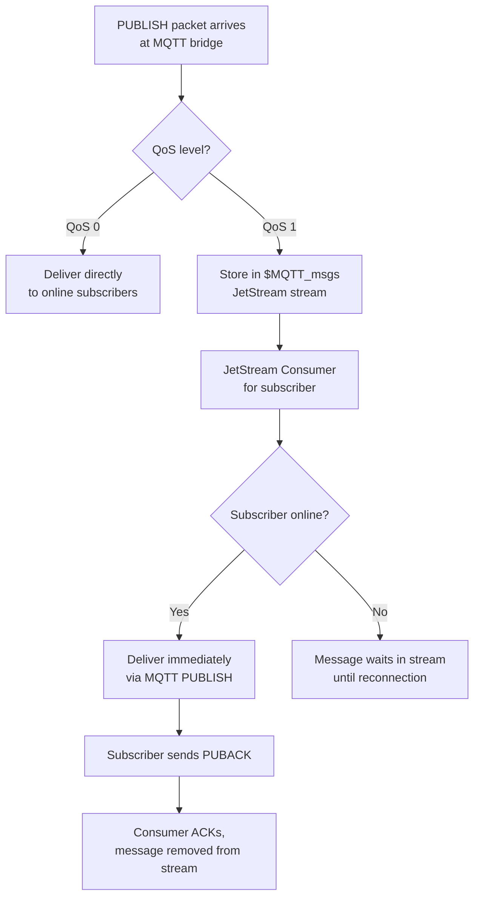

# Device Control Module — MQTT Publishing

## Why MQTT (Not Native NATS)?

The IoT devices in this system are microcontrollers (ESP32, Arduino, etc.) that speak **MQTT** — a lightweight publish/subscribe protocol designed for constrained hardware. They connect to the NATS server's built-in **MQTT bridge** on port 1883.

NATS provides subjects and topic-based messaging, and its MQTT bridge translates between the two protocols:

| MQTT Topic | NATS Subject |
|------------|-------------|
| `devices/rgb-led-01/control` | `devices.rgb-led.rgb-led-01.control` |
| `devices/rgb-led-01/state` | `devices.rgb-led.rgb-led-01.state` |

The critical distinction: devices that subscribe with **MQTT QoS 1** only receive messages that were published through the MQTT protocol path. Publishing to a plain NATS subject does not deliver to MQTT QoS 1 subscribers — the message must go through the NATS MQTT bridge's JetStream pipeline.



## The Publisher: PhpMqttCommandPublisher

`PhpMqttCommandPublisher` implements the `MqttCommandPublisher` interface and handles the raw MQTT v3.1.1 wire protocol over TCP. It lives at `app/Domain/DeviceManagement/Publishing/Mqtt/PhpMqttCommandPublisher.php`.

### Protocol Exchange

For every command, the publisher performs this exchange with the NATS MQTT bridge:



### Why Fixed Client ID + Persistent Session

The publisher uses a **fixed client ID** (`lmu-iot-portal-cmd`) with **clean_session=0** (persistent session). This is a deliberate design decision to prevent a serious data corruption issue.

**The problem with random client IDs + clean_session=1:**

When `clean_session=1` is set, the NATS MQTT bridge creates a new session record in the `$MQTT_sess` JetStream stream on CONNECT and deletes it on DISCONNECT. If every command uses a random client ID:

1. CONNECT → creates session record for `lmu-iot-cmd-a1b2c3d4`
2. DISCONNECT → deletes session record for `lmu-iot-cmd-a1b2c3d4`
3. CONNECT → creates session record for `lmu-iot-cmd-e5f6g7h8`
4. DISCONNECT → deletes session record for `lmu-iot-cmd-e5f6g7h8`
5. ... hundreds of create/delete cycles ...

This rapid churn on different JetStream subjects corrupts the `$MQTT_sess` stream, producing invalid JSON records. When the ESP32 (or any other device) reconnects, NATS tries to restore its session from this stream and fails with:

```
Unable to add JetStream consumer for subscription: invalid JSON: unexpected end of JSON input
```

The device connects but gets **zero subscriptions restored** — it cannot receive any commands.

**The fix with a fixed client ID + clean_session=0:**

- Only one session record exists for `lmu-iot-portal-cmd` in the stream
- Each connection updates the same record in place (no create/delete churn)
- Since the publisher never subscribes, the persistent session has zero overhead
- The `$MQTT_sess` stream remains healthy

### Serialize Command Publishes

Because a fixed client ID is required for session stability, concurrent command publishes would compete for the same MQTT session (brokers allow only one active connection per client ID). To prevent overlapping CONNECT/PUBLISH flows from disconnecting each other, `PhpMqttCommandPublisher` serializes publishes with a lightweight file lock.

- Each `publish()` acquires an exclusive lock in the OS temp directory
- The MQTT publish handshake runs while the lock is held
- The lock is released immediately after disconnect

This keeps the session stable without sacrificing the fixed client ID that protects JetStream’s `$MQTT_sess` stream from corruption.

### QoS 1 — At Least Once Delivery

The publisher uses QoS 1, meaning:

- The publish packet includes a **message ID** (packet identifier)
- The broker responds with a **PUBACK** containing the same message ID
- If PUBACK is not received, the message should be retransmitted (the current implementation does not retry — a single attempt is made)

QoS 1 ensures the message is stored in the `$MQTT_msgs` JetStream stream before the broker acknowledges it. From there, JetStream's consumer guarantees delivery to the subscribed ESP32.

### Topic Resolution

The MQTT topic for a command is built from three pieces:

```
{baseTopic}/{externalId}/{topicSuffix}
```

| Piece | Source | Example |
|-------|--------|---------|
| `baseTopic` | `DeviceType.protocol_config.base_topic` | `devices` |
| `externalId` | `Device.external_id` (or `Device.uuid` as fallback) | `rgb-led-01` |
| `topicSuffix` | `SchemaVersionTopic.suffix` | `control` |

Result: `devices/rgb-led-01/control`

This is handled by `DeviceCommandDispatcher::resolveTopicWithExternalId()`.

### Connection Parameters

| Parameter | Value | Source |
|-----------|-------|--------|
| Host | `127.0.0.1` (default) | `config('iot.mqtt.host')` or caller override |
| Port | `1883` (default) | `config('iot.mqtt.port')` or caller override |
| Client ID | `lmu-iot-portal-cmd` | Hardcoded constant |
| Clean Session | `0` (persistent) | Hardcoded |
| Keep Alive | `60` seconds | Hardcoded constant |
| Connect Timeout | `5` seconds | Hardcoded constant |

## The Interface: MqttCommandPublisher

The `MqttCommandPublisher` interface defines a single method:

```
publish(mqttTopic, payload, host, port): void
```

This interface is bound in the service container, allowing:

- **Production**: `PhpMqttCommandPublisher` (real TCP MQTT)
- **Tests**: Anonymous classes that capture published messages without needing a real broker

The `DeviceCommandDispatcher` receives the publisher via constructor injection and never knows which implementation is behind the interface.

## Infrastructure: NATS + JetStream

### Docker Setup

NATS runs as a Docker container defined in `docker-compose.nats.yml`:

| Port (Host) | Port (Container) | Protocol |
|-------------|-----------------|----------|
| 1883 | 1883 | MQTT |
| 4223 | 4222 | NATS client |
| 8223 | 8222 | HTTP monitoring |

The JetStream data directory is mounted as a Docker volume (`nats-data`) for persistence.

### MQTT Bridge Streams

The NATS MQTT bridge automatically creates these JetStream streams:

| Stream | Purpose |
|--------|---------|
| `$MQTT_sess` | Stores MQTT session records (client subscriptions, QoS state) |
| `$MQTT_msgs` | Stores QoS 1 messages pending delivery to offline subscribers |
| `$MQTT_rmsgs` | Stores retained messages |
| `$MQTT_out` | Outbox for QoS 1 messages being delivered |
| `$MQTT_qos2in` | Stores QoS 2 inbound messages (not used in this system) |

### Message Delivery Pipeline

When `PhpMqttCommandPublisher` publishes a QoS 1 message:



This is why QoS 1 is essential for device commands — if the ESP32 momentarily disconnects, the command is not lost. It waits in JetStream until the device reconnects and restores its subscriptions.

## NATS KV State Store

Separate from the command publishing pipeline, `BasisNatsDeviceStateStore` manages a NATS KV bucket called `device-states`. This stores the **last known state** for each device, organized by topic.

The `DeviceFeedbackReconciler` writes to this store every time a device publishes state. The `DeviceControlDashboard` reads from it on page load to show the current device state before any real-time updates arrive.

The KV document structure per device UUID:

```json
{
  "topics": {
    "devices/rgb-led-01/state": {
      "topic": "devices/rgb-led-01/state",
      "payload": {"power": true, "brightness": 100, "color_hex": "#00FF00"},
      "stored_at": "2026-02-10T14:30:00Z"
    }
  }
}
```

This allows the dashboard to immediately display the last known state without waiting for the device to publish again.
