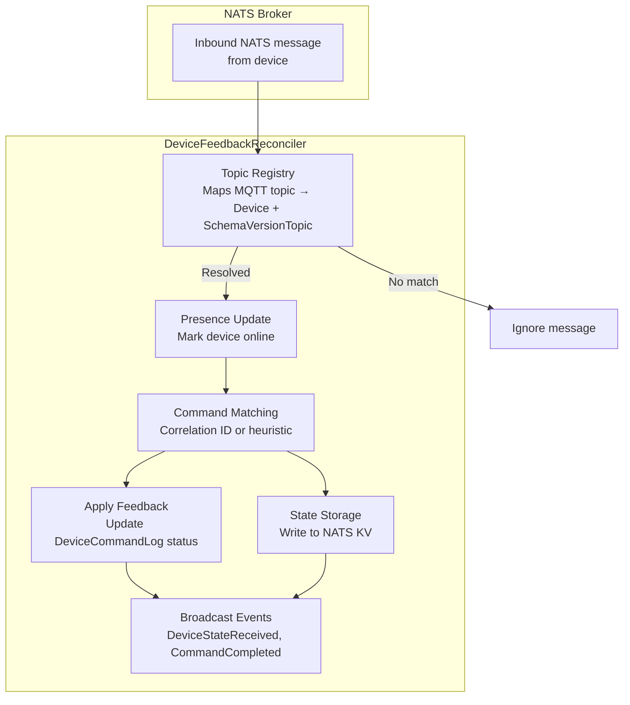
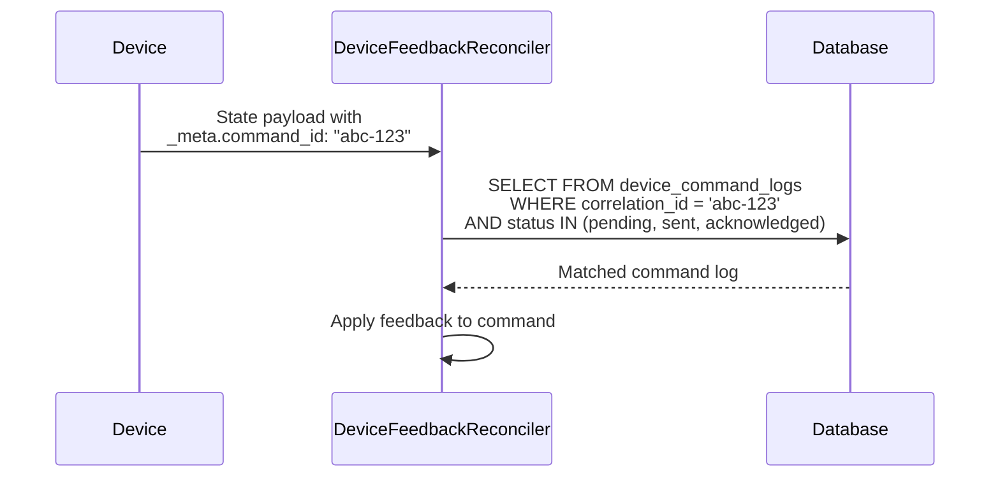
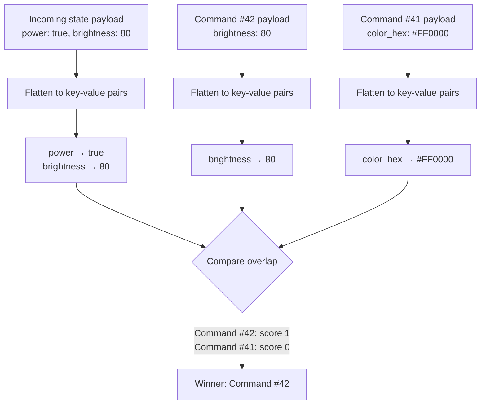
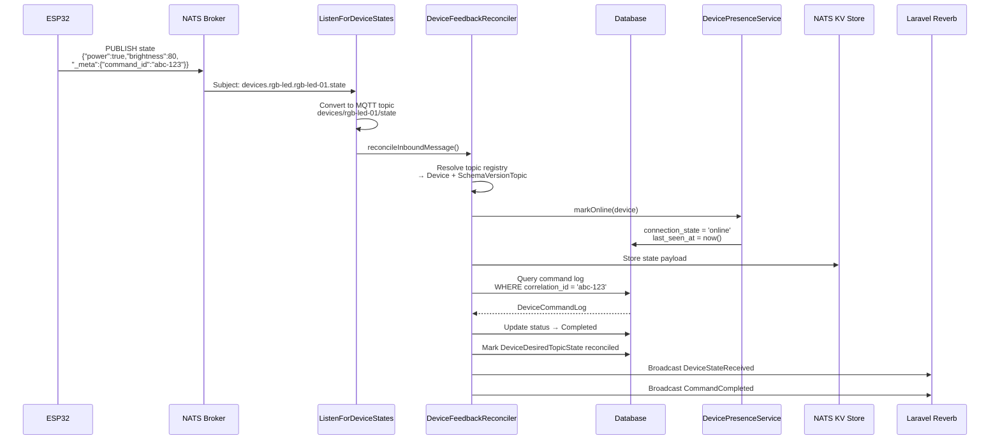

# Device Control Module — Feedback Reconciliation

## What Is Reconciliation?

When the platform sends a command to a device (e.g. "set brightness to 80"), it needs to know whether the device actually applied it. The device confirms by publishing its current state back to the broker. **Feedback reconciliation** is the process of matching that inbound state message to the original command and updating the command's lifecycle status accordingly.

`DeviceFeedbackReconciler` is the central class responsible for this. It sits at `app/Domain/DeviceControl/Services/DeviceFeedbackReconciler.php`.

## High-Level Flow

## The Topic Registry

Before looking up commands, the reconciler must figure out **which device** an inbound message belongs to. It does this through a topic registry — an in-memory map from MQTT topic strings to `Device` + `SchemaVersionTopic` pairs.

### How It Works

1. Query all devices that have a `device_schema_version_id` (i.e. they have a schema)
2. For each device, iterate over its schema version's topics
3. Keep only **publish** topics (topics the device publishes *to*, i.e. state/ack topics)
4. Build the resolved MQTT topic string using `SchemaVersionTopic::resolvedTopic()`
5. Store the mapping: `"devices/rgb-led-01/state" → { device, topic }`

### TTL-Based Refresh

The registry has a **30-second TTL** (`REGISTRY_TTL_SECONDS = 30`). On every `reconcileInboundMessage()` call, the reconciler checks if the registry is stale and refreshes if needed. This balances:

- **Freshness**: New devices or schema changes are picked up within 30 seconds
- **Performance**: Not querying the database on every single message

## Command Matching: Two Strategies

When an inbound message is resolved to a device and topic, the reconciler tries to match it to a pending command. It uses two strategies, in order:

### Strategy 1: Correlation ID (Exact Match)

If the device echoes back the `_meta.command_id` field that was injected during dispatch, the reconciler can perform an exact match:

This is the preferred path. The correlation ID is a UUID generated by `DeviceCommandDispatcher` and injected into the command payload under `_meta.command_id`. If the device firmware includes this field in its state response, matching is deterministic.

### Strategy 2: Heuristic Payload Overlap (Fallback)

Not all devices echo back `_meta`. For those devices, the reconciler falls back to a **heuristic** approach:

1. **Resolve candidate command topics**: Use `TopicLink` relationships to find which command topics are linked to the incoming state/ack topic. If no links exist, fall back to all command topics for the device.

2. **Query recent pending commands**: Find up to 25 command logs for those topics, created within the last 10 minutes, in pending/sent/acknowledged status.

3. **Flatten and compare payloads**: Both the command payload and the feedback payload are flattened into key-value pairs (stripping `_meta`), and a score is computed based on how many key-value pairs match.

4. **Select the best match**: The candidate with the highest overlap score wins, as long as the score is greater than zero.

The zero-score guard (`$bestScore > 0`) prevents false positives where no fields match at all.

## Topic Links

The schema system supports **topic links** — relationships between topics that tell the reconciler where to look for feedback:

| Link Type | Meaning |
|-----------|---------|
| `StateFeedback` | "State published on topic B is feedback for commands sent to topic A" |
| `AckFeedback` | "ACK published on topic B acknowledges commands sent to topic A" |

These are stored in the `schema_version_topic_links` table with columns `from_schema_version_topic_id`, `to_schema_version_topic_id`, and `link_type`.

For example, an RGB LED device might have:

| From Topic (Command) | To Topic (Feedback) | Link Type |
|----------------------|---------------------|-----------|
| `control` (subscribe) | `state` (publish) | StateFeedback |

When a state message arrives on the `state` topic, the reconciler uses `incomingLinks()` to find that it's linked to the `control` topic, and only looks for pending commands on that topic.

## Applying Feedback

Once a command log is matched, the reconciler updates it based on the **purpose** of the incoming topic:

### ACK Topic Response

If the incoming topic has purpose `ack`:

1. Set status to `Acknowledged`
2. Set `acknowledged_at` timestamp
3. **Check if the command topic has any linked state feedback topics**. If it does NOT, auto-promote to `Completed` (since no state response is expected).

### State Topic Response

If the incoming topic has purpose `state`:

1. Set status to `Completed`
2. Set both `acknowledged_at` (if not already set) and `completed_at`

### Desired State Reconciliation

When a command completes, the reconciler also marks the corresponding `DeviceDesiredTopicState` record as reconciled by setting `reconciled_at`. This record was created during dispatch and tracks what the platform *wants* the device to be doing. Once reconciled, the platform knows the device has caught up.

## Presence Side-Effect: Marking the Device Online

Every time an inbound message resolves to a known device via the topic registry, the reconciler calls `DevicePresenceService::markOnline($device)`. This ensures that any device actively publishing telemetry or state data is always marked as online — even if the dedicated presence listener (`ListenForDevicePresence`) missed the device's LWT "online" message.

`markOnline()` is idempotent: if the device is already online, it simply refreshes `last_seen_at` without broadcasting a duplicate `DeviceConnectionChanged` event. This keeps the heartbeat health checker (`iot:check-device-health`) satisfied, since `last_seen_at` is continuously updated for any active device.

This integration is critical because it creates a fallback path to online status — see [06-presence-tracking.md § Telemetry-Based Online Detection](06-presence-tracking.md#telemetry-based-online-detection) for the full explanation.

## State Storage

Regardless of whether a command is matched, every inbound message is stored in the **NATS KV bucket** (`device-states`) via `NatsDeviceStateStore::store()`. This serves two purposes:

1. **Dashboard page load**: When a user opens the Device Control Dashboard, the last known state is loaded from KV immediately, without waiting for the device to publish again.

2. **Per-topic state history**: States are stored per-topic under the device's UUID key, so the dashboard can show what each topic last reported.

See [04-mqtt-publishing.md](04-mqtt-publishing.md) for the KV document structure.

## Broadcast Events

After reconciliation, two types of events may be broadcast:

| Event | When | Channel |
|-------|------|---------|
| `DeviceStateReceived` | Always (for every resolved inbound message) | `device-control.{deviceUuid}` |
| `CommandCompleted` | When a command transitions to `Completed` status | `device-control.{deviceUuid}` |

Both implement `ShouldBroadcastNow` — they are sent immediately via Laravel Reverb WebSocket, not queued.

## The Listener: ListenForDeviceStates

`DeviceFeedbackReconciler` is not invoked directly — it is driven by the `iot:listen-for-device-states` artisan command (`ListenForDeviceStates`).

This long-running command:

1. Connects to NATS on the native protocol (port 4223, not MQTT)
2. Subscribes to `>` (all subjects — a NATS wildcard)
3. For each message, converts the NATS subject to an MQTT topic (dots → slashes)
4. Decodes the JSON payload (skips non-JSON messages)
5. Calls `reconciler->reconcileInboundMessage()`

The wildcard subscription means the listener receives **every** message on the broker, including commands, state updates, presence, and internal NATS subjects. The topic registry filters out messages that don't match any known device publish topic.

## Complete Reconciliation Sequence

