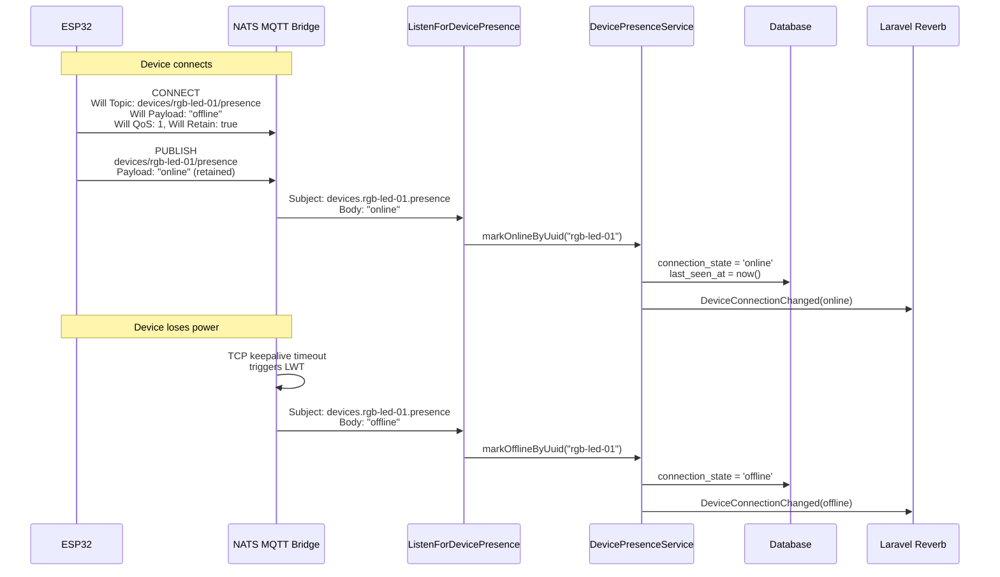
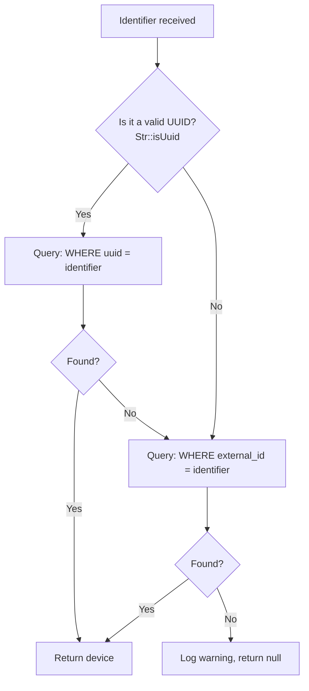
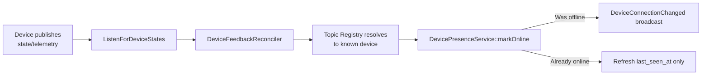
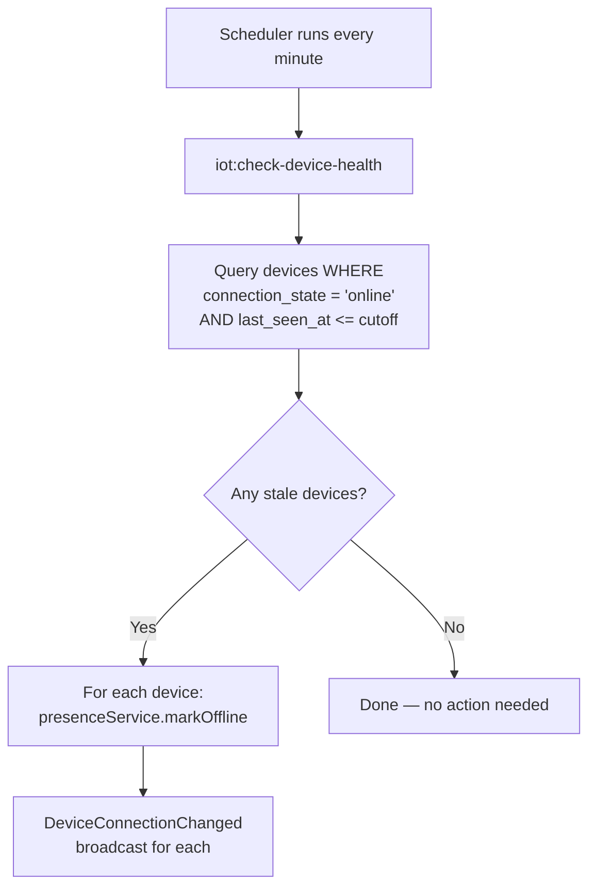

# Device Control Module — Presence Tracking

## What Is Presence Tracking?

Presence tracking answers the question: **"Is this device currently connected to the broker?"** The platform maintains a `connection_state` field on each `Device` model (`online` or `offline`) and broadcasts changes in real-time to the UI.

Three mechanisms work together to keep this state accurate:

| Mechanism | How It Detects | Latency | Direction |
|-----------|---------------|---------|----------|
| **MQTT Last Will and Testament (LWT)** | Broker publishes a pre-registered "offline" message when the device disconnects unexpectedly | Immediate (broker-driven) | Both (online on connect, offline on disconnect) |
| **Telemetry-Based Online Detection** | `DeviceFeedbackReconciler` calls `markOnline()` on every resolved inbound message | Immediate (first message) | Online only |
| **Heartbeat Health Check** | Scheduled command checks if `last_seen_at` exceeds a timeout threshold | Up to 1 minute (scheduler interval) | Offline only |

Online detection happens via two paths: (1) the device publishes an "online" message to its presence topic on connection, or (2) the `DeviceFeedbackReconciler` marks the device online when it receives any telemetry/state data. This dual-path approach ensures resilience — see [Telemetry-Based Online Detection](#telemetry-based-online-detection) below.

## MQTT Last Will and Testament (LWT)

LWT is a standard MQTT feature. When a device connects to the broker, it registers a "will" message — a topic + payload that the broker should publish **on the device's behalf** if the connection drops unexpectedly (TCP timeout, crash, power loss).

### How ESP32 Devices Use LWT



Key points:
- The **will message** (`"offline"`) is registered at CONNECT time, before the device does anything
- The **online message** is published by the device itself immediately after connecting
- Both are published to the same presence topic: `devices/{external_id}/presence`
- The retained flag means new subscribers (or the dashboard) can read the last known presence state

## The Listener: ListenForDevicePresence

`iot:listen-for-device-presence` (`ListenForDevicePresence`) is a long-running artisan command that subscribes to presence topics on NATS.

### Subject Pattern

The command subscribes to:

```
{prefix}.*.{suffix}
```

Where `prefix` and `suffix` come from config:

| Config Key | Default | Example |
|-----------|---------|---------|
| `iot.presence.subject_prefix` | `devices` | `devices` |
| `iot.presence.subject_suffix` | `presence` | `presence` |

Result: `devices.*.presence` — matches any device's presence topic.

### Device UUID Extraction

The listener extracts the device identifier from the NATS subject using a regex pattern:

```
Subject: devices.rgb-led-01.presence
Pattern: ^devices\.([^.]+)\.presence$
Match:   rgb-led-01
```

This identifier is then passed to `DevicePresenceService`.

## DevicePresenceService

Located at `app/Domain/DeviceManagement/Services/DevicePresenceService.php`, this service manages device connection state transitions.

### Identifier Resolution

The service receives an identifier string that could be either a **UUID** or an **external_id**. It resolves the device using this logic:



The `Str::isUuid()` check prevents PostgreSQL type errors — querying a UUID column with a non-UUID string like `rgb-led-01` would throw a database exception.

### State Transitions

| Method | Behaviour |
|--------|-----------|
| `markOnline()` | Sets `connection_state = 'online'` and `last_seen_at`. Broadcasts `DeviceConnectionChanged` only if the previous state was not already online (avoids duplicate events). |
| `markOffline()` | Sets `connection_state = 'offline'`. Broadcasts `DeviceConnectionChanged` only if the previous state was not already offline. Returns early if already offline. |

Both methods use `updateQuietly()` to avoid triggering Eloquent model events, and wrap broadcast calls in try-catch to prevent presence tracking from crashing if Reverb is unavailable.

## Telemetry-Based Online Detection

LWT presence messages are the primary mechanism for marking devices online. However, they can be missed: if `ListenForDevicePresence` restarts, or if a retained "online" message is not replayed by the broker, the device would remain marked as offline despite actively communicating.

To close this gap, `DeviceFeedbackReconciler` calls `DevicePresenceService::markOnline($device)` every time an inbound telemetry or state message resolves to a known device via the topic registry. This means:

- **Any active device will be marked online** — even if the presence listener missed the LWT "online" message
- **`last_seen_at` is continuously refreshed** — keeping the heartbeat health checker (`iot:check-device-health`) satisfied
- **No duplicate broadcasts** — `markOnline()` only broadcasts `DeviceConnectionChanged` on actual state transitions (offline → online), not when the device is already online



See [05-feedback-reconciliation.md § Presence Side-Effect](05-feedback-reconciliation.md#presence-side-effect-marking-the-device-online) for where this call sits in the reconciliation flow.

## Heartbeat Health Check

LWT handles **unexpected** disconnections, but what about devices that go silent without disconnecting? For example, a device might crash internally but keep the TCP connection alive, or the LWT message might be lost.

The `iot:check-device-health` command (`CheckDeviceHealth`) acts as a safety net:



### Timeout Calculation

The heartbeat timeout is configurable:

| Config Key | Default | Meaning |
|-----------|---------|---------|
| `iot.presence.heartbeat_timeout_seconds` | `300` (5 minutes) | If no message from a device for this many seconds, mark it offline |

The command also accepts a `--seconds` option for manual invocation.

### How last_seen_at Gets Updated

The `last_seen_at` timestamp is updated whenever `DevicePresenceService::markOnline()` is called. This happens through two paths:

1. **Presence path**: When the device publishes an "online" presence message → `ListenForDevicePresence` → `markOnlineByUuid()`
2. **Telemetry path**: When any state/telemetry data is received → `ListenForDeviceStates` → `DeviceFeedbackReconciler` → `markOnline()`

The telemetry path is the more frequent one — a device publishing sensor data every few seconds will keep `last_seen_at` current through the reconciler, regardless of whether presence messages are flowing.

## DeviceConnectionChanged Event

When a device's connection state changes, `DeviceConnectionChanged` is broadcast:

| Property | Type | Description |
|----------|------|-------------|
| `deviceId` | `int` | Database primary key |
| `deviceUuid` | `string` | UUID for channel routing |
| `connectionState` | `string` | `"online"` or `"offline"` |
| `lastSeenAt` | `Carbon\|null` | When the device was last heard from |

It broadcasts on two channels:

| Channel | Purpose |
|---------|---------|
| `devices` | Global device list — any page showing device status |
| `device-control.{deviceUuid}` | Device-specific — the control dashboard |

The Device Control Dashboard listens for this event and updates the connection indicator (green pulsing dot for online, red dot for offline) in real-time.

## Configuration Summary

All presence-related configuration lives in `config/iot.php`:

| Key | Default | Description |
|-----|---------|-------------|
| `iot.presence.subject_prefix` | `devices` | NATS subject prefix for presence topics |
| `iot.presence.subject_suffix` | `presence` | NATS subject suffix for presence topics |
| `iot.presence.heartbeat_timeout_seconds` | `300` | Seconds before a silent device is marked offline |
| `iot.nats.host` | `127.0.0.1` | NATS server host for the listener |
| `iot.nats.port` | `4223` | NATS server port for the listener |
