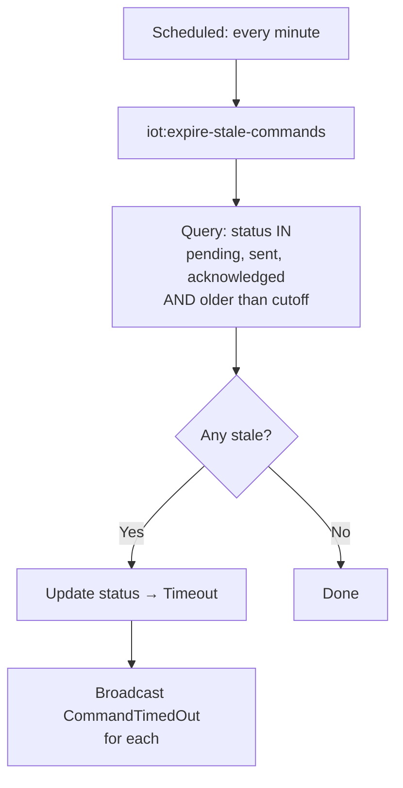
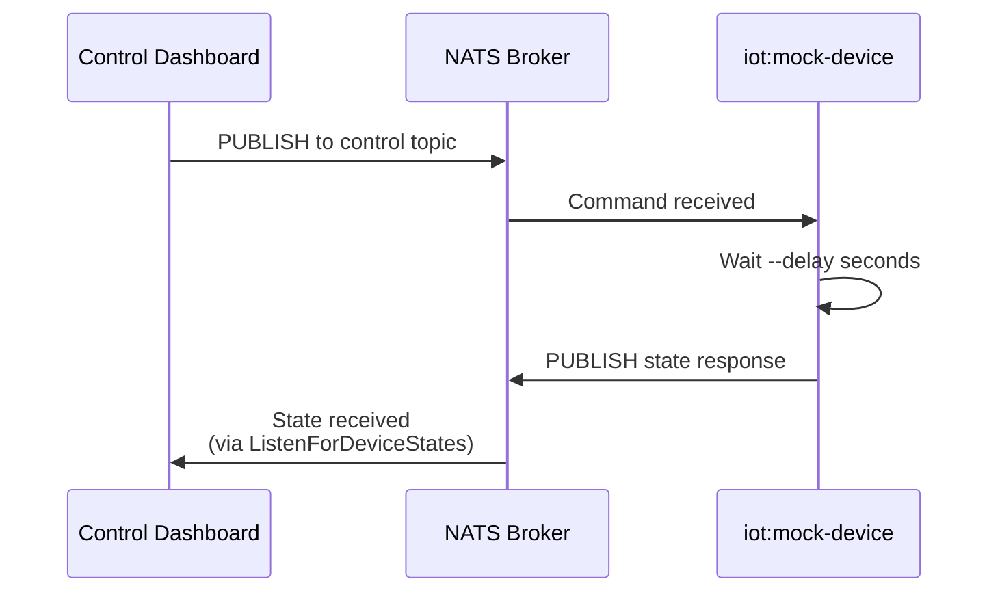
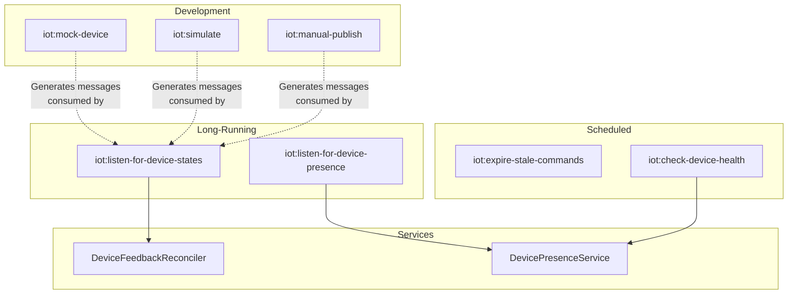

# Device Control Module — Artisan Commands

## Overview

The Device Control module provides eight artisan commands under the `iot:` namespace. Three are **long-running listeners**, two are **scheduled maintenance tasks**, and three are **development/testing utilities**.

| Command | Type | Runs As |
|---------|------|---------|
| `iot:listen-for-device-states` | Listener | Long-running process (supervisor) |
| `iot:listen-for-device-presence` | Listener | Long-running process (supervisor) |
| `iot:ingest-telemetry` | Listener | Long-running process (supervisor) |
| `iot:expire-stale-commands` | Maintenance | Scheduled every minute |
| `iot:check-device-health` | Maintenance | Scheduled every minute |
| `iot:mock-device` | Development | Manual, interactive |
| `iot:simulate` | Development | Manual |
| `iot:manual-publish` | Development | Manual, interactive |

All commands live in `app/Console/Commands/IoT/`.

---

## Long-Running Listeners

These commands connect to NATS and process messages indefinitely. They should be run under a process supervisor (e.g. Laravel Horizon, Supervisor, or systemd) that restarts them on failure.

For local development, you can run all required listeners and support services with:

```bash
./scripts/platform-up.sh
```

And stop everything with:

```bash
./scripts/platform-down.sh
```

### iot:listen-for-device-states

**Purpose**: Receives every message on the NATS broker and feeds it to `DeviceFeedbackReconciler` for command matching and state storage.

**Signature**:
```
iot:listen-for-device-states [--host=] [--port=]
```

**How it works**:
1. Connects to NATS (native protocol, not MQTT)
2. Subscribes to `>` (all subjects)
3. For each message:
   - Converts NATS subject (dots) to MQTT topic (slashes)
   - Decodes JSON payload (skips non-JSON)
   - Calls `DeviceFeedbackReconciler::reconcileInboundMessage()`
4. Loops indefinitely via `$client->process(1)` — processes one message per tick

**Options**:
| Option | Default | Source |
|--------|---------|--------|
| `--host` | `127.0.0.1` | `config('iot.nats.host')` |
| `--port` | `4223` | `config('iot.nats.port')` |

**Dependencies**: `DeviceFeedbackReconciler` (resolved from the container)

See [05-feedback-reconciliation.md](05-feedback-reconciliation.md) for what happens inside the reconciler.

---

### iot:listen-for-device-presence

**Purpose**: Listens specifically for device presence messages (online/offline) and updates the device's `connection_state`.

**Signature**:
```
iot:listen-for-device-presence [--host=] [--port=]
```

**How it works**:
1. Connects to NATS
2. Subscribes to `{prefix}.*.{suffix}` (e.g. `devices.*.presence`)
3. Extracts the device identifier from the subject using regex
4. If body is `"online"` → calls `DevicePresenceService::markOnlineByUuid()`
5. If body is `"offline"` → calls `DevicePresenceService::markOfflineByUuid()`
6. Ignores unknown payloads

**Subject pattern**: The wildcard `*` matches exactly one token — the device's external ID or UUID. For example, `devices.rgb-led-01.presence` matches and extracts `rgb-led-01`.

**Dependencies**: `DevicePresenceService` (injected into `handle()`)

See [06-presence-tracking.md](06-presence-tracking.md) for the full presence system.

---

### iot:ingest-telemetry

**Purpose**: Consumes inbound telemetry from NATS and dispatches normalized processing jobs to the queue.

**Signature**:
```
iot:ingest-telemetry [--host=] [--port=] [--subject=] [--queue=]
```

**How it works**:
1. Connects to NATS
2. Subscribes to telemetry subject (default `>`)
3. Skips internal/unsupported subjects and non-resolvable topics
4. Emits `TelemetryIncoming` for realtime visibility
5. Dispatches `ProcessInboundTelemetryJob` onto configured queue connection/queue
6. Loops indefinitely via `$client->process(1)`

**Options**:
| Option | Default | Source |
|--------|---------|--------|
| `--host` | `127.0.0.1` | `config('ingestion.nats.host')` |
| `--port` | `4223` | `config('ingestion.nats.port')` |
| `--subject` | `>` | `config('ingestion.nats.subject')` |
| `--queue` | `ingestion` | `config('ingestion.queue')` |

**Dependencies**:
- `DeviceTelemetryTopicResolver`
- `ProcessInboundTelemetryJob`
- Queue connection from `config('ingestion.queue_connection')`

---

## Scheduled Maintenance

These commands are registered in the Laravel scheduler and run automatically every minute.

### iot:expire-stale-commands

**Purpose**: Finds command logs that have been in a non-terminal state (pending, sent, acknowledged) for too long and marks them as `Timeout`.

**Signature**:
```
iot:expire-stale-commands [--seconds=]
```

**How it works**:
1. Calculate the timeout cutoff: `now() - timeout_seconds`
2. Query `DeviceCommandLog` records where:
   - Status is `Pending`, `Sent`, or `Acknowledged`
   - `sent_at` (or `created_at` if never sent) is before the cutoff
3. For each stale command:
   - Update status to `Timeout`
   - Set `error_message` to "Command timed out waiting for device feedback."
   - Broadcast `CommandTimedOut` event
4. Process in chunks of 100 to avoid memory issues

**Timeout configuration**:
| Config Key | Default |
|-----------|---------|
| `iot.device_control.command_timeout_seconds` | `120` (2 minutes) |

**Why both sent_at and created_at?** A command might fail to publish (staying in `Pending` with `sent_at = null`). The created_at fallback ensures even failed-to-send commands eventually time out instead of staying pending forever.



---

### iot:check-device-health

**Purpose**: Marks devices as offline if they have not communicated within the heartbeat timeout window.

**Signature**:
```
iot:check-device-health [--seconds=]
```

**How it works**:
1. Calculate the timeout cutoff: `now() - timeout_seconds`
2. Query `Device` records where:
   - `connection_state = 'online'`
   - `last_seen_at` is before the cutoff, OR `last_seen_at` is null
3. For each stale device:
   - Call `DevicePresenceService::markOffline()`
4. Process in chunks of 100

**Timeout configuration**:
| Config Key | Default |
|-----------|---------|
| `iot.presence.heartbeat_timeout_seconds` | `300` (5 minutes) |

See [06-presence-tracking.md](06-presence-tracking.md) for how this fits into the broader presence system.

---

## Development & Testing Utilities

These commands help developers test the command/state lifecycle without physical IoT hardware.

### iot:mock-device

**Purpose**: Simulates a real IoT device by subscribing to command topics on NATS and automatically responding with state on publish topics.

**Signature**:
```
iot:mock-device [device_uuid] [--host=] [--port=] [--delay=1]
```

**How it works**:
1. If no UUID is provided, presents an interactive search prompt to select a device
2. Loads the device's schema version and its subscribe (command) + publish (state) topics
3. Subscribes to all **subscribe** topics via the NATS native client
4. When a command arrives:
   - Logs the received payload
   - Waits `--delay` seconds (simulating device processing)
   - Publishes the command payload back as state on the first **publish** topic
   - Fires `DeviceStateReceived` event
   - Stores state in NATS KV

**Use case**: Open two terminals — one running `iot:mock-device`, the other using the Filament Device Control Dashboard to send commands. The mock device will receive the command and respond, completing the full lifecycle.



---

### iot:simulate

**Purpose**: Generates and publishes simulated telemetry data for a device, useful for testing data ingestion pipelines and dashboards.

**Signature**:
```
iot:simulate {device_uuid} [--count=10] [--interval=1] [--host=] [--port=]
```

**How it works**:
1. Loads the device and its publish topics
2. Delegates to `DevicePublishingSimulator` service
3. For each iteration (up to `--count`):
   - Generates random data based on the topic's parameter definitions
   - Publishes to NATS
   - Waits `--interval` seconds

**Options**:
| Option | Default | Description |
|--------|---------|-------------|
| `--count` | `10` | Number of data points to generate |
| `--interval` | `1` | Seconds between messages |

---

### iot:manual-publish

**Purpose**: Interactively build and publish a state message as if the device itself sent it. Useful for testing the feedback reconciliation pipeline.

**Signature**:
```
iot:manual-publish [device_uuid] [--host=] [--port=]
```

**How it works**:
1. If no UUID is provided, presents an interactive device search prompt
2. Lists the device's publish topics and prompts the user to select one
3. For each parameter definition on the topic, prompts for a value (using the parameter type to determine the input widget — confirm for booleans, text for others)
4. Builds the payload using `ParameterDefinition::placeValue()` for proper JSON path placement
5. Publishes to NATS via `NatsPublisherFactory`
6. Fires `DeviceStateReceived` event
7. Stores the state in NATS KV

**Interactive prompts**: Uses Laravel Prompts for a rich CLI experience — device search with autocomplete, topic selection, type-validated parameter inputs, and a summary table before publishing.

---

## Command Registration

All commands in `app/Console/Commands/IoT/` are auto-discovered by Laravel 12 — no manual registration is needed. The scheduled commands are registered in `routes/console.php` or `bootstrap/app.php`.

## Relationship Between Commands


