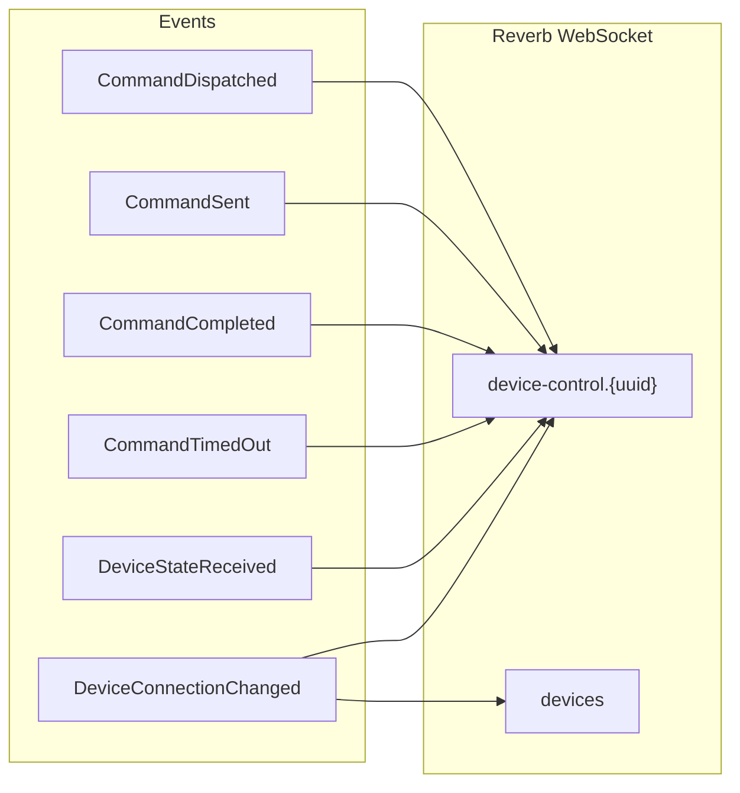
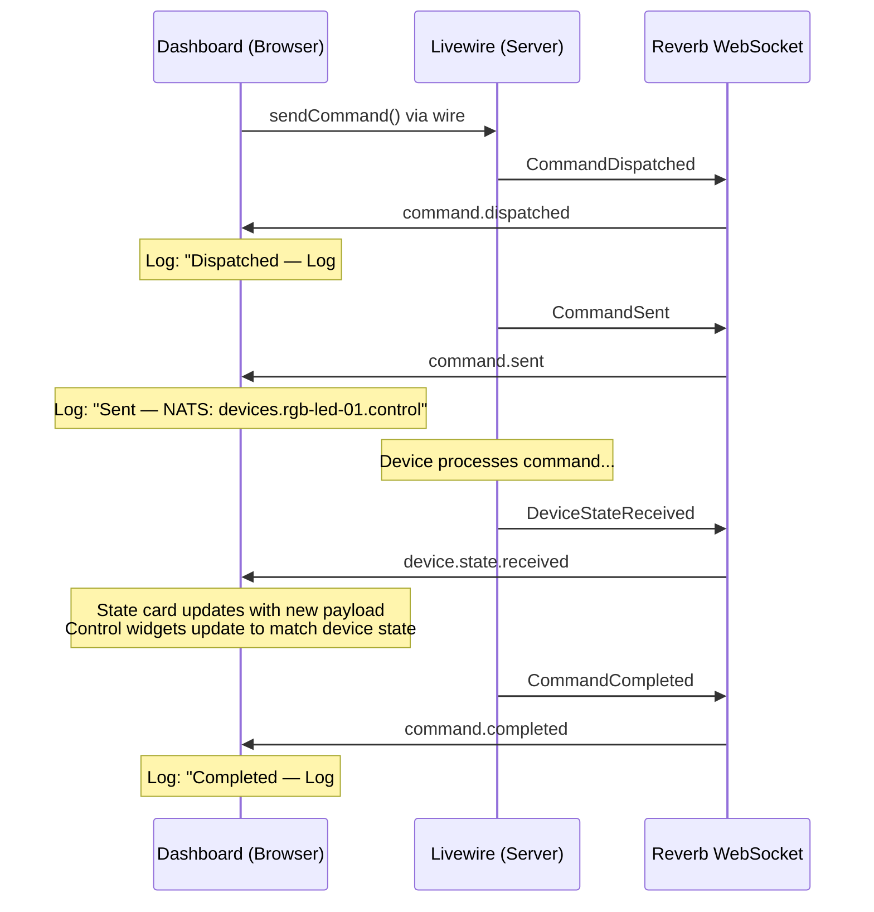
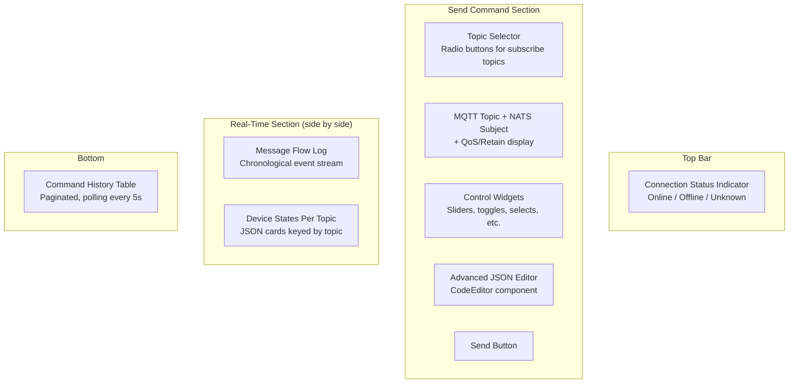

# Device Control Module — Real-Time Events & UI

## Overview

The Device Control Dashboard provides a real-time interface for sending commands to devices and observing their responses. It combines:

- **Filament** (server-side page, forms, tables)
- **Laravel Reverb** (WebSocket server for real-time events)
- **Alpine.js** (client-side reactive state and event handling)
- **Pusher protocol** (client library for WebSocket subscriptions)

Every state change in the command lifecycle is broadcast as a WebSocket event, allowing the dashboard to update without polling.

## Broadcast Events

All events implement `ShouldBroadcastNow` — they are sent immediately via Reverb, not queued through Horizon. Each event broadcasts on a device-specific channel: `device-control.{deviceUuid}`.

| Event Class | Broadcast Name | Trigger | Key Data |
|-------------|---------------|---------|----------|
| `CommandDispatched` | `command.dispatched` | Command log created, before MQTT publish | `command_log_id`, `status`, `command_payload` |
| `CommandSent` | `command.sent` | MQTT publish succeeded, status → Sent | `command_log_id`, `nats_subject`, `sent_at` |
| `CommandCompleted` | `command.completed` | Device feedback matched, status → Completed | `command_log_id`, `response_payload`, `completed_at` |
| `CommandTimedOut` | `command.timeout` | Stale command expired by scheduler | `command_log_id`, `error_message` |
| `DeviceStateReceived` | `device.state.received` | Any resolved inbound device message | `topic`, `payload`, `device_uuid` |
| `DeviceConnectionChanged` | `device.connection.changed` | Device goes online or offline | `connection_state`, `last_seen_at` |

### Channel Architecture



`DeviceConnectionChanged` is the only event that broadcasts on **two** channels:
- `device-control.{uuid}` — for the specific device's dashboard
- `devices` — for any page listing multiple devices (e.g. the device index)

## Event Lifecycle on the Wire

When a user sends a command from the dashboard, this is the sequence of WebSocket events they observe:



## The Device Control Dashboard

`DeviceControlDashboard` is a Filament Page located at `app/Filament/Admin/Resources/DeviceManagement/Devices/Pages/DeviceControlDashboard.php`. It is part of the `DeviceResource` and accessible from a device's detail view.

### Page Sections

The dashboard is divided into four sections:



### Connection Status Indicator

An Alpine.js component at the top of the page shows the device's connection state with a colored dot:

| State | Dot Color | Animation |
|-------|-----------|-----------|
| Online | Green | Pulsing |
| Offline | Red | Static |
| Unknown | Gray | Static |

It initializes from `$this->deviceConnectionState` (loaded from the database on mount) and updates via the `device.connection.changed` WebSocket event.

### Control Widgets

When "Advanced JSON mode" is **off**, the dashboard renders dynamic control widgets based on the selected topic's `ParameterDefinition` records. `ControlSchemaBuilder` translates parameter definitions into a widget specification array:

| Widget Type | Rendered As | Used For |
|-------------|------------|----------|
| `slider` | Range input with min/max/step | Numeric values like brightness |
| `toggle` | Checkbox toggle | Boolean values like power on/off |
| `select` | Dropdown menu | Enumerated options like effects |
| `number` | Numeric text input | Precise numeric entry |
| `color` | Color picker input | Hex color values |
| `button` | Action button | Trigger commands (e.g. "identify") |
| `text` | Text input | String values |
| `json` | Textarea | Complex JSON objects |

These widgets are rendered by a Blade partial: `filament/admin/resources/device-management/devices/partials/control-widgets.blade.php`.

### State Synchronization

When the device publishes new state, the dashboard updates the control widgets to reflect the actual device values. This happens through a chain:

1. `device.state.received` WebSocket event arrives in the browser
2. Alpine.js `deviceControlStream` component dispatches the event
3. Calls `$wire.call('updateControlValuesFromState', payload)` — a Livewire method
4. `DeviceControlDashboard::updateControlValuesFromState()` iterates over `controlSchema` and updates `controlValues` for matching keys
5. Livewire re-renders the control widgets with the new values

This means the sliders, toggles, and selects always reflect what the device actually reported — not just what was last sent.

### Initial State Loading

On page mount, the dashboard loads the last known state from the NATS KV store:

1. `loadInitialDeviceState()` calls `NatsDeviceStateStore::getAllStates()`
2. Returns an array of `{topic, payload, stored_at}` entries
3. `applyInitialStateToControlValues()` maps payload values onto the control widgets
4. The Blade template receives `initialDeviceStates` as initial data for the per-topic state cards

This means the dashboard shows the device's last known state immediately on page load, even before any WebSocket events arrive.

### Command History Table

A Filament Table at the bottom shows all `DeviceCommandLog` records for the device, sorted newest first, with:

| Column | Description |
|--------|-------------|
| `#` | Command log ID |
| `Topic` | The topic suffix (e.g. "control") |
| `Status` | Badge with color coding (gray/info/warning/success/danger) |
| `Payload` | Truncated JSON of the command payload |
| `Sent` | Timestamp when MQTT publish succeeded |
| `Created` | Timestamp when the command log was created |

The table polls every 5 seconds (`->poll('5s')`) to catch updates from events that might have been missed.

## The Alpine.js Component: deviceControlStream

The real-time event handling is implemented as an inline Alpine.js component in the Blade template. It manages:

1. **WebSocket connection** via Pusher.js client pointing at Laravel Reverb
2. **Event log** — an array of event objects displayed in the Message Flow panel
3. **Per-topic state** — a reactive object keyed by MQTT topic

### Initialization

On `init()`, the component:

1. Creates a Pusher instance pointing at the Reverb host/port from config
2. Subscribes to `device-control.{deviceUuid}`
3. Binds handlers for all five event types + connection changed
4. Stores the Pusher instance on `window` to prevent duplicate connections on Livewire re-renders

### Event Handling

Each WebSocket event is translated into a log entry with:

| Property | Description |
|----------|-------------|
| `type` | Event name (used for badge color) |
| `label` | Short display label |
| `detail` | Formatted detail string |
| `time` | Browser local time |

Special handling:
- `command.completed` adds a **cycle separator** ("cycle complete") after the log entry to visually separate command round-trips
- `device.state.received` updates the `topicStates` object AND calls `$wire.call('updateControlValuesFromState')` to sync controls
- `device.connection.changed` dispatches a custom DOM event (`device-connection-changed`) that the connection indicator listens for

### Per-Topic State Cards

The "Device States (Per Topic)" section renders a card for each MQTT topic the device has published state on. Each card shows:

- Topic name as header
- Pretty-printed JSON payload
- "Updated" timestamp from `stored_at`

These update in real-time as `device.state.received` events arrive.

## Configuration Reference

| Config Key | Used By | Default |
|-----------|---------|---------|
| `broadcasting.connections.reverb.key` | Pusher client initialization | — |
| `broadcasting.connections.reverb.options.host` | WebSocket host | — |
| `broadcasting.connections.reverb.options.port` | WebSocket port | — |
| `broadcasting.connections.reverb.options.scheme` | TLS detection (`https` → `wss`) | — |
| `iot.nats.host` | State store reads on page mount | `127.0.0.1` |
| `iot.nats.port` | State store reads on page mount | `4223` |

## Data Flow Summary

```mermaid
graph TB
    subgraph Browser
        ALP[Alpine.js<br/>deviceControlStream]
        FORM[Filament Form<br/>Control Widgets]
        TABLE[Filament Table<br/>Command History]
        CONN_UI[Connection Indicator]
    end
    
    subgraph Server
        LW[Livewire<br/>DeviceControlDashboard]
        DISP[DeviceCommandDispatcher]
        RECON[DeviceFeedbackReconciler]
        PRES[DevicePresenceService]
    end
    
    subgraph Infrastructure
        REVERB[Laravel Reverb]
        NATS[NATS Broker]
        KV[NATS KV Store]
    end
    
    FORM -->|sendCommand()| LW
    LW --> DISP
    DISP --> NATS
    NATS -->|via listeners| RECON
    NATS -->|via listeners| PRES
    RECON --> REVERB
    PRES --> REVERB
    DISP --> REVERB
    REVERB --> ALP
    ALP -->|updateControlValuesFromState| LW
    ALP --> CONN_UI
    KV -->|Page mount| LW
    LW --> FORM
    TABLE -->|Polls 5s| LW
```
