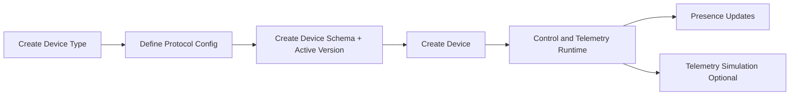

# Device Management Module - Overview

## What This Module Does

The Device Management module owns device inventory, protocol-level connectivity definitions, and simulation tooling.

It provides:

1. Device type catalog with protocol configuration.
2. Device registry per organization.
3. Presence state transitions (online/offline and last seen).
4. NATS/MQTT publishing infrastructure abstractions.
5. Telemetry simulation for testing and demos.

## Core Concepts

| Concept | Description |
|--------|-------------|
| Device Type | Defines protocol (`mqtt` or `http`) and connection config |
| Device | Organization-bound runtime endpoint with schema version and state |
| Protocol Config | Typed value objects (`MqttProtocolConfig`, `HttpProtocolConfig`) |
| Presence | `DevicePresenceService` updates `connection_state` and emits events |
| Simulator | `DevicePublishingSimulator` publishes synthetic telemetry payloads |
| NATS Infrastructure | Factory + publisher + KV state store abstractions |

## Provisioning and Runtime Flow

## Boundaries and Integrations

| Area | Integration |
|------|-------------|
| Device Schema | Device references an active schema version |
| Device Control | Command dispatch uses device type protocol config |
| Data Ingestion | Telemetry topic resolution starts from device + schema |
| Telemetry and Dashboard | Logs and widgets are linked by device identifiers |
| Shared | Every device and org-specific device type references organization |

## Key Source Areas

- Models: `app/Domain/DeviceManagement/Models/`
- Protocol types and casts:
  - `app/Domain/DeviceManagement/Enums/`
  - `app/Domain/DeviceManagement/Casts/ProtocolConfigCast.php`
  - `app/Domain/DeviceManagement/ValueObjects/Protocol/`
- Publishing infrastructure:
  - `app/Domain/DeviceManagement/Publishing/`
- Presence and simulation:
  - `app/Domain/DeviceManagement/Services/DevicePresenceService.php`
  - `app/Domain/DeviceManagement/Publishing/DevicePublishingSimulator.php`
- IoT commands:
  - `app/Console/Commands/IoT/ListenForDevicePresence.php`
  - `app/Console/Commands/IoT/CheckDeviceHealth.php`
  - `app/Console/Commands/IoT/SimulateDeviceCommand.php`

## Documentation Map

- [02 - Architecture](02-architecture.md)
