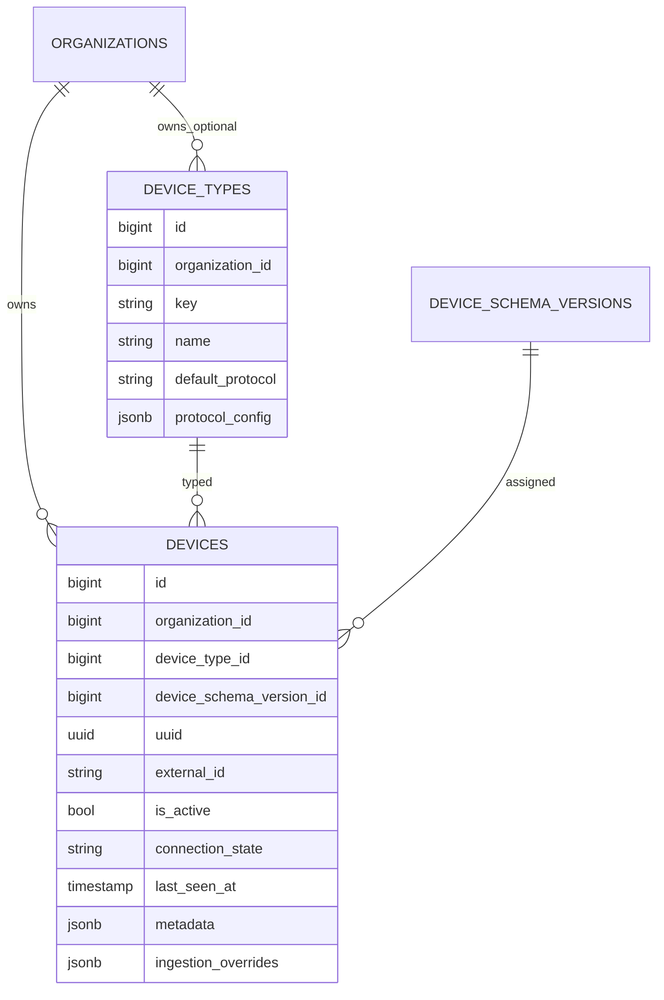

# Device Management Module - Architecture

## Architectural Model

Device Management is split into:

1. Catalog plane (`DeviceType`) for protocol contract templates.
2. Registry plane (`Device`) for actual deployed units.
3. Infrastructure plane for publish/state-store adapters.
4. Runtime services for presence and simulation.

## Component Responsibilities

| Component | Responsibility |
|-----------|----------------|
| `DeviceType` | Protocol defaults and catalog scoping (global vs org-specific) |
| `Device` | Runtime endpoint with schema version, metadata, and state |
| `ProtocolConfigCast` | Converts DB JSON into typed protocol config objects |
| `MqttProtocolConfig` | MQTT broker host/port/auth/base-topic definition |
| `HttpProtocolConfig` | HTTP endpoint/auth config for alternate protocol types |
| `PhpMqttCommandPublisher` | Raw MQTT v3.1.1 publish over TCP with lock-based single client |
| `BasisNatsPublisherFactory` | Creates native NATS publisher clients |
| `BasisNatsDeviceStateStore` | Reads/writes last-known state in NATS KV bucket (`device-states`) |
| `DevicePresenceService` | Online/offline transitions and `DeviceConnectionChanged` events |
| `DevicePublishingSimulator` | Generates random publish-topic payloads for testing |

## Data Model

## Protocol Config Casting

`ProtocolConfigCast` inspects `default_protocol` and materializes:

- `MqttProtocolConfig` for MQTT types,
- `HttpProtocolConfig` for HTTP types.

This gives strong typed access while keeping persisted storage in JSON.

## Presence Runtime

### Input Paths

- LWT/presence listener (`iot:listen-for-device-presence`).
- Telemetry-side online marking from ingestion and feedback reconciliation.

### Service Behavior

`DevicePresenceService`:

- refreshes device model before updates,
- avoids duplicate broadcast noise when state is unchanged,
- broadcasts `DeviceConnectionChanged` on transitions,
- supports lookup by UUID or external ID.

Heartbeat fallback command (`iot:check-device-health`) marks stale online devices offline.

## Simulation Runtime

`DevicePublishingSimulator`:

1. loads publish topics from device schema version,
2. generates random values per parameter type,
3. resolves MQTT topic from base topic + identifier + suffix,
4. publishes to NATS subject equivalent,
5. emits `TelemetryIncoming` events.

The same engine is reused by:

- CLI command `iot:simulate`,
- Filament simulate actions (`SimulatePublishingActions`),
- queue job `SimulateDevicePublishingJob`.

## Operational Notes

- `device_types` has split uniqueness: org-scoped unique and global partial unique index.
- `Device::canBeControlled()` and `canBeSimulated()` guard UI actions based on schema topics.
- NATS KV store handles JetStream-unavailable states gracefully by logging and fallback behavior.
