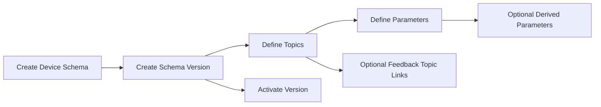

# Device Schema Module - Overview

## What This Module Does

The Device Schema module defines the contract between physical devices and the platform.

It models:

1. Versioned schema definitions.
2. Publish/subscribe topics.
3. Parameter extraction and command payload mapping.
4. Derived parameter formulas.
5. Topic links for command feedback semantics.

Other domains (Device Control, Ingestion, Telemetry, Dashboards, Automation) depend on this contract layer.

## Core Concepts

| Concept | Description |
|--------|-------------|
| Device Schema | Parent contract for a device type |
| Schema Version | Immutable-ish version record (`draft`, `active`, `archived`) |
| Topic | Publish or subscribe channel entry with suffix, QoS, retain, and purpose |
| Parameter Definition | Per-topic field contract (`json_path`, type, validation, mutation, UI hints) |
| Derived Parameter | JsonLogic-computed field based on raw parameter values |
| Topic Link | Feedback linkage (`state_feedback` or `ack_feedback`) between topics |

## Authoring Flow

## Runtime Contributions

The module provides runtime helpers used by other domains:

- `SchemaVersionTopic::resolvedTopic(device)` to build concrete MQTT topic strings.
- `SchemaVersionTopic::buildCommandPayloadTemplate()` for UI/default command payload generation.
- `ParameterDefinition::evaluatePayload()` for extraction, mutation, and validation logic.
- `DerivedParameterDefinition::evaluate()` for computed telemetry values.
- `DeviceSchemaVersion::renderFirmwareForDevice()` for firmware template rendering.

## Key Source Areas

- Domain models: `app/Domain/DeviceSchema/Models/`
- Enums: `app/Domain/DeviceSchema/Enums/`
- Evaluator: `app/Domain/DeviceSchema/Services/JsonLogicEvaluator.php`
- Admin resources:
  - `app/Filament/Admin/Resources/DeviceSchema/DeviceSchemas/`
  - `app/Filament/Admin/Resources/DeviceSchema/DeviceSchemaVersions/`
- Migrations:
  - `database/migrations/2026_02_06_080912_create_device_schemas_table.php`
  - `database/migrations/2026_02_06_080923_create_device_schema_versions_table.php`
  - `database/migrations/2026_02_06_080924_create_schema_version_topics_table.php`
  - `database/migrations/2026_02_06_080925_create_parameter_definitions_table.php`
  - `database/migrations/2026_02_06_160359_create_derived_parameter_definitions_table.php`

## Documentation Map

- [02 - Architecture](02-architecture.md)
