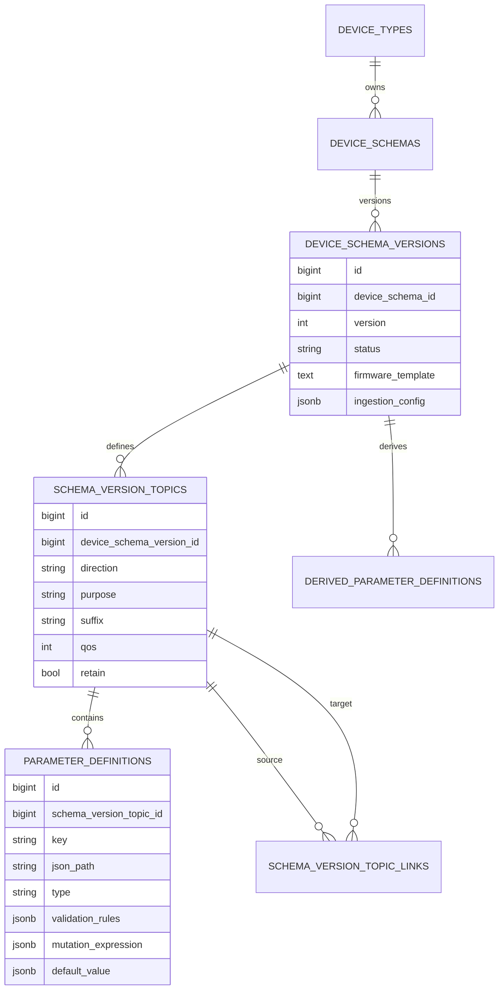

# Device Schema Module - Architecture

## Architectural Model

Device Schema architecture has three planes:

1. Contract persistence plane (schemas, versions, topics, parameters).
2. Authoring plane (Filament resources and relation managers).
3. Runtime utility plane (topic resolution, payload templates, validation, derivation).

## Component Responsibilities

| Component | Responsibility |
|-----------|----------------|
| `DeviceSchema` | Groups schema versions under a device type |
| `DeviceSchemaVersion` | Stores status, notes, firmware template, ingestion config |
| `SchemaVersionTopic` | Defines direction/purpose and resolves full topic strings |
| `ParameterDefinition` | Handles extraction, validation, mutation, and UI widget inference |
| `DerivedParameterDefinition` | JsonLogic expressions with dependency validation and cycle detection |
| `SchemaVersionTopicLink` | Represents state/ack feedback topic links |
| `JsonLogicEvaluator` | Internal evaluator for mutation/derivation expressions |

## Data Model

## Important Constraints

- One active schema version per schema is enforced by partial unique index (`device_schema_versions_active_unique`).
- Topic `key` and `suffix` are unique per schema version.
- Topic link uniqueness is enforced on source + target + link type.
- Parameter keys are unique per topic.

## Topic Resolution and Purpose

`SchemaVersionTopic` resolves behavior using:

- explicit `purpose` when provided,
- fallback inference from direction/suffix/retain.

Helper methods expose semantic checks:

- `isPublish()` / `isSubscribe()`
- `isPurposeCommand()` / `isPurposeState()` / `isPurposeTelemetry()` / `isPurposeAck()`

## Parameter Pipeline

`ParameterDefinition` supports a full mini-pipeline per field:

1. Extract value from payload via `json_path`.
2. Apply optional mutation JsonLogic.
3. Validate type and rules (`min`, `max`, `regex`, `enum`).
4. Return value + validation metadata.

For command authoring, it also infers control widget types and can place default values into nested payload templates.

## Derived Parameter Pipeline

`DerivedParameterDefinition`:

- evaluates JsonLogic expressions over resolved input values,
- resolves dependencies from explicit list or expression scanning,
- validates missing dependencies,
- can detect circular dependencies before runtime.

## Firmware Template Rendering

`DeviceSchemaVersion::renderFirmwareForDevice()` replaces placeholders such as:

- `{{DEVICE_ID}}`
- `{{BASE_TOPIC}}`
- `{{CONTROL_TOPIC}}`
- `{{STATE_TOPIC}}`
- `{{TELEMETRY_TOPIC}}`
- `{{ACK_TOPIC}}`

This enables schema-driven firmware bootstrap output from admin UI actions.

## Authoring UI Structure

- `DeviceSchemaResource` manages schema headers.
- `DeviceSchemaVersionResource` manages versions and related entities.
- Relation managers provide nested editing for:
  - topics,
  - parameter definitions,
  - derived parameter definitions.

These relation managers enforce runtime-relevant constraints directly in authoring forms.
