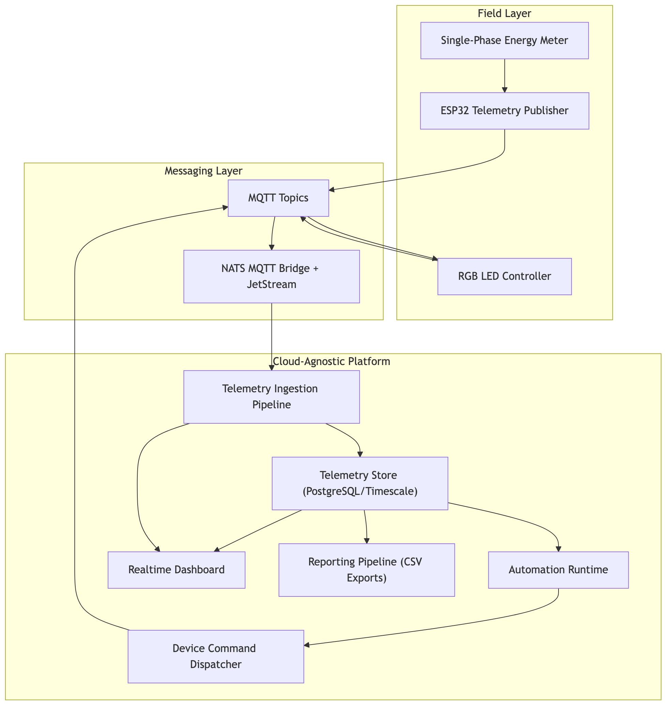
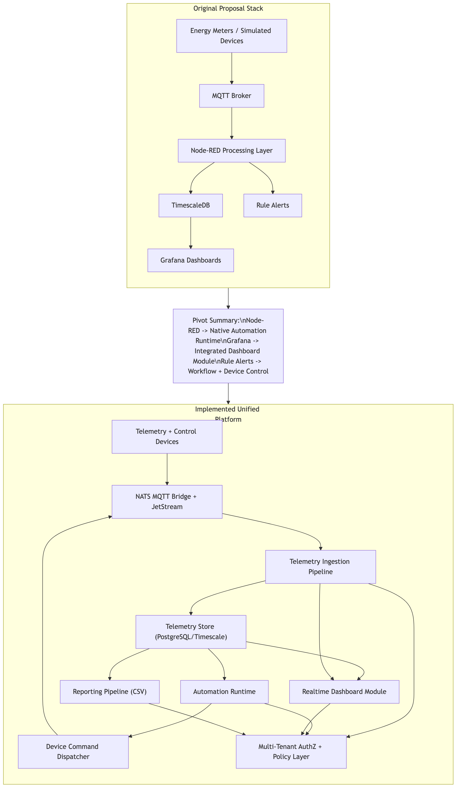
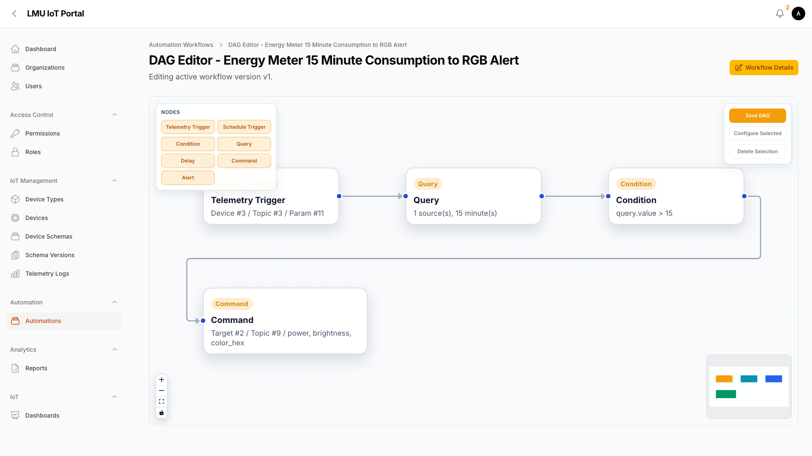
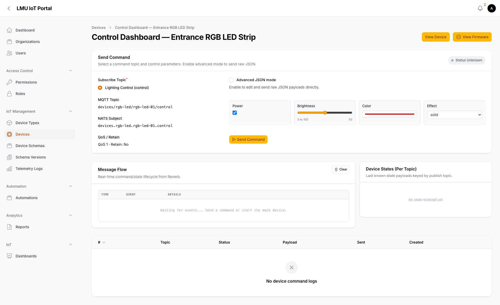
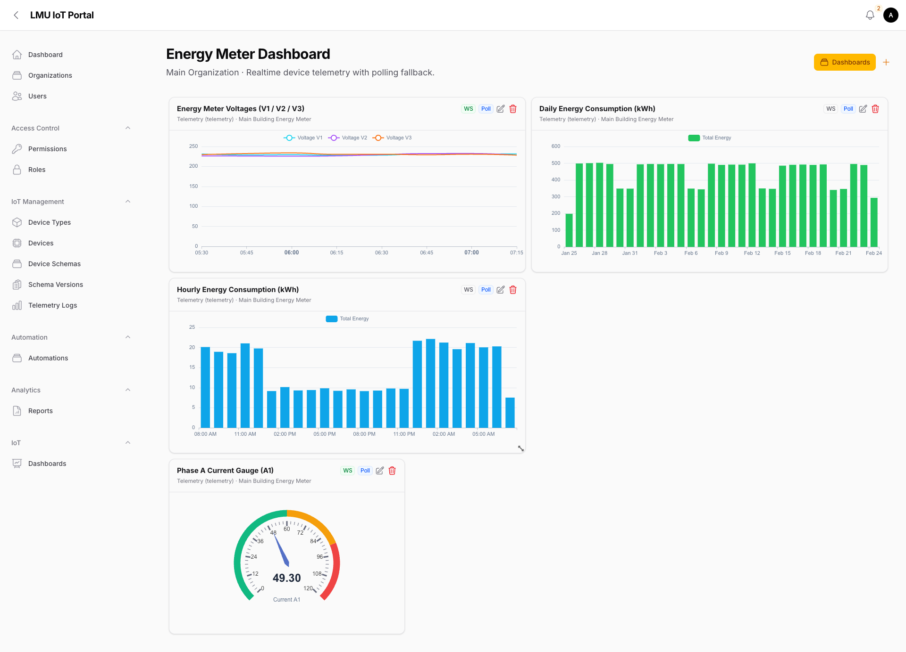
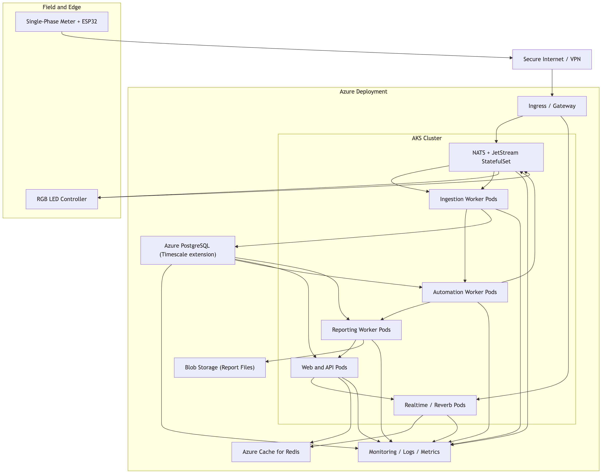

## Executive Summary
This report documents the design and implementation of a cloud-based Internet of Things (IoT) energy monitoring and automation platform built around a single-phase energy monitoring use case. The implemented system ingests telemetry from field hardware, processes and validates it in near real time, evaluates a 15-minute consumption rule, and dispatches an automated control command to an independent RGB LED actuator. The demonstration objective was deliberately practical: prove that independent devices can be orchestrated through one platform contract and that each step in that orchestration can be audited.

The initial proposal considered a conventional composition of separate tools for messaging, workflow construction, visualization, and storage. During implementation, the team pivoted toward a unified open-source platform model in which ingestion, schema enforcement, automation execution, command dispatch, realtime visualization, and reporting are operated within one consistent domain boundary. The functional intent of the proposal was preserved. The architecture changed to improve governance, reduce integration overhead, and create a more scalable onboarding model for heterogeneous device fleets.

A key technical result of this project is that telemetry was not treated as a passive dashboard feed. Telemetry became an automation trigger with deterministic branching and command lifecycle visibility. A second result is that reporting was integrated as an asynchronous pipeline rather than an external afterthought, enabling exportable operational evidence in addition to realtime views.

The platform remains cloud-agnostic and Kubernetes-ready. It can be deployed on managed Kubernetes environments such as Azure Kubernetes Service (AKS) without rewriting core application logic. This portability is achieved by combining containerized services with open protocols and standard data interfaces.

This report also includes firmware architecture decisions for the edge layer. A shared ESP32 runtime pattern is defined for WiFi and MQTT lifecycle management, while sensor/actuator-specific logic is separated into device modules. The existing RGB actuator firmware and a new single-phase PZEM RS485 firmware path are covered as implementation evidence. Together, these outcomes establish a credible foundation for scaling from an academic prototype to production-oriented energy operations.

## Introduction
Energy systems in buildings and facilities are increasingly instrumented, but instrumentation alone does not guarantee operational value. In many deployments, telemetry is collected and visualized, yet decision-making remains manual and slow. Human operators are still required to inspect graphs, interpret anomalies, and trigger responses. This delay is acceptable for retrospective analysis, but it is insufficient for active operational control scenarios where quick intervention is valuable.

The project addressed this gap by designing an end-to-end system that combines sensing, analysis, and action. A single-phase energy monitoring device sends measurements through an ESP32 communication path. The platform computes recent energy behavior over a rolling 15-minute interval and evaluates a threshold condition. When the condition is met, an RGB LED actuator is commanded to signal alert state. The value of this scenario is clarity: it demonstrates telemetry ingestion, time-window analytics, rule execution, control dispatch, feedback reconciliation, and user-facing visualization in one continuous pipeline.

Although the scenario is compact, the architectural intention is not narrow. The solution was built as a reusable platform, not as a one-off demonstration dashboard. Device and topic contracts are modeled explicitly so that new sensors and actuators can be added with controlled change. This is important for long-term platform viability because IoT environments rarely remain static.

A second motivation for this work was operational consolidation. The team initially considered a fragmented stack with separate tools for flow logic and dashboards. During implementation, the architecture moved toward an all-in-one platform approach that unifies user experience, authorization boundaries, and execution traceability. This does not imply that external tools are invalid. It means that for this project’s objectives, integrated operation produced clearer governance and lower coordination cost.

The report that follows is written as a technical and evaluative account of that implementation. It explains what was built, why specific design decisions were made, how those decisions were validated, and what tradeoffs remain.

## Main Body
### 1. Project Aim, Objectives, and Scope
The project aim was to implement a cloud-based IoT platform that can ingest energy telemetry, evaluate short-window conditions, and execute automated device responses with observable runtime evidence.

The objectives were as follows:

1. Build a reliable telemetry ingestion path for single-phase energy data over MQTT-compatible transport.
2. Persist telemetry in a model suited for time-window analytics and historical review.
3. Implement a workflow runtime for trigger-condition-action orchestration.
4. Validate a 15-minute consumption rule that dispatches RGB alert commands.
5. Provide realtime dashboards and asynchronous reporting outputs.
6. Preserve multi-tenant safety and contract-driven extensibility for future scale.

In scope were the end-to-end data and control flow, platform architecture rationale, firmware integration strategy, and deployment portability analysis. Out of scope were advanced machine-learning anomaly detection, full enterprise compliance hardening, and long-duration load benchmark campaigns.

### 2. Problem Framing
The core problem was not merely “how to show meter values.” It was how to create a dependable loop from telemetry to action without introducing fragmented operational ownership. Traditional pilot setups often split responsibilities across multiple tools, creating practical issues: duplicated configuration, inconsistent access control, weak traceability, and brittle cross-tool workflows.

For this project, four non-negotiable requirements emerged. First, the platform needed low-latency telemetry handling suitable for 15-minute bounded decisions. Second, it needed deterministic execution records so outcomes could be explained and audited. Third, it needed device independence so unrelated hardware could be coordinated through contracts rather than hardcoded coupling. Fourth, it needed operational portability so deployment decisions did not force domain rewrites.

These requirements shaped both backend architecture and edge firmware design.

### 3. Architecture and Flow
The implemented architecture is event-driven and domain-partitioned. Telemetry ingress, automation execution, command dispatch, and reporting are logically separated but governed through shared contracts and organization boundaries. Messaging follows topic/subject semantics compatible with MQTT-style publish/subscribe patterns (MQTT.org, 2024; NATS, n.d.-a; NATS, n.d.-b). Persistent stream behavior uses JetStream concepts for durability and recovery support (NATS, n.d.-c). Time-oriented persistence and query flexibility use PostgreSQL/Timescale-compatible patterns (Tiger Data, n.d.; PostgreSQL Global Development Group, 2025).

In the operational flow, telemetry enters through broker subjects, passes staged validation and transformation, and is persisted as canonical logs. Persisted events feed automation matching. Matching workflows evaluate query and condition nodes, then dispatch command payloads when conditions are true. Device feedback is reconciled against command lifecycle records. In parallel, the reporting pipeline reads historical telemetry and generates asynchronous CSV outputs with run-state tracking.

This single canonical telemetry substrate supports dashboards, automation, and reporting simultaneously. As a result, teams do not need separate truth layers for control and analytics.

### 4. All-in-One Platform Positioning (Balanced Comparison)
The original proposal considered a stack that combined broker, visual flow tooling, timeseries storage, and external dashboards. The implemented architecture consolidated those concerns inside one platform boundary.

The strategic argument for this decision is operational coherence, not tool preference. In fragmented architectures, every integration seam creates synchronization work: schema mapping, access policy alignment, and duplicate runtime observability setup. These tasks are manageable in small demonstrations but become expensive as organizations, devices, and workflows expand.

By integrating workflow runtime, control dispatch, dashboarding, and reporting in one system, the project achieved a unified user experience and consistent governance boundary. This also reduced dependence on separately managed tooling stacks that can introduce additional licensing, operational, or coordination costs at scale. The report therefore presents the implemented system as an all-in-one operational platform while avoiding absolute claims that external tools are universally unsuitable.

### 5. ESP32 Firmware Architecture: Common Runtime + Device Modules
A major implementation decision was to define firmware behavior as two layers.

The first layer is a common runtime pattern shared across device types. This layer handles WiFi bootstrap, broker connection, MQTT session lifecycle, Last Will and Testament (LWT), presence publication, reconnect behavior, and publish retry timing. It also provides a consistent telemetry envelope and diagnostics fields so the platform receives predictable payload structures.

The second layer is device-specific logic. In this project, one module manages RGB actuator behavior and command acknowledgment semantics. Another module manages single-phase meter acquisition over RS485 Modbus and telemetry publication.

This separation is important for maintainability. It allows teams to add new sensor or actuator classes without rewriting connectivity and session-management logic repeatedly. It also improves operational reliability because lifecycle behavior is standardized across device fleet firmware.

In implementation terms, the runtime contract is expressed through reusable lifecycle hooks: `deviceSetup()`, `deviceLoop(nowMs)`, and `onControlMessage(payload)`. The connectivity layer establishes and maintains network state, while device modules focus only on business logic and data transformation. For actuator devices, the control hook applies command payloads and emits state acknowledgements. For the meter path in v1, the control hook is intentionally inert, making behavior explicitly read-focused and reducing unsafe side effects. This model supports gradual firmware evolution because write-oriented controls can be added later without restructuring the communication lifecycle. It also improves testability: reconnect, heartbeat, and publish behavior can be verified independently from sensor parsing.

### 6. Actuator Firmware Module (RGB)
The RGB firmware path acts as the control-side proof point. It subscribes to control topics, applies payload parameters such as power, brightness, color, and effect, then publishes state updates. Command lifecycle evidence is reconciled in the platform so success is determined by observed feedback, not just publish attempt.

This module demonstrates deterministic control semantics and closes the loop between workflow decisions and physical device behavior.

### 7. Single-Phase Meter Firmware Module (PZEM RS485)
To extend the edge layer beyond the actuator path, this implementation adds an ESP32 firmware path for PZEM-014/016-style single-phase metering via RS485-UART. The manual-provided communication profile is Modbus RTU over UART at 9600 baud, 8 data bits, 1 stop bit, no parity, with measurement reads on function `0x04`.

The v1 polling command reads 10 registers from `0x0000` to `0x0009` using frame intent `01 04 00 00 00 0A CRC`, where the expected CRC low/high pair for this request is `70 0D` under Modbus CRC16 ordering. The firmware validates response length and CRC before applying scaling.

The decoded telemetry set includes:

1. Voltage (`0x0000`) at 0.1 V resolution.
2. Current (`0x0001` low + `0x0002` high) at 0.001 A resolution.
3. Active power (`0x0003` low + `0x0004` high) at 0.1 W resolution.
4. Energy (`0x0005` low + `0x0006` high) in Wh, published as kWh.
5. Frequency (`0x0007`) at 0.1 Hz resolution.
6. Power factor (`0x0008`) at 0.01 resolution.
7. Alarm status (`0x0009`).

Write-oriented operations in the manual, such as address updates, alarm threshold writes, and energy reset commands, are intentionally excluded from v1 runtime behavior. They are treated as controlled future enhancements.

To align with schema-driven onboarding, the firmware uses placeholder-based identifiers and topics (`{{DEVICE_ID}}`, `{{MQTT_CLIENT_ID}}`, `{{TELEMETRY_TOPIC}}`, `{{STATE_TOPIC}}`, `{{PRESENCE_TOPIC}}`). Published payload keys include `voltage_v`, `current_a`, `active_power_w`, `frequency_hz`, `power_factor`, `total_energy_kwh`, `alarm_status`, and `read_ok`, with optional diagnostics such as `modbus_error`, `poll_ms`, and `fw_version`.

### 8. Ingestion, Automation, and Control Logic
On the platform side, ingestion is implemented as staged processing with validation and mutation gates before persistence. Queue-backed workers handle asynchronous workloads and isolate ingestion spikes from downstream execution pressure (Laravel, n.d.-a; Laravel, n.d.-b).

The demonstration automation computes 15-minute consumption by windowed delta over cumulative energy (`MAX(total_energy_kwh) - MIN(total_energy_kwh)` in interval). A threshold condition then decides whether to dispatch an RGB alert command. This choice of bounded-window logic reduces sensitivity to single-sample noise and aligns with operational decision timescales.

Run-step records and command lifecycle status provide traceability for each decision branch.

### 9. Dashboard and Reporting
The dashboard layer supports historical and realtime views for voltage, energy, and current variables.

Realtime delivery uses broadcast channels with polling fallback to maintain continuity under variable network conditions (Laravel, n.d.-c; Laravel, n.d.-d).

The reporting module adds asynchronous CSV exports with queue visibility and lifecycle states (`queued`, `running`, `completed`, `no_data`, `failed`).

This architecture turns telemetry into both operational feedback and auditable analytical artefacts.

### 10. Cloud-Agnostic Deployment and Kubernetes Scalability
The solution is cloud-agnostic because core processing logic depends on portable containerized services and open protocol/data interfaces rather than vendor-specific runtime features. Kubernetes provides the orchestration model for scaling independent workloads such as ingestion workers, automation workers, realtime services, and reporting jobs (Kubernetes Authors, n.d.-a; Kubernetes Authors, n.d.-b).

For Azure deployment, AKS offers managed Kubernetes operations while preserving this portability model (Microsoft, n.d.).

### 11. Evaluation and Validation
Validation focused on correctness and traceability rather than speculative performance claims.

In positive-path workflow scenarios, telemetry ingestion, query output, condition pass, command dispatch, and feedback reconciliation were observable through run-step and command records. In negative-path scenarios, threshold failure correctly prevented actuator side effects.

For the meter firmware path, validation criteria were defined at protocol and runtime levels: request frame structure, CRC validation, response byte checks, scaling correctness, timeout handling, and non-crashing recovery behavior on malformed frames. On connectivity, expected behavior was reconnect and presence restoration without firmware restart.

At platform-contract level, payload validation required that `total_energy_kwh` be present and numeric, because this field is central to the 15-minute consumption workflow.

Validation also included operational edge cases that are common in mixed hardware environments. These cases included transient broker disconnection during active polling windows, delayed serial responses from the RS485 bus, and malformed reply buffers with correct headers but invalid CRC tails. The expected behavior in each case was controlled degradation rather than workflow interruption: mark `read_ok=false`, preserve runtime loop continuity, publish diagnostics, and recover on subsequent valid cycles. This behavior is critical for production-readiness because it avoids false “device offline” assumptions when the real issue is short-lived transport noise.

### 12. Methodology Note on AI-Assisted Development
During implementation, GPT-Codex and Claude Opus were used as engineering assistants for drafting code fragments, firmware structure proposals, and report scaffolding. Final technical decisions, integration, and validation were performed by the project team. AI output was treated as draft material, not as an authoritative result. This workflow was used to accelerate iteration while retaining human accountability for correctness and system behavior.

## Conclusion
This project implemented a complete energy-monitoring-to-action loop on a cloud-based IoT platform. The delivered system ingests single-phase telemetry, computes bounded-window energy behavior, executes deterministic automation, dispatches actuator commands, reconciles device feedback, and exposes both realtime dashboards and asynchronous reporting outputs.

The architectural pivot from a fragmented toolchain toward an integrated platform improved operational coherence without reducing functional scope. A unified UX, shared governance boundary, and contract-driven device onboarding model made the solution more suitable for growth beyond pilot scale.

The addition of firmware architecture standardization further strengthens this foundation. A shared ESP32 runtime pattern combined with device-specific modules enables reuse and controlled extension. The new PZEM RS485 meter path demonstrates this approach for sensor-side acquisition while retaining compatibility with existing automation logic.

Overall, the platform provides a practical, cloud-agnostic baseline for scaling energy IoT operations where traceability, interoperability, and operational simplicity are priorities.

## Recommendations
1. Implement controlled write-path support for PZEM address/alarm/reset operations behind explicit authorization and audit controls.
2. Add long-duration ingestion and websocket load testing to quantify throughput and latency under realistic fleet conditions.
3. Introduce adaptive anomaly thresholds while preserving deterministic rule fallback for critical workflows.
4. Expand firmware contract tests and hardware-in-the-loop validation for regression safety across device variants.
5. Define tenant-level Kubernetes resource policies and autoscaling guardrails for large multi-organization deployments.

## Limitations
1. Current validation emphasizes functional correctness and traceability rather than full benchmark characterization.
2. The meter firmware v1 is read-focused and does not yet expose controlled write operations.
3. Security/compliance hardening is outside the current report scope.
4. Manual image artefacts in the appendix are evidence-oriented and do not replace vendor primary documentation.

## Reflection
The most important learning outcome from this project is that architecture decisions dominate long-term operability more than short-term feature velocity. Early in the project, it was tempting to optimize by combining familiar individual tools as quickly as possible. That approach can deliver a demo, but it can also create hidden coordination overhead that scales poorly once more devices and users are introduced.

By consolidating ingestion, automation, control, visualization, and reporting inside one governed platform boundary, the team reduced integration ambiguity and simplified operational ownership. This required more deliberate domain modeling, but it paid off in traceability and maintainability.

A second learning outcome was the central role of firmware contract clarity. Separating common connectivity/runtime concerns from device-specific logic made it easier to reason about behavior and to plan new device onboarding. The PZEM addition reinforced this benefit by showing that protocol-specific acquisition can be integrated without redesigning platform-side automation.

The team also learned that reporting is not a secondary feature. Realtime dashboards support immediate decision-making, but operations and governance need durable exports and run histories for accountability. Treating reporting as a first-class workflow improved the platform’s practical usefulness.

Finally, AI-assisted development was useful for speed, but only when coupled with strict human review and verification. The project reaffirmed that tooling can accelerate engineering work, yet responsibility for correctness remains with the implementation team.

## References
Espressif Systems (n.d.) *ESP32-S3 series*. Available at: https://www.espressif.com/en/products/socs/esp32-s3 (Accessed: 25 February 2026).

Kubernetes Authors (n.d.-a) *Overview: What is Kubernetes?* Available at: https://kubernetes.io/docs/concepts/overview/what-is-kubernetes/ (Accessed: 25 February 2026).

Kubernetes Authors (n.d.-b) *Autoscaling workloads*. Available at: https://kubernetes.io/docs/concepts/workloads/autoscaling/ (Accessed: 25 February 2026).

Laravel (n.d.-a) *Queues (Laravel 12.x documentation)*. Available at: https://laravel.com/docs/12.x/queues (Accessed: 25 February 2026).

Laravel (n.d.-b) *Horizon (Laravel 12.x documentation)*. Available at: https://laravel.com/docs/12.x/horizon (Accessed: 25 February 2026).

Laravel (n.d.-c) *Broadcasting (Laravel 12.x documentation)*. Available at: https://laravel.com/docs/12.x/broadcasting (Accessed: 25 February 2026).

Laravel (n.d.-d) *Reverb (Laravel 12.x documentation)*. Available at: https://laravel.com/docs/12.x/reverb (Accessed: 25 February 2026).

Microsoft (n.d.) *What is Azure Kubernetes Service (AKS)?* Available at: https://learn.microsoft.com/en-us/azure/aks/what-is-aks (Accessed: 25 February 2026).

MQTT.org (2024) *MQTT specifications*. Available at: https://mqtt.org/mqtt-specification/ (Accessed: 25 February 2026).

NATS (n.d.-a) *Subject-based messaging*. Available at: https://docs.nats.io/nats-concepts/subjects (Accessed: 25 February 2026).

NATS (n.d.-b) *MQTT configuration*. Available at: https://docs.nats.io/running-a-nats-service/configuration/mqtt (Accessed: 25 February 2026).

NATS (n.d.-c) *JetStream concepts*. Available at: https://docs.nats.io/nats-concepts/jetstream (Accessed: 25 February 2026).

Peacefair (n.d.) *PZEM-014/016 AC communication module manual* (project-supplied device documentation).

PostgreSQL Global Development Group (2025) *JSON functions and operators*. Available at: https://www.postgresql.org/docs/current/functions-json.html (Accessed: 25 February 2026).

Tiger Data (n.d.) *Hypertables*. Available at: https://docs.timescale.com/use-timescale/latest/hypertables/ (Accessed: 25 February 2026).

## Appendices
### Appendix A: Firmware Listing (RGB Actuator)
Full firmware listing location:

- `plan/DeviceControlArchitecture/esp32-rgb-light/esp-32-rgb-light.ino`

The RGB module demonstrates command subscription, effect application, state publication, and presence lifecycle behavior.

### Appendix B: Firmware Listing (Single-Phase Meter via RS485)
Full firmware listing location:

- `plan/DeviceControlArchitecture/esp32-single-phase-energy-meter/esp32-single-phase-energy-meter.ino`

This module demonstrates Modbus RTU measurement polling and telemetry publication using the shared connectivity/runtime pattern.

### Appendix C: PZEM Manual Evidence and Protocol Extraction
Formatting and interpretation in firmware are based on the project-supplied PZEM-014/016 manual pages.

Manual evidence figures (appendix-only):

<!-- Insert provided manual image: PZEM protocol/register page -->
<!-- Suggested file path if added locally: report-images/pzem-manual-protocol-registers.jpg -->

<!-- Insert provided manual image: PZEM wiring/functional block page -->
<!-- Suggested file path if added locally: report-images/pzem-manual-wiring-block.jpg -->

Extracted register map used in firmware v1:

| Register | Meaning | Resolution used in firmware |
|---|---|---|
| `0x0000` | Voltage | `raw * 0.1` V |
| `0x0001` + `0x0002` | Current (low/high) | `combined * 0.001` A |
| `0x0003` + `0x0004` | Active power (low/high) | `combined * 0.1` W |
| `0x0005` + `0x0006` | Energy (low/high) | `combined` Wh → `/1000` kWh |
| `0x0007` | Frequency | `raw * 0.1` Hz |
| `0x0008` | Power factor | `raw * 0.01` |
| `0x0009` | Alarm status | direct integer/status flag |

Modbus read frame baseline validated for firmware:

- Request intent: `01 04 00 00 00 0A CRC`
- CRC16 low/high bytes expected for this request: `70 0D`

### Appendix D: Final Formatting Notes for Submission
For final academic formatting consistency with the sample style:

1. Use Times New Roman.
2. Use black font color throughout.
3. Use justified paragraph alignment.
4. Use numbered heading hierarchy on A4 page layout.
