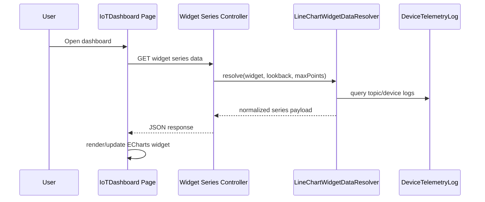

# IoT Dashboard Module - Overview

## What This Module Does

The IoT Dashboard module provides configurable, organization-scoped telemetry dashboards.

It allows users to:

1. Define dashboard containers.
2. Add and configure line-chart widgets.
3. Bind widgets to a device + publish topic + parameter set.
4. View realtime telemetry with polling fallback.
5. Arrange widget layout with drag/resize persistence.

## Core Concepts

| Concept | Description |
|--------|-------------|
| Dashboard | `IoTDashboard` container owned by an organization |
| Widget | `IoTDashboardWidget` chart tile definition |
| Series Config | Per-widget parameter list with labels and colors |
| Widget Data API | Auth-protected endpoint returning normalized chart series payload |
| Layout API | Auth-protected endpoint storing GridStack x/y/w/h layout |
| Runtime Page | Filament page (`App\Filament\Admin\Pages\IoTDashboard`) rendering chart grid |

## Runtime Flow

## Boundaries and Integrations

| Area | Integration |
|------|-------------|
| Shared | Dashboard belongs to one organization |
| Device Management | Widget must reference a device in dashboard organization |
| Device Schema | Widget topic must match selected device schema version and publish direction |
| Telemetry | Series data is read from `device_telemetry_logs.transformed_values` |
| Realtime stack | Reverb/Pusher client is used for websocket updates with polling fallback |

## Key Source Areas

- Domain models/services:
  - `app/Domain/IoTDashboard/Models/`
  - `app/Domain/IoTDashboard/Services/LineChartWidgetDataResolver.php`
- Admin resources/pages:
  - `app/Filament/Admin/Resources/IoTDashboards/`
  - `app/Filament/Admin/Pages/IoTDashboard.php`
- APIs:
  - `app/Http/Controllers/IoTDashboard/IoTDashboardWidgetSeriesController.php`
  - `app/Http/Controllers/IoTDashboard/IoTDashboardWidgetLayoutController.php`
- Routes: `routes/web.php`
- Frontend view: `resources/views/filament/admin/pages/io-t-dashboard.blade.php`

## Documentation Map

- [02 - Architecture](02-architecture.md)
