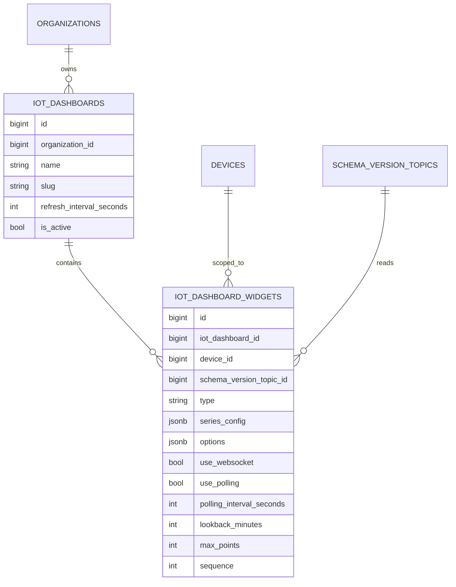

# IoT Dashboard Module - Architecture

## Architectural Model

The module has two cooperating planes:

1. Configuration plane (resource CRUD + widget form actions).
2. Runtime plane (chart rendering + data/layout APIs).

## Component Responsibilities

| Component | Responsibility |
|-----------|----------------|
| `IoTDashboard` | Dashboard container metadata and organization ownership |
| `IoTDashboardWidget` | Widget config including topic/device/series/layout options |
| `IoTDashboardResource` | Admin CRUD for dashboards |
| `IoTDashboard` page | Runtime operations: add/edit/delete widgets and bootstrap payload |
| `LineChartWidgetDataResolver` | Query and transform telemetry logs into chart-ready series |
| `IoTDashboardWidgetSeriesController` | Enforces auth/tenant checks and returns series payload |
| `IoTDashboardWidgetLayoutController` | Persists GridStack layout changes with auth/tenant checks |

## Data Model

## Widget Runtime Contracts

### Series Endpoint

`GET /admin/iot-dashboard/widgets/{widget}/series`

- validates authenticated user,
- validates dashboard organization access,
- validates widget device organization consistency,
- clamps lookback and max points,
- returns normalized series payload.

### Layout Endpoint

`POST /admin/iot-dashboard/widgets/{widget}/layout`

- same auth/organization checks,
- validates grid payload via form request,
- stores layout in widget `options.layout` with 24-column grid semantics.

## Runtime Page Behavior

`App\Filament\Admin\Pages\IoTDashboard` provides:

- dashboard selection from query string,
- organization-aware device/topic/parameter option builders,
- widget create/edit/delete actions,
- bootstrap payload including data/layout URLs,
- dispatch event when widget configuration changes.

## Query Behavior for Charts

`LineChartWidgetDataResolver`:

1. filters by `schema_version_topic_id`,
2. filters by `device_id`,
3. filters by lookback window,
4. limits by max points,
5. sorts ascending by recorded time for chart rendering,
6. extracts numeric series values from `transformed_values` via `data_get`.

## Frontend Runtime Stack

Dashboard view uses:

- GridStack for drag and resize layouts,
- ECharts for chart rendering,
- Reverb/Pusher config for realtime updates,
- polling fallback when websocket updates are disabled/unavailable.

Layout and widget metadata are embedded as bootstrap JSON in page script context.

## Security and Multi-Tenancy

Controllers and page queries enforce that non-super-admin users can only read/update dashboards for organizations they belong to.

Additional checks ensure a widget cannot reference a device outside the dashboard organization.

## Operational Notes

- Widgets support legacy layout options and scale to current 24-column model.
- `resolvedSeriesConfig()` normalizes malformed/incomplete series JSON safely.
- Polling interval and point-window bounds are clamped to protect database queries.
