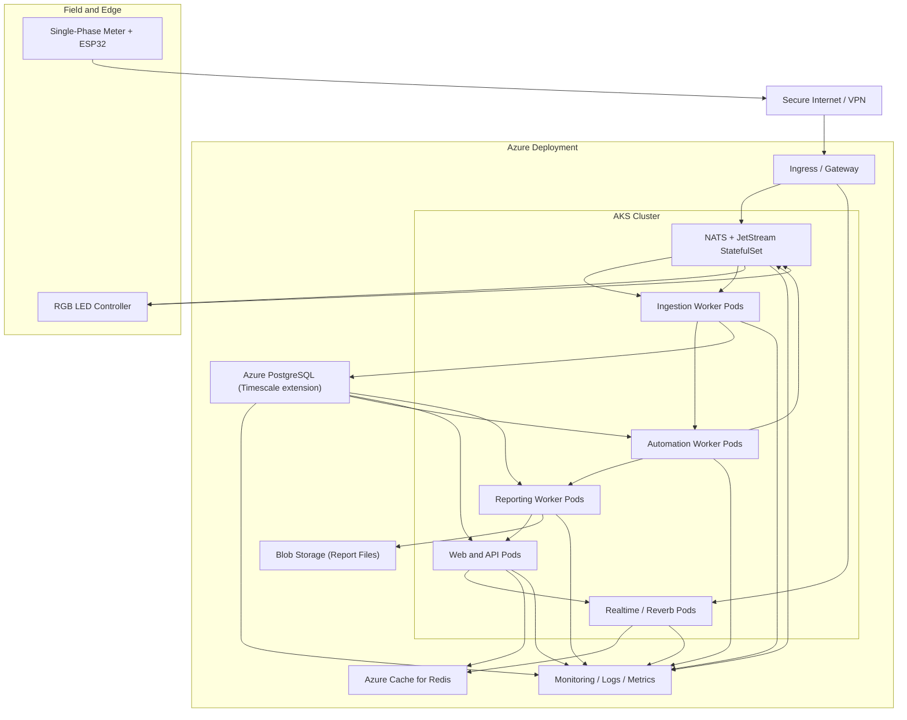

# Deployment Architecture (AKS Reference) - Mermaid Source

```mermaid
flowchart TB
    subgraph Field["Field and Edge"]
        direction TB
        Meter["Single-Phase Meter + ESP32"]
        RGB["RGB LED Controller"]
    end

    Internet["Secure Internet / VPN"]

    subgraph Azure["Azure Deployment"]
        direction TB
        Ingress["Ingress / Gateway"]

        subgraph AKS["AKS Cluster"]
            direction TB
            NATS["NATS + JetStream StatefulSet"]
            ING["Ingestion Worker Pods"]
            AUTO["Automation Worker Pods"]
            REP["Reporting Worker Pods"]
            API["Web and API Pods"]
            WS["Realtime / Reverb Pods"]

            NATS --> ING --> AUTO --> REP --> API --> WS
        end

        PG["Azure PostgreSQL (Timescale extension)"]
        REDIS["Azure Cache for Redis"]
        BLOB["Blob Storage (Report Files)"]
        OBS["Monitoring / Logs / Metrics"]
    end

    Meter --> Internet --> Ingress --> NATS
    NATS --> ING
    ING --> PG
    PG --> AUTO
    AUTO --> NATS
    NATS --> RGB
    RGB --> NATS

    PG --> API
    PG --> REP
    REP --> BLOB

    Ingress --> WS
    API --> REDIS
    WS --> REDIS
    PG --> OBS
    NATS --> OBS
    API --> OBS
    WS --> OBS
    ING --> OBS
    AUTO --> OBS
    REP --> OBS
```
