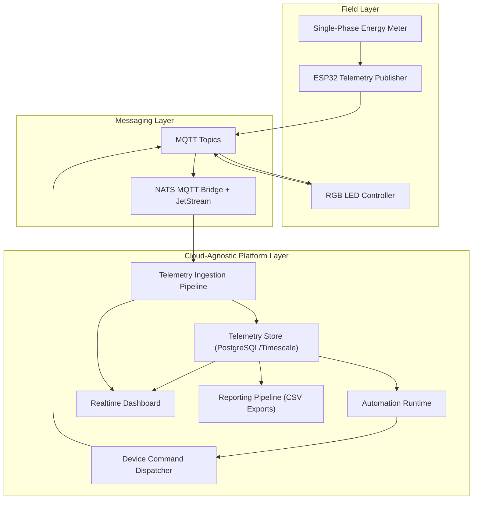

# Figure 2 - End-to-End Architecture (Mermaid Source)

```mermaid
flowchart TB
    subgraph Field["Field Layer"]
        direction TB
        Meter["Single-Phase Energy Meter"]
        ESP["ESP32 Telemetry Publisher"]
        RGB["RGB LED Controller"]

        Meter --> ESP
    end

    subgraph Broker["Messaging Layer"]
        direction TB
        MQTT["MQTT Topics"]
        NATS["NATS MQTT Bridge + JetStream"]

        MQTT --> NATS
    end

    subgraph Platform["Cloud-Agnostic Platform Layer"]
        direction TB
        Ingest["Telemetry Ingestion Pipeline"]
        Store["Telemetry Store (PostgreSQL/Timescale)"]
        Auto["Automation Runtime"]
        Control["Device Command Dispatcher"]
        Dash["Realtime Dashboard"]
        Report["Reporting Pipeline (CSV Exports)"]

        Ingest --> Store --> Auto --> Control
    end

    ESP --> MQTT
    NATS --> Ingest
    Control --> MQTT
    MQTT --> RGB
    RGB --> MQTT

    Store --> Dash
    Ingest --> Dash
    Store --> Report
```
