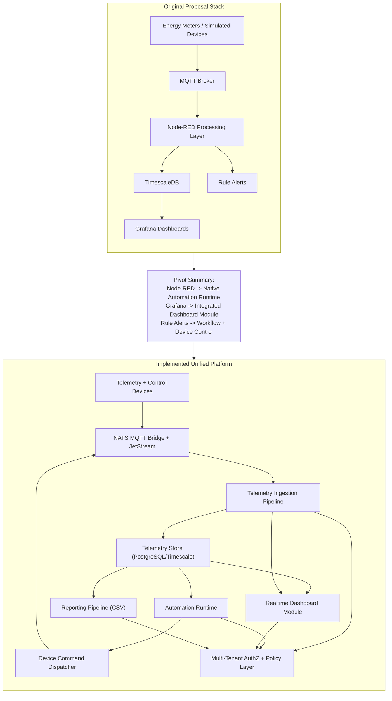

# Figure 7 - Proposed vs Implemented Architecture (Mermaid Source)

```mermaid
flowchart TB
    subgraph Proposed["Original Proposal Stack"]
        direction TB
        P1["Energy Meters / Simulated Devices"]
        P2["MQTT Broker"]
        P3["Node-RED Processing Layer"]
        P4["TimescaleDB"]
        P5["Grafana Dashboards"]
        P6["Rule Alerts"]

        P1 --> P2 --> P3 --> P4 --> P5
        P3 --> P6
    end

    subgraph Implemented["Implemented Unified Platform"]
        direction TB
        I1["Telemetry + Control Devices"]
        I2["NATS MQTT Bridge + JetStream"]
        I3["Telemetry Ingestion Pipeline"]
        I4["Telemetry Store (PostgreSQL/Timescale)"]
        I5["Automation Runtime"]
        I6["Device Command Dispatcher"]
        I7["Realtime Dashboard Module"]
        I8["Reporting Pipeline (CSV)"]
        I9["Multi-Tenant AuthZ + Policy Layer"]

        I1 --> I2 --> I3 --> I4
        I4 --> I5 --> I6 --> I2
        I4 --> I7
        I3 --> I7
        I4 --> I8
        I3 --> I9
        I5 --> I9
        I7 --> I9
        I8 --> I9
    end

    Pivot["Pivot Summary:\nNode-RED -> Native Automation Runtime\nGrafana -> Integrated Dashboard Module\nRule Alerts -> Workflow + Device Control"]

    Proposed --> Pivot --> Implemented
```
