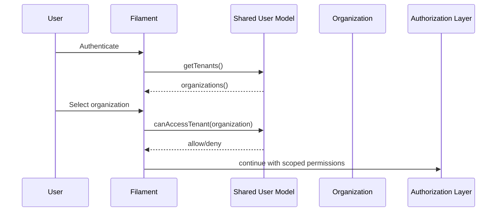

# Shared Module - Overview

## What This Module Does

The Shared module provides tenant-aware identity and organization primitives used by every other domain.

It is responsible for:

1. User identity and authentication model.
2. Organization tenancy model.
3. User-organization membership.
4. Shared permission enums for core entities.

## Core Concepts

| Concept | Description |
|--------|-------------|
| User | `App\Domain\Shared\Models\User`, authenticatable + Filament tenant-aware user |
| Organization | `App\Domain\Shared\Models\Organization`, tenant aggregate with UUID and soft deletes |
| Membership | Many-to-many pivot (`organization_user`) linking users to organizations |
| Super Admin | User flag that bypasses normal authorization in gate pre-check |
| Tenant Access | `User::canAccessTenant()` ensures users access only assigned organizations |

## Tenant and Access Flow

## Boundaries and Integrations

| Area | Integration |
|------|-------------|
| Authorization | User roles are attached with organization-aware pivot metadata |
| IoT Dashboards | Organization owns dashboards |
| Device and telemetry domains | Device records reference `organization_id` |
| Filament tenancy | User implements `HasTenants` and exposes available organizations |

## Key Source Areas

- Models:
  - `app/Domain/Shared/Models/User.php`
  - `app/Domain/Shared/Models/Organization.php`
- Permission enums:
  - `app/Domain/Shared/Permissions/`
- Admin resources:
  - `app/Filament/Admin/Resources/Shared/Organizations/`
  - `app/Filament/Admin/Resources/Shared/Users/`
- Membership migration: `database/migrations/2024_12_08_062611_create_organization_user_table.php`

## Documentation Map

- [02 - Architecture](02-architecture.md)
