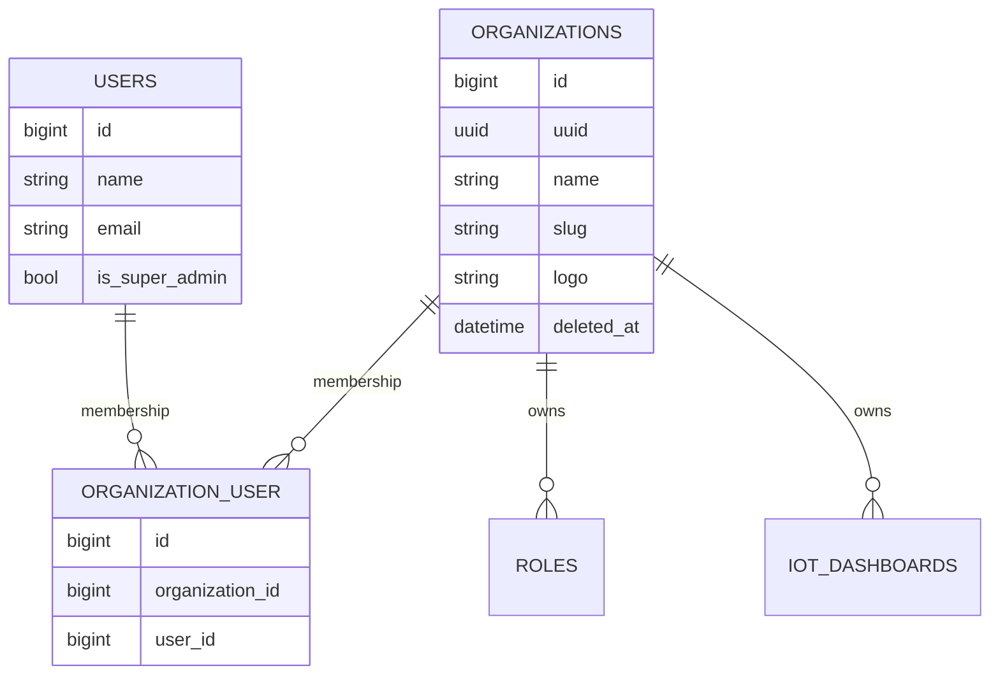

# Shared Module - Architecture

## Architectural Model

Shared is the tenancy and identity backbone:

1. Identity model (`User`) with authentication and role traits.
2. Tenant model (`Organization`) with UUID and avatar support.
3. Membership model through `organization_user` pivot.
4. Filament admin resources for tenant/user management.

## Component Responsibilities

| Component | Responsibility |
|-----------|----------------|
| `User` | Auth model, tenant access checks, organizations relation, roles relation |
| `Organization` | Tenant aggregate, logo/avatar support, user and role ownership |
| `UserResource` | CRUD and relation managers for organizations and roles |
| `OrganizationResource` | CRUD, soft-delete handling, and user attachments |
| Shared permission enums | Canonical permission names for User and Organization aggregates |

## Data Model

## Tenancy Contracts

`User` implements:

- `FilamentUser`
- `HasTenants`

Key methods:

- `canAccessTenant(Model $tenant): bool`
- `getTenants(Panel $panel): Collection`

This drives tenant pickers and access checks in Filament panels.

## Role Relationship Override

`User::roles()` is explicitly defined as `morphToMany` on `model_has_roles` with `organization_id` pivot.

Why this matters:

- preserves Spatie-compatible `model_type` writes,
- exposes team metadata for admin relation managers,
- supports organization-aware role listing and attachment.

## Operational Notes

- `Organization` and `Device` UUIDs are generated on create hooks.
- `Organization` is soft deletable; admin list includes `TrashedFilter` for recovery workflows.
- Impersonation is enabled in `UserTable` for super admins only.
