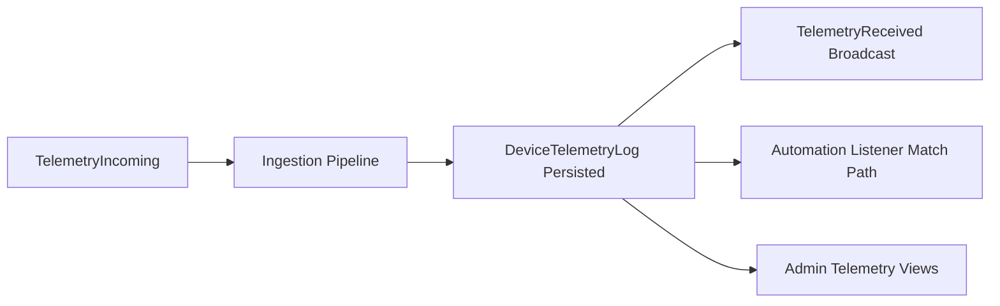

# Telemetry Module - Overview

## What This Module Does

The Telemetry module is the durable record layer for device readings.

It stores raw and transformed telemetry values, exposes realtime events, and provides operator-facing observability surfaces.

It is fed by two paths:

1. Ingestion pipeline persistence (primary path).
2. Direct recorder service (`TelemetryLogRecorder`) for internal/manual flows.

## Core Concepts

| Concept | Description |
|--------|-------------|
| Telemetry Log | `DeviceTelemetryLog` time-series row in `device_telemetry_logs` |
| Validation Status | `valid`, `warning`, `invalid` semantic quality marker |
| Processing State | Ingestion outcome marker such as `processed`, `invalid`, `publish_failed` |
| TelemetryIncoming Event | Broadcast event before ingestion persistence |
| TelemetryReceived Event | Broadcast event after telemetry row is persisted |

## Event and Persistence Flow

## Key Source Areas

- Model: `app/Domain/Telemetry/Models/DeviceTelemetryLog.php`
- Services:
  - `app/Domain/Telemetry/Services/TelemetryLogRecorder.php`
  - `app/Domain/DataIngestion/Services/TelemetryPersistenceService.php` (primary write path)
- Events:
  - `app/Events/TelemetryIncoming.php`
  - `app/Events/TelemetryReceived.php`
- Admin UI:
  - `app/Filament/Admin/Resources/Telemetry/DeviceTelemetryLogs/`
  - `app/Filament/Admin/Pages/TelemetryViewer.php`

## Documentation Map

- [02 - Architecture](02-architecture.md)
