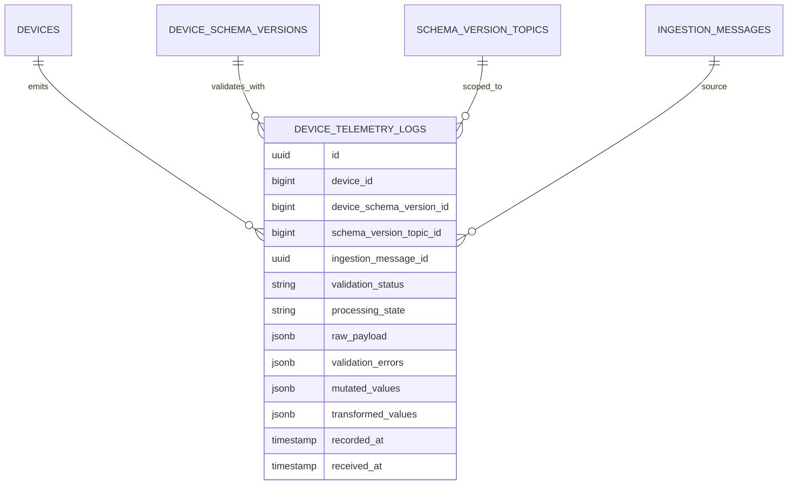

# Telemetry Module - Architecture

## Architectural Model

Telemetry architecture combines:

1. Time-series persistence model (`DeviceTelemetryLog`).
2. Event stream (`TelemetryIncoming`, `TelemetryReceived`).
3. Read/query interfaces in Filament resources and debug pages.

## Component Responsibilities

| Component | Responsibility |
|-----------|----------------|
| `DeviceTelemetryLog` | Durable telemetry record with raw/mutated/transformed values |
| `TelemetryLogRecorder` | Standalone recorder that evaluates payload and writes log rows |
| `TelemetryPersistenceService` | Ingestion-integrated writer with presence update and event emit |
| `TelemetryIncoming` | Realtime pre-ingestion event on `telemetry` channel |
| `TelemetryReceived` | Realtime post-persist event on `telemetry` channel |
| `DeviceTelemetryLogResource` | Filterable telemetry table and detailed payload infolist |
| `TelemetryViewer` | Debug page showing ingestion health and live stream component |

## Data Model

## Storage Characteristics

- Table uses composite primary key (`id`, `recorded_at`).
- `recorded_at` is indexed for time-range queries.
- On PostgreSQL, migration enables TimescaleDB and converts table to hypertable on `recorded_at`.

## Validation Semantics

`ValidationStatus` values:

- `valid`: all checks pass.
- `warning`: non-critical validation issues.
- `invalid`: critical validation issues.

`processing_state` adds ingestion-pipeline execution context (`processed`, `invalid`, `inactive_skipped`, `publish_failed`).

## Realtime Event Surface

Both telemetry events broadcast to channel `telemetry`:

- `telemetry.incoming`: pre-ingestion payload visibility.
- `telemetry.received`: persisted telemetry payload and metadata.

`TelemetryViewer` uses these events to update a live stream panel.

## Query and UI Patterns

`DeviceTelemetryLogsTable` supports filtering by:

- validation status,
- processing state,
- recorded-at range.

The infolist renders JSON sections for:

- raw payload,
- validation errors,
- mutated values,
- transformed values.

## Operational Notes

- Automation runtime listens to `TelemetryReceived`, so telemetry persistence availability directly impacts automation triggering.
- `TelemetryLogRecorder` remains useful for direct/internal recording flows where full ingestion orchestration is not required.
