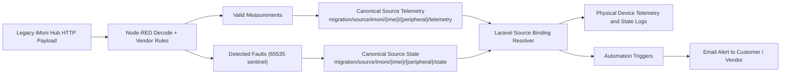

# iMoni Error State Contract

## Decision Summary

The `state` topic is where device read-health and peripheral error state should live.

For legacy and third-party devices such as iMoni:

- Node-RED is responsible for detecting vendor-specific fault conditions such as the `65535` sentinel.
- Node-RED should normalize that fault into the platform's canonical source contract.
- Node-RED should publish the error on a normalized source `state` topic, not mix it into numeric telemetry.
- Laravel should bind that source-state signal to the correct physical device and parameter set.

For first-party devices that we manufacture:

- The firmware should publish the canonical platform structure directly.
- Node-RED should not be required for native devices unless it is being used as a deliberate integration adapter.

This keeps the platform contract stable:

- `telemetry` stays numeric and chart-friendly
- `state` carries read status, hardware faults, and recoveries
- the ingestion pipeline remains generic
- automation, notifications, dashboards, and vendor escalation can all react to the same normalized shape

## Why `state` Instead of `telemetry`

If an iMoni peripheral returns `65535`, that is not a real measurement. It is a device-side error sentinel.

Publishing that value as telemetry creates bad outcomes:

- charts and reports can be polluted by invalid values
- string error markers mixed into telemetry make charting harder
- the platform has to guess whether a value is a reading or a fault

Using a separate `state` topic avoids that.

Recommended rule:

- valid measurements go to `telemetry`
- device read failures and peripheral faults go to `state`

## Canonical Topic Contract

For any normalized iMoni source channel:

- source telemetry topic: `migration/source/imoni/{hub_imei}/{peripheral_type_hex}/telemetry`
- source state topic: `migration/source/imoni/{hub_imei}/{peripheral_type_hex}/state`

Examples:

- `migration/source/imoni/869244049087921/00/telemetry`
- `migration/source/imoni/869244049087921/00/state`
- `migration/source/imoni/869244041754866/00/telemetry`
- `migration/source/imoni/869244041754866/00/state`

Hub presence remains separate:

- `devices/{hub_external_id}/presence`

The platform then binds those normalized source topics to the correct physical device and device topic.

## Canonical Payload Shape

### Source telemetry payload

Telemetry contains only valid chartable data.

```json
{
  "io_2_value": 1,
  "io_3_value": 0,
  "_meta": {
    "source_key": "869244041754866:00",
    "hub_imei": "869244041754866",
    "peripheral_name": "iMoni_LITE",
    "peripheral_type_hex": "00",
    "packet_type": "13",
    "packet_description": "PeripheralData",
    "source": "node-red-imoni"
  }
}
```

### Source state payload

State carries read health and normalized device fault details.

```json
{
  "read_ok": false,
  "error": "Peripheral returned 65535 sentinel",
  "error_code": "IMONI_FFFF_SENTINEL",
  "error_count": 1,
  "error_details": [
    {
      "peripheral_name": "iMoni_LITE",
      "peripheral_type_hex": "00",
      "io_number": 2,
      "action": "readAnalogIN",
      "raw_hex": "0102FFFF",
      "reason": "IMONI_FFFF_SENTINEL"
    }
  ],
  "_meta": {
    "source_key": "869244041754866:00",
    "hub_imei": "869244041754866",
    "packet_type": "13",
    "packet_description": "PeripheralData",
    "source": "node-red-imoni"
  }
}
```

### Clean recovery state payload

When the next read is healthy, the device should publish a clean state payload to clear the fault:

```json
{
  "read_ok": true,
  "error": null,
  "error_code": null,
  "error_count": 0,
  "error_details": [],
  "_meta": {
    "source_key": "869244041754866:00",
    "hub_imei": "869244041754866",
    "source": "node-red-imoni"
  }
}
```

## Responsibility Boundary

### Node-RED responsibilities for legacy devices

- decode raw vendor payloads
- detect vendor-specific sentinels such as `65535`
- suppress invalid measurements from telemetry payloads
- build normalized source `state` payloads when faults are present
- publish canonical source `telemetry` and `state` topics for the same normalized source channel

### Platform responsibilities after ingestion

- bind normalized source `telemetry` and `state` topics to physical devices through source-signal bindings
- ingest resolved device `telemetry` and `state` topics through the normal schema pipeline
- store device `state` logs like any other publish-topic log
- drive dashboards, automations, alerts, and analytics from normalized values
- notify customer or vendor contacts using platform automation

### Native device responsibilities

- publish the canonical platform contract directly
- do not depend on Node-RED for platform semantics
- use `telemetry` for measurements and `state` for device faults and read health

## Expected Flow



## Implementation Direction

1. Keep the iMoni decode guard that recognizes `65535` as an error sentinel.
2. Stop silently dropping that information.
3. Add a normalized internal error collection during Node-RED decoding.
4. Publish valid values to source `telemetry`.
5. Publish read health and fault details to source `state`.
6. Bind source error-state signals to the relevant physical devices and add a `state` publish topic to those device schemas.
7. Use the existing telemetry automation pipeline to send email alerts when `read_ok == false`.

## Schema Direction

For affected physical-device schemas, add a publish topic with suffix `state` and these parameters:

- `read_ok` as `Boolean`
- `error` as `String`
- `error_code` as `String`
- `error_count` as `Integer`
- `error_details` as `Json`

Important:

- use `error`, not `ERROR`
- do not put error strings into the `telemetry` topic
- do not treat these as invalid-ingestion failures; they are valid device-state reports

## Practical Outcome

This means:

- yes, the `state` topic is the right place to handle device errors
- for iMoni, Node-RED should detect the vendor fault and publish a separate normalized source `state` message
- the platform should then bind that source `state` message to the physical device and internally react to it
- for devices we manufacture, we should emit this ideal payload shape directly without needing Node-RED to invent it later
