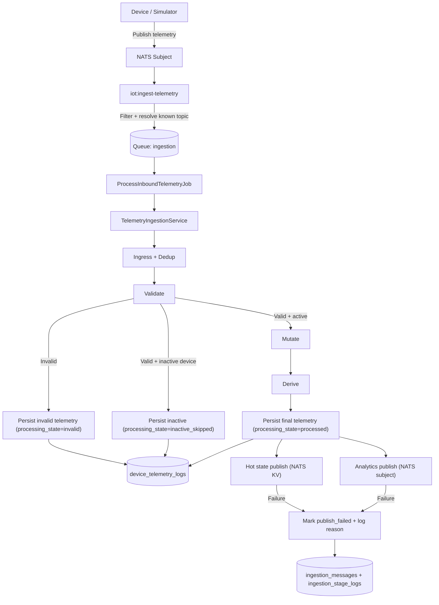
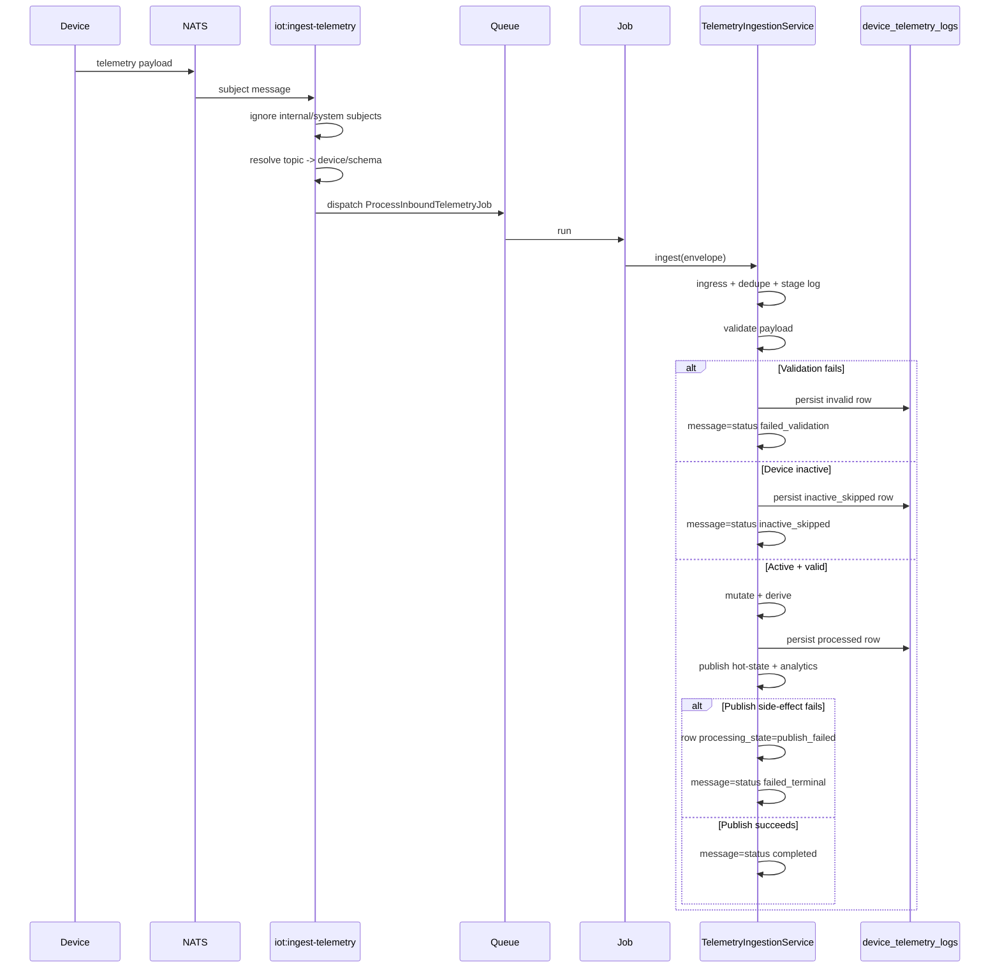

# Data Ingestion Architecture

## Purpose
This domain ingests device telemetry from NATS/MQTT subjects, validates/mutates/derives values, persists to the Timescale-backed telemetry table, and publishes downstream analytics/state updates.

## End-to-End Flow

## Sequence (Runtime)

## Core Runtime Components
- Command: `app/Console/Commands/IoT/IngestTelemetryCommand.php`
- Queue job: `app/Domain/DataIngestion/Jobs/ProcessInboundTelemetryJob.php`
- Orchestrator: `app/Domain/DataIngestion/Services/TelemetryIngestionService.php`
- Stage services:
- `DeviceTelemetryTopicResolver`
- `TelemetryValidationService`
- `TelemetryMutationService`
- `TelemetryDerivationService`
- `TelemetryPersistenceService`
- `TelemetryAnalyticsPublishService`

## Stage Outcomes
- `validate` failure: persisted + halted.
- inactive device: persisted + halted.
- active valid payload: mutate -> derive -> persist -> publish.
- dedupe hit: marked `duplicate`, no downstream replay.
- publish side-effect failure: data remains persisted; state marked `publish_failed`; error reason recorded.

## Feature Flags
- `ingestion.pipeline.enabled`
- `ingestion.pipeline.driver`
- `ingestion.pipeline.publish_analytics`

## Current Safety Notes
- Internal NATS subjects (`$JS.*`, `$KV.*`, `_REQS.*`, `_INBOX.*`) are ignored by ingestion command.
- Unknown/irrelevant subjects are dropped before queue dispatch.
- JetStream/KV unavailability no longer blocks telemetry persistence.
