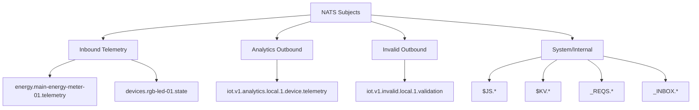
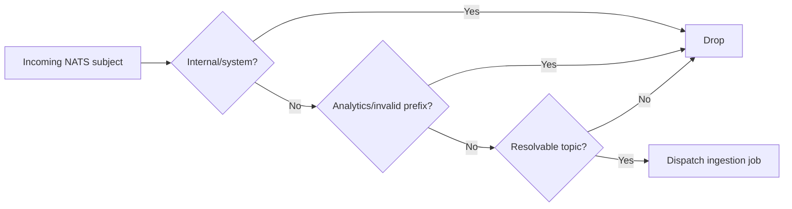

# NATS Topic Taxonomy

## Objective
Keep subjects deterministic and low-cardinality, avoid feedback loops, and preserve clean consumer routing.

## Subject Classes
- Inbound telemetry: device-originated subjects (example: `energy.main-energy-meter-01.telemetry`).
- Analytics outbound: `iot.v1.analytics.<env>.<org>.<device>.<topic>`.
- Invalid outbound: `iot.v1.invalid.<env>.<org>.<reason>`.

## Taxonomy Map

## Listener Filtering (Current)
Even if listener subject is broad (`>`), ingestion command only queues messages when:
1. Subject is not internal/system.
2. Subject is not analytics/invalid loopback.
3. Subject resolves to a known device+schema telemetry topic.

## Anti-Bloat Rules
- Fixed-depth subject format per class.
- Only sanitized tokens (lowercase, `a-z0-9_-`).
- No free-text segments from UI/user input.
- New subject classes require explicit code path.

## Recommended Stream Grouping
- Raw telemetry stream: inbound device subjects.
- Analytics stream: `iot.v1.analytics.>`.
- Invalid stream: `iot.v1.invalid.>`.
- KV bucket (`device-states`) for latest-state reads only.

## Loop Prevention
- Do not subscribe ingestion pipeline to analytics/invalid streams unless explicitly segregated.
- Keep outbound publish prefixes distinct from inbound telemetry namespace.
