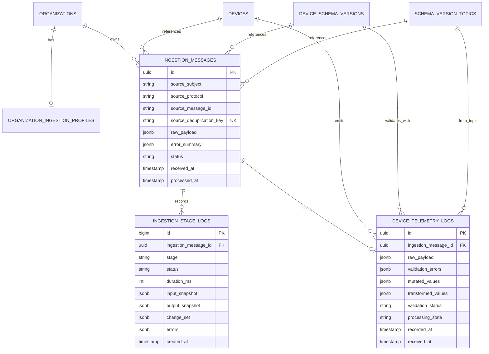
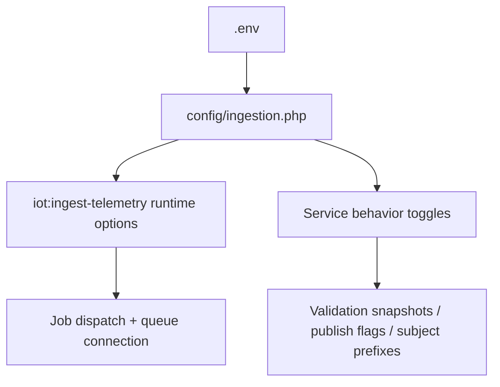

# Data Model and Configuration

## Data Model Overview

## State Semantics
- `ingestion_messages.status`
- `queued`, `processing`, `completed`, `failed_validation`, `inactive_skipped`, `failed_terminal`, `duplicate`.
- `device_telemetry_logs.processing_state`
- `processed`, `invalid`, `inactive_skipped`, `publish_failed`.

## Config Resolution

## Key Configuration Values
- `ingestion.enabled`
- `ingestion.driver`
- `ingestion.queue_connection`
- `ingestion.queue`
- `ingestion.nats.host`
- `ingestion.nats.port`
- `ingestion.nats.subject`
- `ingestion.nats.analytics_subject_prefix`
- `ingestion.nats.invalid_subject_prefix`

## Schema Extension Points
- `device_schema_versions.ingestion_config`: per-schema rules and strategy knobs.
- `devices.ingestion_overrides`: per-device overrides for ingestion behavior.
- `organization_ingestion_profiles`: retention/soft quota policy envelope.

## Query Tips for Debugging
- Latest failures by stage: `ingestion_stage_logs where status='failed_terminal'`.
- Latest publish-side issues: `device_telemetry_logs where processing_state='publish_failed'`.
- End-to-end trace: join `device_telemetry_logs.ingestion_message_id` -> `ingestion_messages` -> `ingestion_stage_logs`.
