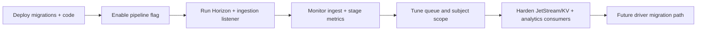
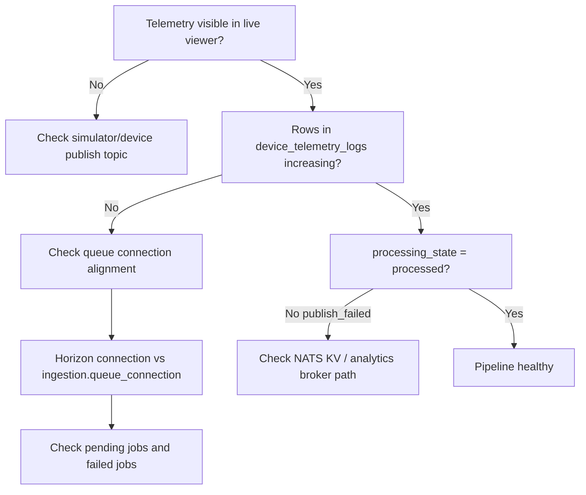

# Rollout, Testing, and Operations

## Rollout Plan

## Runtime Processes
- Horizon workers process queue jobs (`ingestion` queue).
- `iot:ingest-telemetry` is the long-running subscriber that feeds the queue.

## Operational Decision Tree

## Minimal Runbook
1. Confirm processes:
- `php artisan horizon:status`
- `php artisan iot:ingest-telemetry`
2. Confirm queue alignment:
- `ingestion.queue_connection` matches Horizon worker connection.
3. Confirm persistence:
- `device_telemetry_logs` row count increases during simulation.
4. Confirm stage visibility:
- `ingestion_messages` and `ingestion_stage_logs` record each message lifecycle.
5. Inspect publish failures:
- Telemetry Viewer health panel + `publish_failed` rows.

## Test Coverage (Current)
- `tests/Feature/DataIngestion/TelemetryIngestionServiceTest.php`
- full valid pipeline
- validation halt
- inactive halt
- dedupe
- feature toggle kill switch
- post-persist publish failure behavior
- `tests/Unit/DataIngestion/TelemetryDerivationServiceTest.php`
- dependency-order derivation
- unresolved dependency handling
- `tests/Unit/IoT/IngestTelemetryCommandSubjectFilterTest.php`
- NATS internal/system subject filtering

## Safety Guarantees
- Telemetry persistence happens before publish side-effects.
- Publish-side failure does not lose telemetry row.
- Failure reason is captured for UI and runbook debugging.
