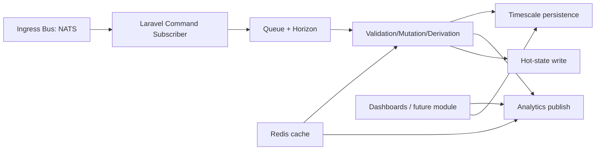
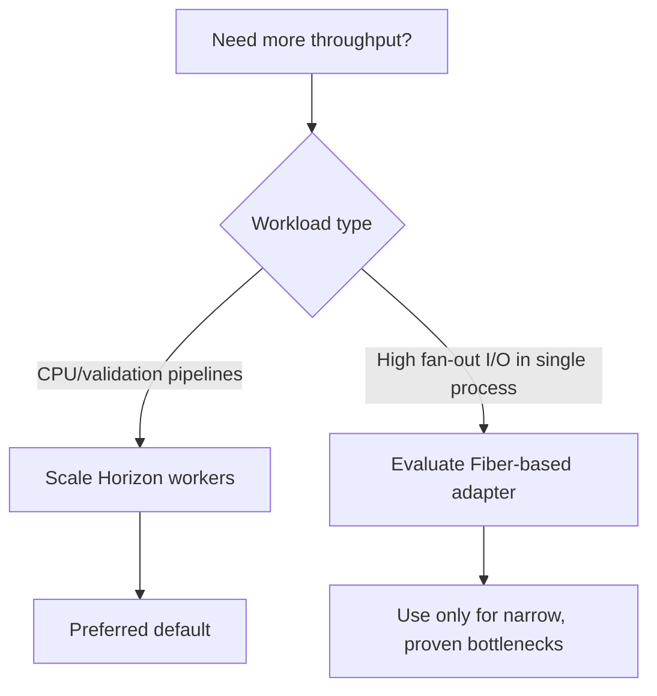
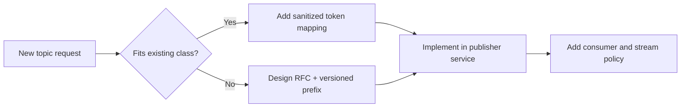

# Technology Research and Recommendations

## Baseline (This Project)
- Laravel 12 + Horizon + queue workers.
- NATS client (`basis-company/nats`).
- Timescale hypertable backing `device_telemetry_logs`.
- Data ingestion domain under `App\\Domain\\DataIngestion`.

## Recommended Architecture Split

## Technology Decision Summary
| Layer | Recommendation | Why |
|---|---|---|
| Transport | NATS (+ JetStream where needed) | Low-latency fan-in, stream durability path |
| Processing | Laravel queue workers via Horizon | Simple operations, scalable concurrency |
| Runtime Concurrency | Queue parallelism first; Fibers only for special adapters | Operationally safer than custom event-loop complexity |
| Cache | Redis for registry/derived cache | Reduce DB/ORM pressure for hot lookups |
| System of Record | Timescale hypertables | Time-series query efficiency + retention/compression |
| Realtime consumer path | NATS analytics subjects + short-lived cache | Avoid hammering raw telemetry table |

## Fibers vs Horizon

## Database Strain Reduction Strategy
- Keep realtime dashboards on analytics stream + cached windows.
- Use Timescale retention/compression policies for raw data.
- Build continuous aggregates for heavy trend queries.
- Keep debug-stage logs queryable but separate from dashboard read path.

## NATS Topic Governance Strategy

## Suggested Adoption Order
1. Stabilize current Laravel ingestion and observability.
2. Add Redis-backed shared topic/schema registry cache.
3. Apply Timescale retention + compression + continuous aggregates.
4. Add JetStream durability/replay where operationally required.
5. Consider Octane for API-heavy workloads, not queue throughput.
6. Evaluate Fiber adapters only after profiling proves I/O bottlenecks.

## Source References
- Laravel Octane: https://laravel.com/docs/12.x/octane
- Laravel Horizon: https://laravel.com/docs/12.x/horizon
- Laravel Cache: https://laravel.com/docs/12.x/cache
- PHP Fibers: https://www.php.net/manual/en/language.fibers.php
- NATS Subjects: https://docs.nats.io/nats-concepts/subjects
- NATS JetStream: https://docs.nats.io/nats-concepts/jetstream
- Timescale Hypertables: https://docs.tigerdata.com/use-timescale/latest/hypertables/
