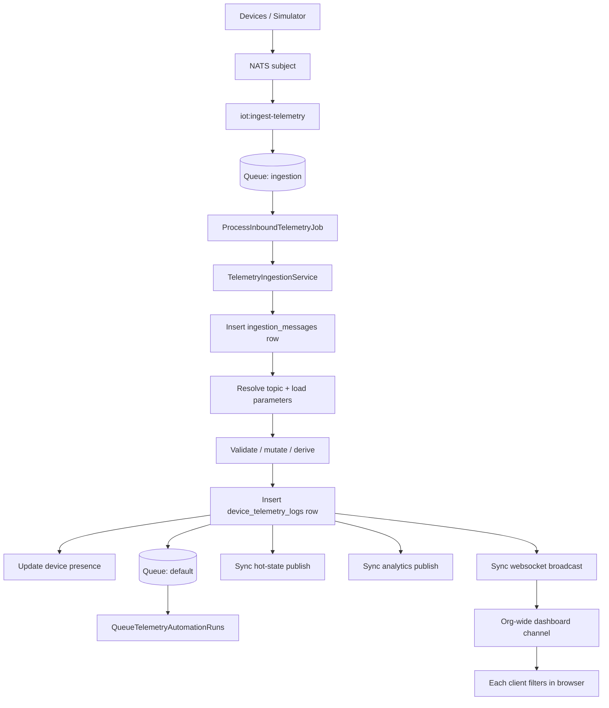
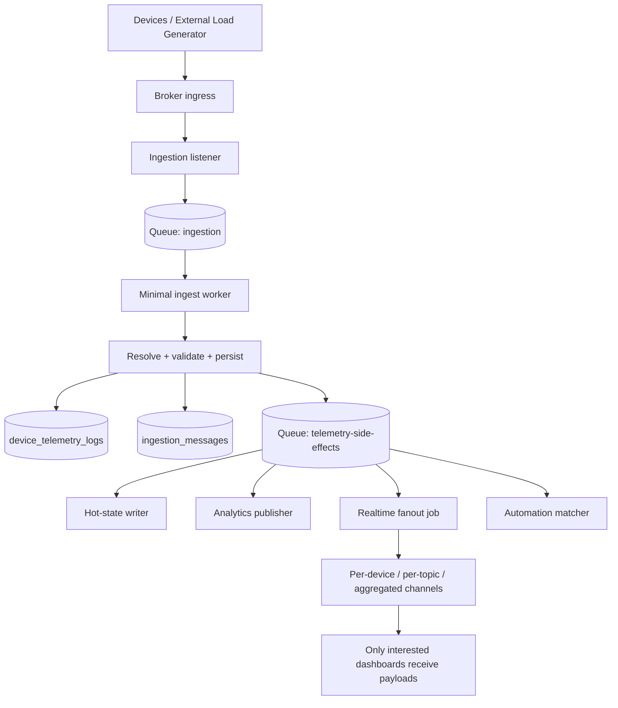
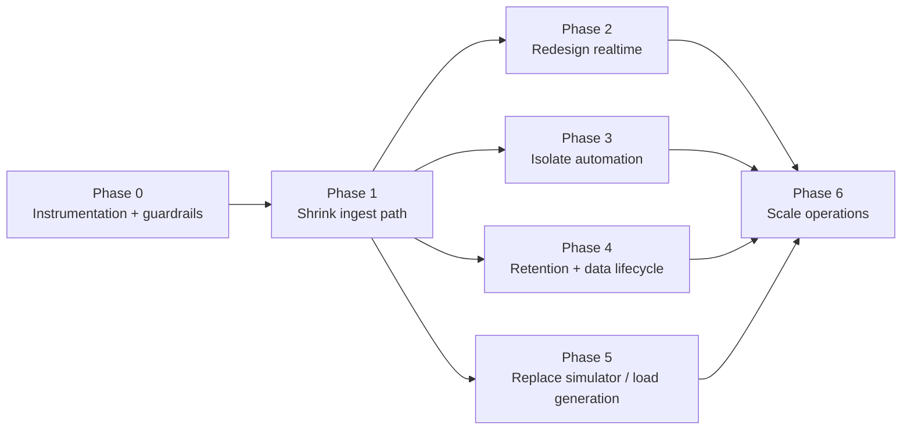

# Fleet Scale Remediation Plan

## Purpose
This plan turns the current telemetry scaling analysis into an execution roadmap for supporting thousands of devices publishing every few seconds without coupling device ingest to dashboard fan-out, analytics publish latency, or simulator overhead.

## Target Outcome
- Support sustained high-rate telemetry ingest by keeping the critical path small: receive, resolve, validate, persist, acknowledge.
- Move non-critical side effects out of the ingestion hot path.
- Make realtime delivery selective instead of organization-wide.
- Replace the current simulation strategy with a load generator that does not create one Laravel job per emitted message.
- Add storage lifecycle policies before telemetry volume becomes an operational problem.

## Capacity Framing
- `1,000` devices every `5s` is about `200 msgs/s` and `17.3M msgs/day`.
- `5,000` devices every `5s` is about `1,000 msgs/s` and `86.4M msgs/day`.
- `10,000` devices every `5s` is about `2,000 msgs/s` and `172.8M msgs/day`.
- At current row sizes, telemetry plus ingestion tracking is already roughly `1.9 KB` per message before websocket, Redis, and broker overhead.

## Current Constraints
- Ingestion does persistence and side effects in the same worker path.
- Realtime broadcasting is synchronous and organization-wide.
- Automation creates extra queue activity for every persisted telemetry event.
- The simulator scales queue jobs with message count instead of acting like a long-lived device publisher.
- Retention is configured conceptually but not operationally scheduled for telemetry and ingestion tables.

## Current Flow

## Target Flow

## Delivery Sequence

## Phase 0: Instrumentation and Guardrails
### Goal
Create enough visibility and control to measure bottlenecks before changing topology.

### Tasks
- Measure queue wait time and job runtime separately for `ingestion`, `default`, and simulation queues.
- Measure broker publish latency for hot-state and analytics side effects.
- Measure Reverb error rate, connection count, and message fan-out volume.
- Measure database write volume for `device_telemetry_logs`, `ingestion_messages`, and `ingestion_stage_logs`.
- Add explicit kill switches for raw telemetry broadcast, analytics publish, dashboard realtime, and automation fan-out.
- Define the first capacity target as a concrete benchmark, such as `1,000 devices every 5 seconds`.

### Exit Criteria
- A load test can answer where time is spent per message.
- Non-critical side effects can be disabled independently during incidents.

## Phase 1: Shrink the Ingestion Critical Path
### Goal
Make ingestion workers responsible only for the minimum work required to accept telemetry safely.

### Tasks
- Keep topic resolution, validation, mutation, derivation, and persistence in the ingestion worker.
- Move hot-state publish, analytics publish, dashboard broadcast, and automation matching out of the synchronous persist path.
- Ensure websocket or broker-side failures cannot fail telemetry persistence.
- Treat side effects as downstream jobs with their own queue, retry policy, and failure visibility.
- Cache parameter and derived-parameter metadata more aggressively so repeated messages do not re-query the same schema state.
- Revisit the topic registry refresh strategy so it does not rebuild the full device/topic map too often at larger fleet sizes.

### Exit Criteria
- Ingestion queue throughput is no longer tied directly to Reverb or downstream NATS publish latency.
- A temporary Reverb outage does not threaten telemetry persistence.

## Phase 2: Redesign Realtime Delivery
### Goal
Stop broadcasting all organization telemetry to every dashboard client.

### Tasks
- Replace organization-wide telemetry channels with a narrower delivery pattern such as per-device channels, per-topic channels, or pre-aggregated dashboard channels.
- Keep raw telemetry viewers as a diagnostic tool only, not as a default ingestion side effect.
- Add server-side filtering before broadcast so browsers only receive relevant payloads.
- Add rate limiting or sampling for noisy streams, especially for line charts.
- Consolidate polling fallback so dashboards do not make one request per widget when websocket delivery is unavailable.

### Exit Criteria
- A dashboard for one device does not receive traffic for the entire organization.
- Browser load scales with visible widgets, not fleet size.

## Phase 3: Isolate Automation from Every Telemetry Event
### Goal
Prevent automation matching from becoming a mandatory extra queue hop for all telemetry.

### Tasks
- Move automation onto a dedicated queue and supervisor.
- Reduce match attempts before queueing when possible by using topic or device targeting earlier in the flow.
- Keep the cached trigger list, but avoid queueing an automation listener job for telemetry that cannot match any active automation scope.
- Add rate controls for automation workflows that respond to high-frequency measurements.

### Exit Criteria
- High telemetry throughput does not force equal growth on the default queue.
- Automation latency and ingestion latency can be tuned independently.

## Phase 4: Storage Lifecycle and Retention
### Goal
Make long-term telemetry volume operationally affordable.

### Tasks
- Add Timescale retention and compression policies for telemetry chunks.
- Define different retention for hot telemetry, raw telemetry, invalid payloads, and debugging stage logs.
- Add pruning jobs for `ingestion_messages` and `ingestion_stage_logs`.
- Reassess indexes for dashboard snapshot queries and high-rate read paths.
- Separate operational troubleshooting data from long-term analytical data.

### Exit Criteria
- Telemetry storage growth is bounded by policy.
- Ingestion side tables do not grow forever.

## Phase 5: Replace the Current Load Generator
### Goal
Use a load tool that models device behavior without creating a Laravel queue job per emitted message.

### Tasks
- Stop using one queued Laravel job per device publish iteration for large fleet tests.
- Build or adopt an external load generator that keeps long-lived broker connections open.
- Model realistic mixes such as steady telemetry, burst telemetry, reconnect storms, invalid payload percentages, and dashboards with connected viewers.
- Treat simulator-driven raw telemetry broadcasts and presence updates as optional diagnostics, not default behavior.

### Exit Criteria
- Load tests stress the ingestion platform, not the simulation framework.
- A `10,000` device test does not imply millions of queued simulation jobs.

## Phase 6: Scale Operations and Runbook Hardening
### Goal
Tune the runtime only after the architecture is cheaper per message.

### Tasks
- Revisit Horizon supervisor counts, balancing strategy, timeout, and retry policy.
- Split queues by responsibility: ingestion, side effects, automation, and simulations.
- Add dead-letter or replay strategy for messages that fail after queue dispatch.
- Scale Reverb horizontally only after the channel strategy is narrowed.
- Treat Octane as secondary unless telemetry ingestion moves to HTTP.

### Exit Criteria
- Queue growth, websocket delivery, and downstream broker publishing can be scaled independently.
- Worker counts are a tuning lever, not the primary architecture fix.

## Implementation Notes: Pipeline and Fibers
### Laravel Pipeline
- Laravel's `Pipeline` is a reasonable way to structure the synchronous ingestion stages inside Phase 1.
- A `Pipeline` refactor can make the hot path explicit: resolve topic, validate, mutate, derive, persist, then dispatch downstream side effects.
- `Pipeline` is not, by itself, a fan-out or decoupling fix. If hot-state publish, analytics publish, dashboard broadcast, or automation matching still execute inside the same worker flow, they are still coupled to ingestion throughput.
- Do not treat `Pipeline` as a replacement for queue boundaries, side-effect isolation, or narrower broadcast topology.
- Avoid expanding transactional scope around downstream publish and broadcast work, since that would tighten coupling instead of reducing it.

### PHP Fibers
- PHP Fibers are not the default recommendation for this remediation plan.
- Fibers may be worth evaluating only for narrow, proven high-fan-out I/O adapters after the architecture has already been simplified.
- Fibers do not replace queue durability, Horizon isolation, retry policy, or selective realtime delivery.
- The first scaling lever should remain queue parallelism plus architectural decoupling, not custom in-process concurrency.
- Revisit Fibers only after Phase 1 and Phase 2, and only if profiling shows a worker is dominated by independent outbound I/O wait time rather than validation, persistence, or ORM overhead.

## Recommended Implementation Order
1. Complete Phase 0 first.
2. Do Phase 1 before buying more worker capacity.
3. Do Phase 2 immediately after Phase 1 for any serious realtime rollout.
4. Do Phase 5 before attempting large fleet simulations.
5. Do Phase 4 before sustained soak testing.
6. Use Phase 6 only after message cost per worker has been reduced.

## Success Metrics
- Ingestion worker runtime becomes stable and mostly insensitive to Reverb outages.
- Queue wait time for ingestion stays flat during benchmark traffic.
- Dashboard websocket traffic scales with subscribed entities, not organization size.
- Automation queue volume becomes proportional to actual automation usage.
- Daily storage growth stays within an explicit retention budget.

## Non-Goals
- This plan does not replace the existing DataIngestion design documents.
- This plan does not prescribe one broker or one deployment topology.
- This plan does not assume Octane is the primary scaling answer for telemetry.
