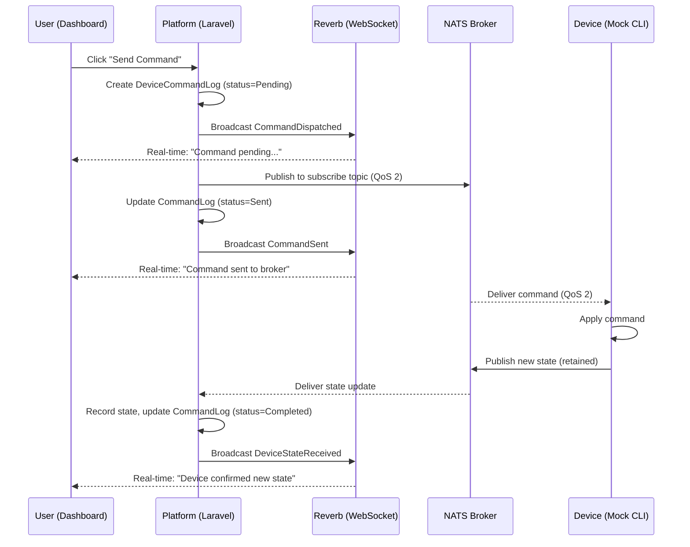
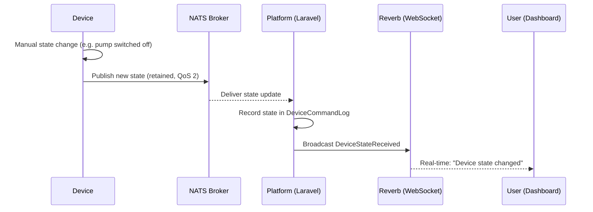
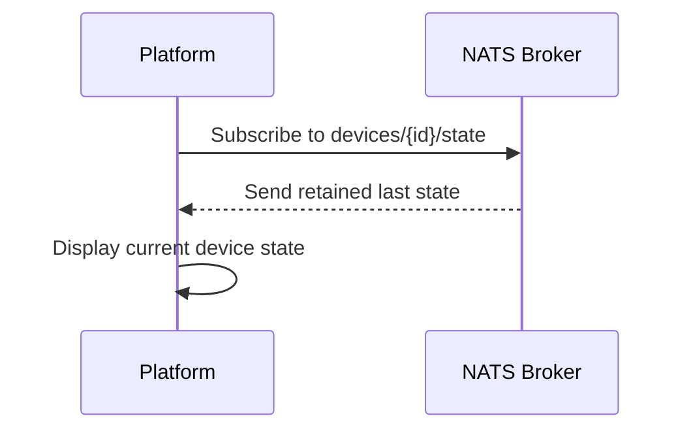
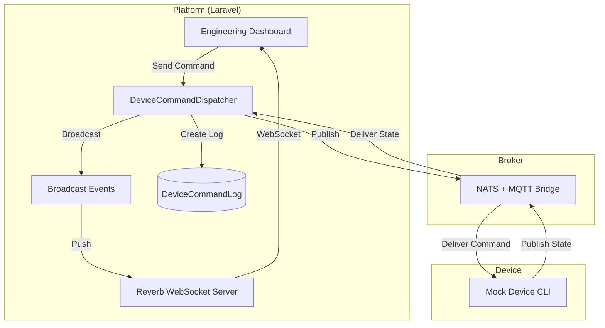

# Device Control Module — Architecture & Implementation Plan

This document defines how devices, the platform, and the NATS/MQTT broker coordinate control commands, state reporting, and real-time observability.

---

## Goals

1. Publish a prepared JSON command from the platform UI to a device-specific **subscribe topic** via NATS.
2. The broker retains the last state so reconnecting clients get the latest value immediately.
3. The device publishes its **actual state** back on its **publish topic** — the platform receives it and records it.
4. When a device changes state manually (e.g. pump switched off physically), the platform detects the change via the incoming state message.
5. Provide a real-time **Engineering Dashboard** (Filament page) that uses **Reverb** (WebSockets) to visualize every step of the command → state flow as it happens.

---

## Topic Design

Topics are defined in `SchemaVersionTopic` with `TopicDirection::Subscribe` (Platform → Device) and `TopicDirection::Publish` (Device → Platform).

Resolved topics follow the pattern: `{baseTopic}/{deviceIdentifier}/{suffix}`

```
# Command: Platform → Device (subscribe topic)
devices/{deviceId}/control

# State: Device → Platform (publish topic, retained)
devices/{deviceId}/state

# Telemetry: Device → Platform (publish topic)
devices/{deviceId}/telemetry
```

> The topic suffix + direction are defined per-schema, not hardcoded.

---

## QoS Strategy

| Flow | QoS | Reason |
|------|-----|--------|
| Platform → Device (commands) | **2** | Exactly-once delivery for state-changing operations |
| Device → Platform (state) | **2** | State must arrive exactly once; retained for persistence |
| Device → Platform (telemetry) | **1** | At-least-once is sufficient for sensor readings |

**QoS 2 guarantees:**
- Publisher ↔ Broker: exactly-once delivery (4-step handshake)
- Broker ↔ Subscriber: exactly-once delivery (4-step handshake)
- Does **not** guarantee the device *applied* the command — only that it was delivered

---

## Message Flow

### Flow 1: Platform Sends Command to Device



### Flow 2: Device Changes State Manually



### Flow 3: Retained State on Reconnect



---

## Example Payloads

### Command (Platform → Device via subscribe topic)

```json
{
  "power": "on",
  "mode": "auto",
  "flow_rate": 12.5
}
```

The payload structure matches the `SchemaVersionTopic` parameter definitions. The platform builds it from `buildCommandPayloadTemplate()` and the user can edit values before sending.

### State Response (Device → Platform via publish topic, retained)

```json
{
  "power": "on",
  "mode": "auto",
  "flow_rate": 12.5
}
```

### Manual State Change (Device → Platform)

```json
{
  "power": "off",
  "mode": "manual",
  "flow_rate": 0
}
```

When the platform receives this and no matching pending command exists, it records the state update as a device-initiated change.

---

## Implementation Components

### 1. DeviceCommandDispatcher (Service)

Analogous to `DevicePublishingSimulator` but for Platform → Device commands.

- Takes a `Device`, `SchemaVersionTopic`, and `payload` array
- Creates a `DeviceCommandLog` (status=Pending)
- Publishes to the resolved NATS subject
- Updates log status to Sent
- Broadcasts events at each step via Reverb

### 2. Broadcast Events (Reverb)

| Event | Channel | Trigger |
|-------|---------|---------|
| `CommandDispatched` | `device-control.{deviceUuid}` | Command log created (Pending) |
| `CommandSent` | `device-control.{deviceUuid}` | Published to NATS (Sent) |
| `DeviceStateReceived` | `device-control.{deviceUuid}` | Device state arrives back |

All events implement `ShouldBroadcastNow` and carry the full command log data + timestamps.

### 3. Mock Device Artisan Command

`php artisan iot:mock-device {device_uuid}`

- Subscribes to the device's subscribe topics via NATS
- On receiving a command, prints it and publishes a state response on the publish topic
- Simulates a configurable delay before responding
- Can also publish manual state changes on demand
- Runs as a long-lived CLI process for testing

### 4. Engineering Dashboard (Filament Page)

A custom page on `DeviceResource` at route `/{record}/control-dashboard`.

**Features:**
- **Send Command panel**: Select subscribe topic, edit JSON payload, publish
- **Message Flow log**: Real-time Reverb-powered event stream showing:
  - `CommandDispatched` → "Command created (pending)"
  - `CommandSent` → "Published to NATS broker"
  - `DeviceStateReceived` → "Device responded with state"
- **Command History table**: Recent `DeviceCommandLog` entries with status badges
- Uses Alpine.js + Echo for WebSocket subscriptions on the device-specific channel

### 5. SendCommand Filament Action

A reusable action (like `SimulatePublishingActions`) that:
- Shows subscribe topics for the device
- Previews/edits the JSON payload from `buildCommandPayloadTemplate()`
- Dispatches via `DeviceCommandDispatcher`

---

## Architecture Diagram



---

## File Structure

```
app/Domain/DeviceControl/
├── Services/
│   └── DeviceCommandDispatcher.php
├── Models/
│   ├── DeviceCommandLog.php      (existing)
│   └── DeviceDesiredState.php    (existing)
└── Enums/
    └── CommandStatus.php          (existing)

app/Events/
├── CommandDispatched.php
├── CommandSent.php
└── DeviceStateReceived.php

app/Console/Commands/IoT/
├── SimulateDeviceCommand.php     (existing)
└── MockDeviceCommand.php          (new)

app/Filament/Admin/Resources/DeviceManagement/Devices/
├── Pages/
│   ├── ...existing pages...
│   └── DeviceControlDashboard.php (new)
└── DeviceResource.php             (register new page)

app/Filament/Actions/DeviceManagement/
├── SimulatePublishingActions.php  (existing)
└── SendCommandActions.php         (new)
```

---

## Testing Strategy

- **Unit**: `DeviceCommandDispatcher` creates log, publishes to NATS (fake), broadcasts events
- **Feature**: Full flow — dispatch command, mock device responds, state recorded
- **Filament**: Dashboard page renders, send command action works, Livewire assertions
- **Manual**: Run `iot:mock-device` in one terminal, open dashboard, send command, watch flow

---

## Notes

- Payloads match schema parameter definitions — no separate desired/actual state tracking for now.
- The device's actual state is whatever it publishes on its publish topic.
- State comparison and sync tracking can be added later as a separate feature.
- The mock device command is essential for testing without real hardware.
